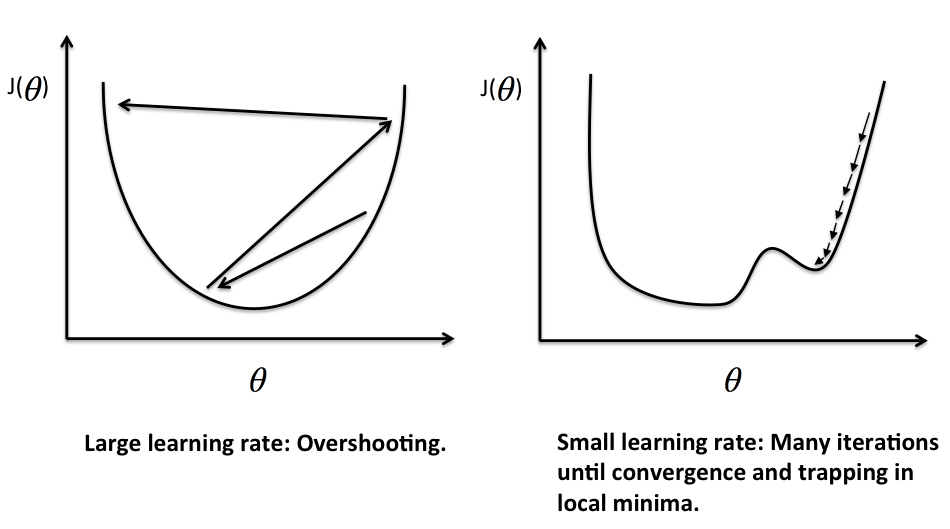

 

## Table of contents
- [Given problem](#given-problem)
- [Solution of Gradient Descent](#solution-of-gradient-descent)
- [Improvement GD with Momentum](#improvement-gd-with-momentum)
- [Nesterov accelerated gradient (NAG)](#nesterov-accelerated-gradient-(nag))
- [Benefits and Drawbacks](#benefits-and-drawbacks)
- [Wrapping up](#wrapping-up)

 

## Given problem

In the previous article [Linear Regression](https://ducmanhphan.github.io/2020-04-02-Linear-regression/), we had visited the Linear Regression model and Normal Equation for solving the first degree equation with parameter $\mathbf{\theta}$. Then, we also had the disadvantages of Normal Equation:
- The algorithm complexity for inversing matrix is $O(n^3)$. So, it takes so much time when we have the large input features.

The large features of our data is normal case. So, what is other way to deal with this problem?

 

## Solution of Gradient Descent

1. Explain the formula of Gradient Descent

    In the previous article [Linear Regression](https://ducmanhphan.github.io/2020-04-02-Linear-regression/), we solved the derivation of equation $J(\mathbf{\theta}) = 0)$ to find the value of $\mathbf{\theta}$. But Gradient Descent algorithm uses the derivation of cost function $J(\mathbf{\theta})$ to know the tendency of direction of parameter $\mathbf{\theta}$. Then we will update the parameter $\theta_j$ based on the cost function's derivation with $\theta_j$.

    Repeat until convergence:

    $$\theta_j = \theta_j - \alpha \frac{\partial{J(\mathbf{\theta})}}{\partial{\theta_j}}$$

    

    Because our cost function is the second degree equation, then we have a parabol graph that is describe in an above image.
    
    And the image shows that:
    - When the slope is negative (all the data points are in the left side of global minimum point such as **B** point), means that $\frac{\partial{J(\mathbf{\theta})}}{\partial{\theta_1}} \leq 0$, the value of $\theta_1$ increases because of $-\alpha \frac{\partial{J(\mathbf{\theta})}}{\partial{\theta_1}} \geq 0$.

    - When the slope is positive (all the data points are in the right side of global minimum point such as **A** point), means that $\frac{\partial{J(\mathbf{\theta})}}{\partial{\theta_1}} \geq 0$, the value of $\theta_1$ decreases because of $-\alpha \frac{\partial{J(\mathbf{\theta})}}{\partial{\theta_1}} \leq 0$.

    In both our cases, the tendency of cost function always go to local minimum points, luckly, we can get the global minimum point.

    - Influence of $\alpha$'s value

        

        If $\alpha$ is too small, gradient descent can be slow.

        If $\alpha$ is too large, gradient descent can overshoot the minimum. It may fail to converge or even diverge.

        Gradient descent can converge to a local minimum, even with the learning rate $\alpha$ fixed. As we approach a local minimum, gradient descent will automatically take smaller steps. So no need to decrease $\alpha$ over time.

2. Build the vectorize version of $\mathbf{\theta}$

    According to the formula of Gradient Descent algorithm, we have:

    $$\theta_j = \theta_j - \alpha \frac{\partial{J(\mathbf{\theta})}}{\partial{\theta_j}} (1)$$

    But, in the previous article [Linear Regression](https://ducmanhphan.github.io/2020-04-02-Linear-regression/), we have:

    $$J(\mathbf{\theta}) = \frac{1}{2m} \sum\limits_{i=1}^{m}(h_\mathbf{\theta}(\mathbf{x}^{(i)}) - y^{(i)})^2$$

    Then, the partial derivation of the above equation is:

    $$\frac{\partial{J(\mathbf{\theta})}}{\partial{\theta_j}} = 2.\frac{1}{2m} \sum\limits_{i=1}^{m}(h_\mathbf{\theta}(\mathbf{x}^{(i)}) - y^{(i)})\frac{\partial{(h_\mathbf{\theta}(\mathbf{x}^{(i)}}) - y^{(i)})}{\partial{\theta_j}}$$

    $$\Leftrightarrow \frac{\partial{J(\mathbf{\theta})}}{\partial{\theta_j}} = \frac{1}{m}\sum\limits_{i=1}^{m}(h_\mathbf{\theta}(\mathbf{x}^{(i)}) - y^{(i)}) \frac{\partial}{\partial{\theta_j}}(\sum\limits_{k=0}^{n}\theta_kx_k^{(i)} - y^{(i)})$$

    $$\Leftrightarrow \frac{\partial{J(\mathbf{\theta})}}{\partial{\theta_j}} = \frac{1}{m}\sum\limits_{i=1}^{m}(h_\mathbf{\theta}(\mathbf{x}^{(i)}) - y^{(i)})x_j^{(i)} (2)$$

    Combine $(2)$ with $(1)$ with $j = 0, 1, \dots, n$, we have:

    $$\theta_j = \theta_j - \alpha \frac{1}{m}\sum\limits_{i=1}^{m}(h_\mathbf{\theta}(\mathbf{x}^{(i)}) - y^{(i)})x_j^{(i)}  (3)$$

    So, we have the vectorized version of parameter $\mathbf{\theta}$:

    $$\mathbf{\theta} = \mathbf{\theta} - \alpha \frac{1}{m} \sum\limits_{i=1}^{m}(\mathbf{\bar{x}}^{(i)}\mathbf{\theta}- y^{(i)})\mathbf{x}^{(i)}$$

3. Some note about Gradient Descent

 

## Gradient Descent with feature scaling

 

## Improvement GD with Momentum

 

## Nesterov accelerated gradient (NAG)

 

## The comparison between Normal Equation and Gradient Descent

|        Gradient Descent        |         Normal Equation          |
| ------------------------------ | -------------------------------- |
| Need to choose alpha           | No need to choose alpha          |
| Needs many iterations          | No need to iterate               |
| $O(kn^2)$                      | $O(n^3)$, need to calculate inverse of $\mathbf{\bar{X}}^T.\mathbf{\bar{X}}$ |
| Works well when n is large     | Slow if n is very large          |

In practice, when the number of traning samples exceeds 10000, it might be a good time to go from a normal solution to an iterative process.

There is no need to do feature scaling with the normal equation.

 

## Benefits and Drawbacks

 

## Wrapping up
- The above Gradient Descent algorithm also called as Batch Gradient Descent.

 

Refer:

[https://www.hackerearth.com/blog/developers/3-types-gradient-descent-algorithms-small-large-data-sets](https://www.hackerearth.com/blog/developers/3-types-gradient-descent-algorithms-small-large-data-sets)

[https://www.quora.com/In-gradient-descent-without-feature-scaling-why-does-theta-descend-quickly-for-small-ranges-and-slowly-for-large-ones](https://www.quora.com/In-gradient-descent-without-feature-scaling-why-does-theta-descend-quickly-for-small-ranges-and-slowly-for-large-ones)

[https://machinelearningmastery.com/linear-regression-for-machine-learning/](https://machinelearningmastery.com/linear-regression-for-machine-learning/)

[https://machinelearningcoban.com/2017/01/16/gradientdescent2/#vi-du-minh-hoa](https://machinelearningcoban.com/2017/01/16/gradientdescent2/#vi-du-minh-hoa)

[https://blog.paperspace.com/part-2-generic-python-implementation-of-gradient-descent-for-nn-optimization/](https://blog.paperspace.com/part-2-generic-python-implementation-of-gradient-descent-for-nn-optimization/)