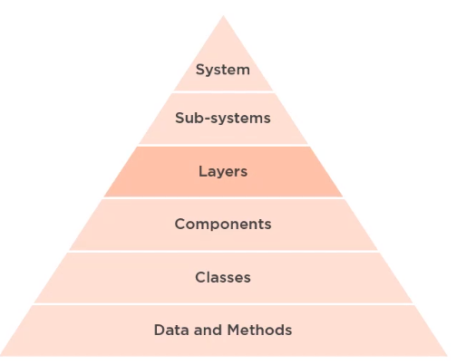

 

## Table of contents
- [Given problem](#given-problem)
- [Solution with Clean architecture](#solution-with-clean-architecture)
- [Source code](#source-code)
- [Benefits and Drawbacks](#benefits-and-drawbacks)
- [The relationship with other patterns](#the-relationship-with-other-patterns)
- [Wrapping up](#wrapping-up)

 

## Given problem

1. What is software architecture

    

    There are a few general concepts that we can probably all agree upon. First, it's high level or at least higher level than the code we write. Second, it has to do with the structure of software or how things are organized. Third, it typically involves layers, which are vertical partitions of the system. Fourth, it typically involves components of some kind, which are  typically horizontal partitions within each layer. Finally, it involves the relationships between these things, that is how they're all wired together.

2. Levels of architectural abstraction

    

    Starting at the top, that is the most abstract representation of software, we have the system, which can be represented as a set of one or more subsystems, which are typically divided into one or more layers, which are often subdivided into one or more components, which contains classes that contains data and methods.

    Our primary focus for the conceptual information will mainly be at the abstraction levels of layers and components. In addition, we'll also see an alternative representation of components as small subsystems when we get into microservice architectures.

3. Messy and clean architecture

    - Bad architecture

        Bad or messy architecture is architecture that is complex, but due to accidental complexity rather that necessary complexity.
        
        - It's incoherent in the sense that the parts do not seem like they fit together.
        
        - It's rigid, that is the architecture resists change or makes it difficult to evolve the architecture over time.
        
        - It's brittle, touching a part of the code might break another part of the code somewhere else.

        - It's untestable.
        
        - Ultimately, all of these things lead to an architecture that's unmaintainable over the life of the project 

    - Good architecture

        We have good, clean architecture when it is simple or at least it's only as complex as is necessary, and that complexity is not accidental.

        - It's understandable, that is it's easy to reason about the software as a whole.

        - It's flexible, we can easily adapt the system to meet changing requirements.

        - It's emergent, the architecture evolves over the life of the project.

        - It's testable, the architecture makes testing easier, not harder.

        - Ultimately, all of these leads to an architecture that's more maintainable over the life of the project.

--> So, based on the bad architecture's characteristics, we need the clean architecture.

 

## Solution with Clean architecture

Clean architecture is architecture that is designed for the inhabitants of the architecture, not for the architect or for the machine. Clean architecture is philosophy of architectural essentialism.

It's about focusing on what is truly essentail to the software's architecture versus what is just an implemenation detail. By designing for the inhabitants we mean the people that will be living within the architecture during the life of the project. This means the users of the system, the developers building the system, and the developers maintaining the system.

By not designing for the architect, we mean that the architect should not put aside his or her own desires, preferences, and wishes, and only consider what is best for the inhabitants of the architecture with each decision that is made.

By not designing for the machine, we mean that we should optimize the architecture first for the needs of the inhabitants, that is the users and the developers, and only optimize for the machine when the cost of performance issues to the users, who are inhabitants of the architecture, outweights the benefits of a clean design to the developers who are also inhabitants of the architecture.

Essentially, we want to avoid premature optimization, which as visionary computer scientist Donald Knuth says, is the root of of all evil in software development.

 

## Source code

 

## Benefits and Drawbacks

 

## The relationship with other patterns

 

## Wrapping up

 

Refer:

[Clean Architecture: Patterns, Practices, and Principles](https://app.pluralsight.com/library/courses/clean-architecture-patterns-practices-principles/table-of-contents)