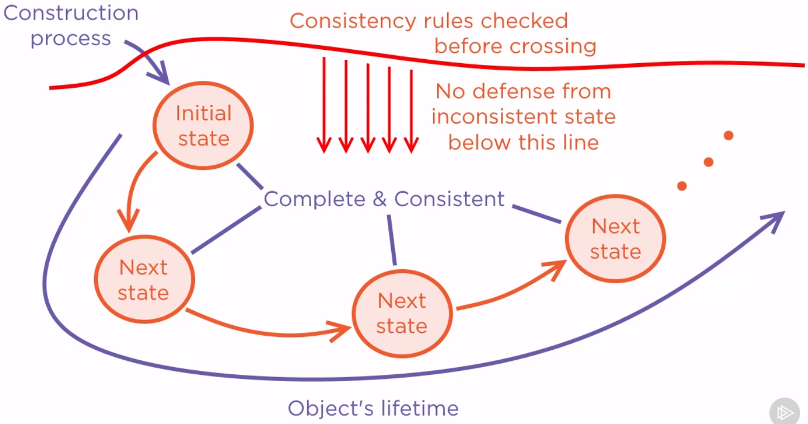

<br>

## Table of contents
- [Given problem](#given-problem)
- [Solution with Consistent Objects](#solution-with-consistent-objects)
- [Some problems with Constructors](#some-problems-with-constructors)
- [Using Builder pattern to solve Constructors's problem](#using-builder-pattern-to-solve-constructor's-problem)
- [Wrapping up](#wrapping-up)

<br>

## Given problem

Assuming that we have a Student class that looks like a below definition:

```java
public class Student {
    private String name;

    public void setName(String name) {
        this.name = name;
    }

    public void getName() {
        return this.name;
    }
}
```

But using the above code, we can find that it has some wrong approaches. So there are some questions that always appears in our mind.
- Can **name** field be empty?
- Can it be null?
- About Object's internal operation, what will happen to the object if its state is inconsistent ?

    If internal object states would probably lead to execution errors and execution errors must be prevented, which gives rise to defensive coding. If we can expect errors in data, then all operations related to data must be guarded.

    For example:

    ```java
    public class Student {
        private String name;

        // getter and setter of name field
        // ...

        public int getNameLength() {
            // fail if name field is null
            return this.name.length;
        }

        public char getInitialLetterName() {
            // fail if name is null or empty
            return this.name.charAt(0);
        }
    }
    ```

    After applying defensive coding for the above example, we have:

    ```java
    public in getNameLength() {
        if (this.name != null) {
            return this.name.lenggth;
        } else {
            return 0;
        }
    }

    public char getInitialLetterName() {
        if (this.name != null && this.name.length > 0) {
            return this.name.charAt(0);
        } else {
            return 'A';
        }
    }
    ```

    The drawbacks of the above defensive coding are:
    - it has multiple boilerplate code to guard our code.
    - it makes solution a couple of times longer.

- About Dependee's operation, what will happen to others if an object publicly exposes inconsistent state ?


<br>

## Solution with Consistent Objects

From the above example, we have some conclusions:
- If only the name field could never be null or empty, then we would have nothing to defend from.
- Introduce factory function for a stateful object.

    Factory function is the function which constructs an object and does that correctly and completely. In object-oriented languages, every class comes with an implicit factory function that is the implicit parameterless constructor.

    ```java
    public class Student {
        private String name;

        // getter and setter for name field
        // ...

        // implicit parameterless constructor
        // set numeric fields to zero, boolean field to false, references to null
        public Student() {}
    }
    ```

    With implict parameterless constructor, the **name** field will be set to null. When we allow that to happen, we would have to use defensive coding for that field. Normally, we do not want to write defensive code in multiple places where appear the **name** field. Instead, we want to recognize the sources which are making us have to defend in the first place. Then, we have to get rid of those sources.

    In our example, the sources of troubles is in the implicit constructor which is initializing the field to an impossible value. So we will use another form of Student constructor.

    ```java
    public class Student {
        private String name;

        public Student(String name) {
            this.name = name;
        }

        public String getName() {
            return this.name;
        }
    }
    ```

    In the above custom parameterized constructor, we set the **name** field to non-default values. However, the client still have a chance to pass null value to the name field. So, we need to defend in the custom parameterize constructor by throwing an exception.

    ```java
    public class Student {
        private String name;

        public Student(String name) {
            if (StringUtils.isNullOrEmpty(name)) {
                throw new RuntimeException();
            }

            this.name = name;
        }

        public String getName() {
            return this.name;
        }

        public int getNameLength() {
            return this.name.length;
        }

        public char getInitialLetterName() {
            return this.name.charAt(0);
        }
    }
    ```

    After defending the one place that can cause inconsistent state of the name field, no need to defend when accessing internal state. The above constructor ensures that only valid objects can be created. And the caller will never be able to obtain an inconsistent object. Under the idea of factory functions, every stateful object should have a factory function which constructed in complete and consistent state.


<br>

## Some problems with Constructors

1. Using factory methods for solving Constructor problems

    Constructors don't have their own names. Constructors are named after a class, and it doesn't necessarily communicate their own logic.

    For example:

    ```java
    public class Student {
        private String name;
        private Semeter enrolled;
        private boolean comesFromExchange;

        public Student(boolean comesFromExchange, String name) {
            if (StringUtils.isNullOrEmpty(name)) {
                throw new RuntimeException();
            }

            this.comesFromExchange = comesFromExchange;
            this.name = name;
        }

        public void enroll(Semeter semester) {
            if (semester == null || semester.getPredecessor() != this.enrolled) {
                throw new IllegalArgumentException();
            }

            this.enrolled = semester;
        }
    }
    ```

    One common technique to improve communication skills of the constructor is to replace it with one or more static factory methods and transform that constructor to **private**.

    ```java
    public class Student {
        // fields, getter

        private Student(boolean comesFromExchange, String name) {
            // ...
        }

        public static Student create(String name) {
            return new Student(false, name);
        }

        public static Student createFromExchange(String name) {
            return new Student(true, name);
        }
    }
    ```

    This solution with static factory methods is bringing troubles on a different places. If we have multiple factory methods indicate that the class is doing more than one thing. And this is true for this Student class. Boolean flag will affect the way it execute the enroll() method.

    ```java
    public void enroll(Semester semester) {
        if (semester == null || (!this.comesFromExchange && semester.getPredecessor() != this.enrolled)) {
            throw new IllegalArgumentException();
        }

        this.enrolled = semester;
    }
    ```

    Having a boolean flag inside an object is bad coding practice. Callers will probably need to think how to deal with an object, depending on the method which was used to construct it. In this case, the execution of enroll() method is affected by the private boolean flag. If we catch ourself making more than one factory method for one class, we better ask ourself, is it really one class we're talking about? Maybe we're talking about two classes only merged together into one piece of code.

    Below is the rules of thumb:
    - Define one factory method per class.
    - Have no discrete parameters (no enums, Booleans, ...)

    So, we need to separate Student class into two classes based on the **private comesFromExchange** boolean flag.

    ```java
    public abstract class Student {
        private String name;
        private Semester enrolled;

        protected Student(String name) {
            if (StringUtils.isNullOrEmpty(name)) {
                throw new RuntimeException();
            }

            this.name = name;
        }
        
        public void enroll(Semester semester) {
            if (!this.canEnroll(semester)) {
                throw new RuntimeException();
            }

            this.enrolled = semester;
        }

        public abstract boolean canEnroll(Semester semester);

        public Semester getEnrolled() {
            return this.enrolled;
        }

    }


    public class RegularStudent extends Student {
        public RegularStudent(String name) {
            super(name);
        }

        @Override
        public boolean canEnroll(Semester semester) {
            return semester != null && semester.getPredecessor.equals(this.getEnrolled());
        }
    }

    public class ExchangeStudent extends Student {
        public ExchangeStudent(String name) {
            super(name);
        }

        @Override
        public boolean canEnroll(Semester semester) {
            return semester != null;
        }
    }
    ```

    Then, we have a rule of thumb:
    - Never accept null argument value.

2. Drawbacks of Constructor

    - Every object should start off in a complete and consistent state. Later on, the object will move for different states. What happens to that object later during its lifetime is a different story. But again we will insist on making all other states of the object complete and consistent too. If we can make that happen, then we will never have to defend against inconsistencies in the objects internal state and how back to the entire state.

        The trick is that if consistency criteria were violated before constructing the instance, then the factory method would fail and it would not produce the object on the output. In other words, we will be prevented from laying our hands on an inconsistent or incomplete object. There will never be a reference to an inconsistent object. It requires no defensive code at all in any methods which consumes the object.

        

        Below is the object rule:
        - If you have the object, then it is fine.

            If it weren't fine, you wouldn't have the object in the first place.

    - Assuming that we have an application with:

        Constructor ExamApplication object:
        - Student - takes the exam
        - Subject - in which the exam is taken
        - Professor - administers the exam

        The rules for this application:
        - student != null
        - subject != null
        - professor != null
        - student enrolled semester of subject
        - student has not passed exam on subject
        - subject taught by professor

        The below ExamApplication's constructor can't execute if any of the rules are violated. It is common to throw exceptions in each of the cases.

        ```java
        class ExamApplication {
            public ExamApplication(Student candidate, Subject subject, Professor admin) {
                if (<any argument null>) {
                    throw new IllegalArgumentException();
                }

                if (<any other rule violated>) {
                    throw new IllegalArgumentException();
                }

                // ...
            }
        }
        ```

        But what's wrong with exceptions thrown from constructors? The truth is that someone was in need of an ExamApplication object and that someone has invoked the constructor expecting to have an object after that make knowing an exception. We're actually not creating an object. That's bad thing. If we consider that the application will not be able to continue with execution of the current operation, this situtation is indicated of a limitation that comes with the concept of constructors. Constructor cannot tell in advance whether it will succeed or not. We can only invoke it and hope for the best. Defending from a constructor, which communicates rule violations by throwing exceptions, boils down to handling exceptions.

        ```java
        try {
            ExamApplication appl = new ExamApplication(student, subject, professor);
            dealWith(appl);
        } catch(Exception ex) { // try-catch is probably the heaviest if-then-else you could ever think of
            ex.printStackTrace();
        }
        ```

        One problem here is that we're employing heavy mechanism exception handling to control one tiny bit of behavior. If only we could ask the constructor if everything is all right with our arguments before invoking it. We would know that there is a problem in advance and we wouldn't even involved a construct. There would be no exception to catch in the first place. 

<br>

## Using Builder pattern to solve Constructors's problem


<br>

## Wrapping up


<br>

Refer:

[Advanced Defensive Programming Techniques by Zoran Horvat](https://app.pluralsight.com/library/courses/advanced-defensive-programming-techniques/table-of-contents)