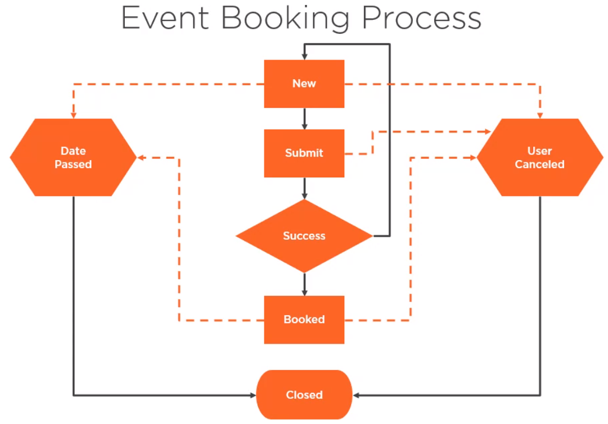
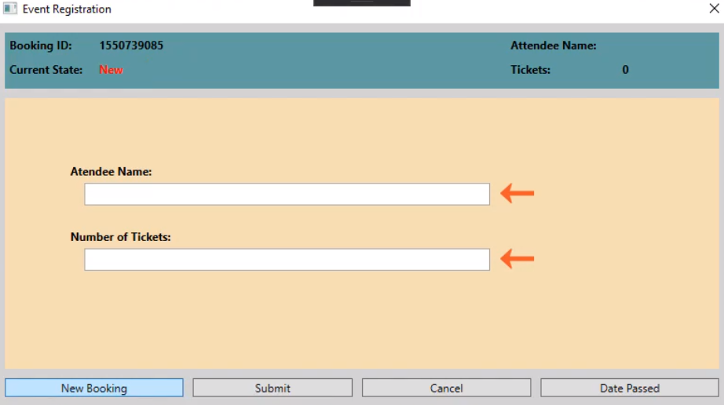

<br>

## Table of contents


<br>

## Given problem




<br>

## Description for booking process

1. **New** state

    

    With this state, we have some actions:
    - assign a booking ID.
    - display the status of the booking.
    - provide for data entry such as username, the number of tickets, ...

    From the New state, some states can turn such as:
    - Date Passed state

        The date for the event can pass at which point the booking is closed.

    - User Canceled
    
        The user can cancel, also resulting in the booking being closed.

    - Submit
    
        The user can submit their information for processing.

    When a booking is closed for any reason, we simply want to display the booking state and provide the user with a reason that the booking was closed.

2. Submit state
3. Success state
4. Booked state
5. Closed state
6. Date Passed state
7. User Canceled state

<br>

## Naive approach for Booking process

From the above images, we can find that buttons will consider our states such as New, Submit, Cancel, and Date Passed.

It means that when we click Cancel button, our booking event will be canceled, then the final state is closed. And clicking Date Passed button, our booking event will be Date Passed state, the final state is closed. Our code will look like:

```java
enum BookingState {
    NEW, SUBMIT, USER_CANCELED, DATE_PASSED, SUCCESSFUL, BOOKED, CLOSED;
}

private BookingState currentState;

public void clickCancelBtn() {
    this.currentState = BookingState.Canceled;
    System.out.println("Canceled by user");
}

public void clickDatePassedBtn() {
    this.currentState = BookingState.DATE_PASSED;
    System.out.println("Booking expired");
}
```

The above implementation seems normal, but it exists issues such as a canceled booking can expire or even be re-canceled, and an expired booking can also be canceled or re-expired.

A common way to address these types of issues in the absence of the state pattern is to use a simple Boolean field.

```java
private boolean isNew = true;

public void clickCancelBtn() {
    if (isNew) {
        this.currentState = BookingState.Canceled;
        System.out.println("Canceled by user");
    } else {
        System.out.println("Closed bookings cannot be canceled");
    }
}

public void clickDatePassedBtn() {
    this.currentState = BookingState.DATE_PASSED;
    System.out.println("Booking expired");
}

```

<br>

## Wrapping up


<br>

Refer:

[]()