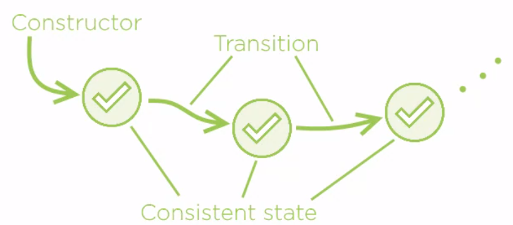

<br>

## Table of contents
- [Given problem](#given-problem)
- []()
- []()
- []()
- [Wrapping up](#wrapping-up)


<br>

## Given problem


<br>

## Introduction to Defensive Programming

1. Definition of Defensive programming


2. The first law of Defensive programming

    ```
    When you have to defend, you have to already lost.
    ```

    It means that we will build safety into high-level design without defining explicitly defensive instructions in code.

3. The difference between Defensive coding and Defensive programming

    |             Defensive Coding                            |               Defensive Programming                  |
    | ------------------------------------------------------- | ---------------------------------------------------- |
    | Write code which explicitly defends from negative cases | Produce design which defends out of the box          |
    |                                                         | Positive and negative execution scenarios treated the same |
    | Always applicable and produces poor results             | Sometimes applicable and produces greater results    |


<br>

## Some ways to represent Defensive programming

1. Consistent objects

    We will create consistent and complete objects as the fundamental method of avoiding the need to defend against the opposite, incomplete or inconsistent state.

2. Consistent mutations

    All transitions must lead to complete and consistent states.

    

    If the object appears in complete and consistent state, and then only traverse other complete and consistent states, then we will never have to defend against missing parts and contradictory information coming out from the Objects state

3. No primitive types

    - Avoid excessive use of primitive types.
    - Replace primitive types with custom domain types.

    It means that we will use Value Object pattern.

4. Function domains

    Satisfy mandatory conditions before making a function call.

    For example, normally we will use try-catch to handle exception.

    ```java
    try {
        obj.doSomething();
    } catch (InvalidOperationException ex) {
        ex.printStackTrace();
    }
    ```

    In the above code, we will quickly realize that it boils down a deceptively simple question **Am I safe making this call?**. Using this way we can remove that boilerplat code.

5. Defensive design

    Encapsulate state and operations.

6. Objects, not null


7. Rich domain models


8. No exceptions

<br>

## 


<br>

## 


<br>

## 


<br>

## Wrapping up


<br>

Refer:

[]()

[]()

[]()