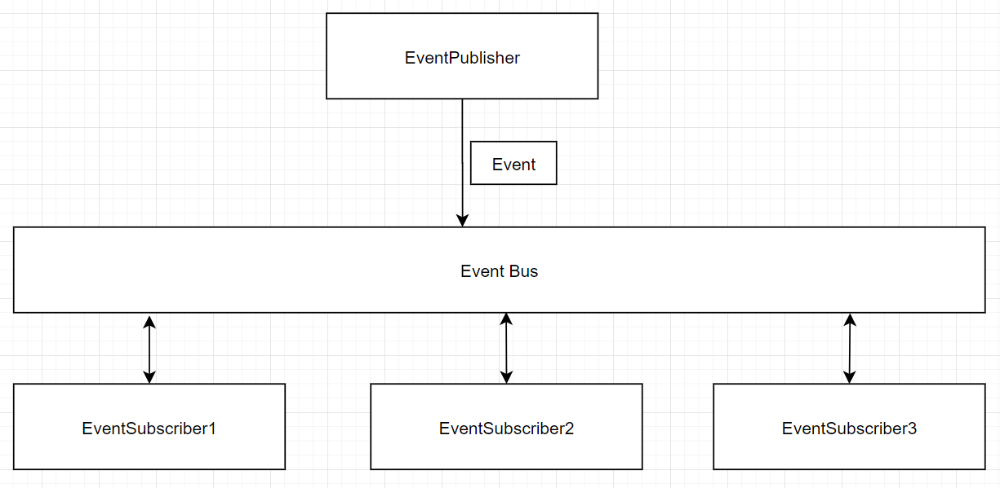

 

## Table of contents
- [Given problem](#given-problem)
- [Solution with Event bus pattern](#solution-with-event-bus-pattern)
- [Source code](#source-code)
- [Benefits and Drawbacks](#benefits-and-drawbacks)
- [The relationship with other patterns](#the-relationship-with-other-patterns)
- [How to implement Event Bus pattern in Reactive programming](#how-to-implement-event-bus-pattern-in-reactive-programming)
- [Wrapping up](#wrapping-up)

 

## Given problem

In the section **Some problems with Command Bus pattern** of the article [Command bus pattern](https://ducmanhphan.github.io/2020-12-02-command-bus-pattern/), we discussed about their Command bus pattern's arduous and its solution. It is to use Event Bus pattern to decouple between the primary action and the secondary action in Command Bus pattern.

This way makes our code satisfy Single Responsibility Principle and extends our functionality in the future time.

So how do we implement the Event Bus pattern?

 

## Solution with Event bus pattern

Below is the diagram that describes how Event Bus pattern works.

Some components in this pattern:
1. Event Publisher

    Event Publisher is a component that is responsible for publish an Event to the Event Bus.

2. Event Bus

    After the Event Bus received an Event from Event Publisher, the Event Subscriber components that have subscribed to that Event will get notified.

3. Event Subscriber

    The Event Subscriber receives an Event, and it will start to do its behavior.

    The relationship between Event and Event Publisher is that an Event can be sent to the multiple Event Subscribers.

 

## Source code

 

## Benefits and Drawbacks

1. Benefits

    - 
    - 
    - 

2. Drawbacks

    - 
    - 
    - 

 

## The relationship with other patterns

1. Event Bus pattern and Publisher/Subscriber pattern

    - Publisher/Subscriber pattern also want some other components to be aware of certain events taking place. But the Publisher does not want to know who the events will be received.

        And a message that is sent by Publisher, will be processed in the future time. It means that it is in the asynchronous way.

    - Event Bus pattern need to know which Event Subscribers that subscribed some specific events.

        An event will be process in the synchronous way. It means that Event Subscribers will be implement its logic immediately after taken that event.

2. Event Bus pattern and Mediator pattern

    The Event Bus pattern is an instance of Mediator pattern.

 

## How to implement Event Bus pattern in Reactive programming

 

## Wrapping up

 

Refer:

[https://blog.jkl.gg/implementing-an-event-bus-with-rxjava-rxbus/](https://blog.jkl.gg/implementing-an-event-bus-with-rxjava-rxbus/)

[https://hackernoon.com/event-bus-implementation-s-d2854a9fafd5](https://hackernoon.com/event-bus-implementation-s-d2854a9fafd5)

[https://code.google.com/archive/p/simpleeventbus/](https://code.google.com/archive/p/simpleeventbus/)

[https://medium.com/elixirlabs/event-bus-implementation-s-d2854a9fafd5](https://medium.com/elixirlabs/event-bus-implementation-s-d2854a9fafd5)

[https://dzone.com/articles/design-patterns-event-bus](https://dzone.com/articles/design-patterns-event-bus)

[https://docs.microsoft.com/en-us/dotnet/architecture/microservices/multi-container-microservice-net-applications/integration-event-based-microservice-communications](https://docs.microsoft.com/en-us/dotnet/architecture/microservices/multi-container-microservice-net-applications/integration-event-based-microservice-communications)

[https://www.techyourchance.com/event-bus/](https://www.techyourchance.com/event-bus/)

[https://searchapparchitecture.techtarget.com/tip/How-to-tackle-5-common-event-bus-pattern-problems](https://searchapparchitecture.techtarget.com/tip/How-to-tackle-5-common-event-bus-pattern-problems)

[https://timnew.me/blog/2014/12/06/typical-eventbus-design-patterns/](https://timnew.me/blog/2014/12/06/typical-eventbus-design-patterns/)

[https://codeopinion.com/cap-event-bus-outbox-pattern/](https://codeopinion.com/cap-event-bus-outbox-pattern/)

[https://pub.dev/packages/event_bus](https://pub.dev/packages/event_bus)

[https://vertx.io/docs/vertx-core/java/](https://vertx.io/docs/vertx-core/java/)

[https://subscription.packtpub.com/book/application_development/9781788629775/11/ch11lvl1sec85/the-event-bus-pattern](https://subscription.packtpub.com/book/application_development/9781788629775/11/ch11lvl1sec85/the-event-bus-pattern)

[https://aspnetboilerplate.com/Pages/Documents/EventBus-Domain-Events](https://aspnetboilerplate.com/Pages/Documents/EventBus-Domain-Events)

[https://microservices.io/patterns/data/event-driven-architecture.html](https://microservices.io/patterns/data/event-driven-architecture.html)