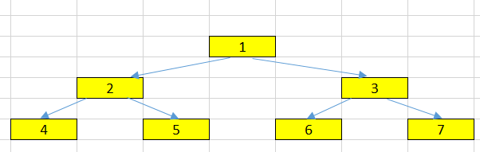

<br>

## Table of contents
- [Given problem](#given-problem)
- [Using recursive version](#using-recursive-version)
- [Using iterative version](#using-iterative-version)
- [When to use](#when-to-use)
- [Benefits and Drawbacks](#benefits-and-drawbacks)
- [Wrapping up](#wrapping-up)


<br>

## Given problem

Given a binary tree, return the level order traversal of its node's value.



The output of the above binary tree is:

```java
1 --> 2 --> 3 --> 4 --> 5 --> 6 --> 7
```

<br>

## Using recursive version

1. The first action we need to do is to calculate the maximum level of the tree.

    The level of node is defined by 1 + the number of edges between a node and the root node.

    The level of root node is 1.

    ```java
    Level = Depth + 1
    ```

    The maximum level of above tree is 3.

2. After we had the tree's maximum level, we will iterate from level 1 to the maximum level, then get all elements of each level.

<br>

## Using iterative version


<br>

## When to use

- 


<br>

## Benefits and Drawbacks


<br>

## Wrapping up


<br>

Refer:

[https://www.geeksforgeeks.org/level-order-tree-traversal/](https://www.geeksforgeeks.org/level-order-tree-traversal/)

[https://leetcode.com/problems/binary-tree-level-order-traversal/](https://leetcode.com/problems/binary-tree-level-order-traversal/)