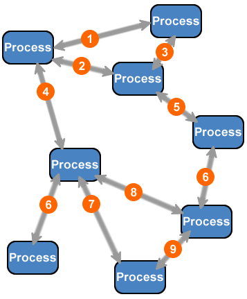

 

## Table of contents
- [Given Problem](#given-problem)
- [Solution of Event-driven architecture pattern](#solution-of-event-driven-architecture-pattern)
- [When to use](#when-to-use)
- [Benefits & Drawback](#benefits-&-drawback)
- [Code C++ /Java / Javascript](#code-c++-/java-/-javascript)
- [Related Patterns](#related-patterns)
- [Wrapping up](#wrapping-up)

 

## Given Problem

 

## Solution of Event-driven architecture pattern

 

## When to use

 

## Benefits & Drawback

 

## Code C++ /Java / Javascript

 

## Related Patterns

 

## Wrapping up

 

Refer:

[Software architecture pattern ebook]()

[Designing Event-driven Applications Using Apache Kafka Ecosystem By Bogdan Sucaciu](https://app.pluralsight.com/library/courses/designing-event-driven-applications-apache-kafka-ecosystem/table-of-contents)

[https://www.confluent.io/blog/apache-kafka-for-service-architectures/](https://www.confluent.io/blog/apache-kafka-for-service-architectures/)

[https://stackoverflow.com/questions/54875234/request-based-vs-event-based-architecture](https://stackoverflow.com/questions/54875234/request-based-vs-event-based-architecture)