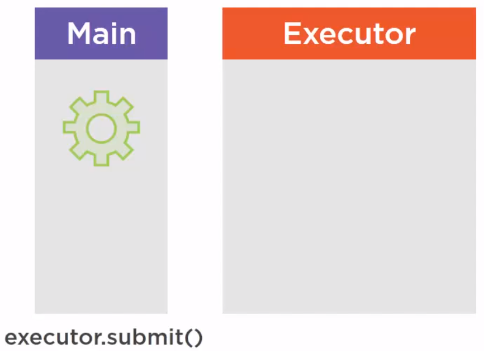
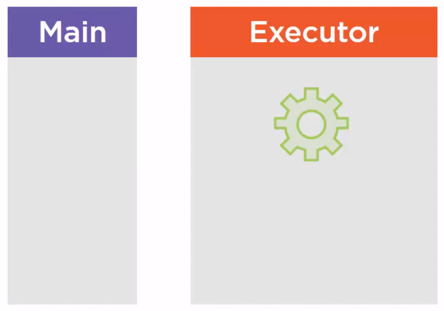
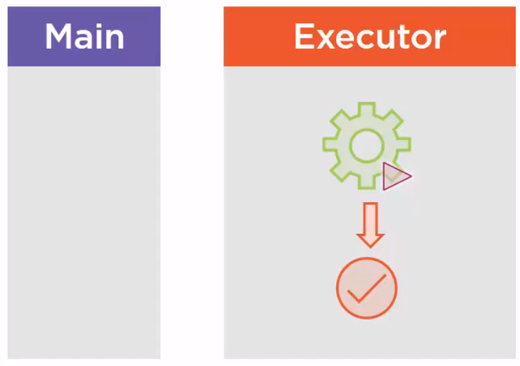

<br>

## Table of contents
- [Understanding about Callable](#understanding-about-callable)
- [Understanding about Future](#understanding-about-future)
- [Understanding about CompletableFuture](#understanding-about-completablefuture)
- [Wrapping up](#wrapping-up)


<br>

## Understanding about Callable

1. Given problem

    To understand why we need Callable functional interface, we need to take closer look at Runnable interface.

    ```java
    Runnable task = () -> someReallyLongProcess();
    Executor executor = Executors.newSingleThreadExecutor();
    executor.execute(task);
    ```

    There are several caveats in this Runnable interface:
    - The **run()** method of Runnable interface does not return anything. It means that no object can be returned and no exception can be raised.

        Suppose our task involved some kind of database quering. The database query is something we might want to execute in another thread because it can be a long-running process. This query can go longer and the standard way to tell that in the JDK is to throw a SQL exception, and if it goes well, it will simply produce a result. This result or this exception cannot be transmitted through the Runnable task.

    - There is no way we can know if a task is done or not, if it has complete normally or exceptionally, and this task cannot produce any result.

    So, we have some questions when using Runnable interface:
    - How can a task return a value?

    - How can we get the exceptions raised by a task?

    - How can this value or exception go from one thread to another?
    
        Because a task is created in a given thread, passed to a thread of an ExecutorService, and it is in this last thread that the result of the exception is created.
        
    So we need a new model for our tasks.
    - With a method that returns a value.
    - And that can throw an Exception.
    - We also need a new object that will act as a bridge between threads.

2. Solution

    Based on some drawbacks of Runnable interface, we have Callable interface to fix them. The Callable interface is a generated interface. It has a single method, just as the Runnable interface called call() method. This call() method returns an object of type V and may throw an Exception, so it does exactly what we need.

    ```java
    @FunctionalInterface
    public interface Callable<V> {

        V call() throws Exception;

    }
    ```

    As we saw the Executor interface does not handle **Callable** directly. It has a single method that takes a **Runnable** as a parameter. But the **ExecutorService** interface has a **submit()** method that takes a Callable as a parameter, and it returns a **Future** object --> this object is a wrapper on the object returned by the task, but it has also special functionalities. So to use **Callable** tasks, we have to use ExecutorService instead of Executors.

    ```java
    public interface ExecutorService extends Executor {

        // Submits a value-returning task for execution and returns a Future representing the pending results of the task.
        <T> Future<T> submit(Callable<T> task);

        // Submits a Runnable task for execution and returns a Future representing that task.
        Future<?> submit(Runnable task);

        // Submits a Runnable task for execution and returns a Future representing that task.
        <T> Future<T> submit(Runnable task, T result);
    }
    ```

<br>

## Understanding about Future

1. How does Future object works

    Suppose that we create a **Callable** in the main thread. This is the task we want to execute in the Executor we have, so we pass this task to the **submit()** method of this Executor.
    
    
    
    This task is then transmitted from the main thread to the **ExecutorService**.

    

    Now the **ExecutorService** is going to execute it in a thread of its own pool, which is of course, different from the main thread. This special thread will create a result whether it is a normal result or an exception.

    

    Then the **Executor** will have to pass this object from its thread to the main thread that created the task. This is precisely the the role of this Future object.

    

    In fact, the **Executor** will return a **Future** object that is going to hold the result of the execution of this task once it is available.

2. Understanding about **Future.get()** method

    Below is the source code that uses Future object with Callable interface.

    ```java
    // In the main thread
    Callable<String> task = () -> buildPatientReport();
    Future<String> future = executor.submit(task);

    String result = future.get();   // blocking here to get the result
    ```

    In the above code, we create the task in the main thread, then submit this task, and this **submit()** method will immediately return a Future object with the same type as the type of the **Callable**. Then we can call the **get()** method on this **Future** object. We can execute the other code before calling this **get()** method.

    There are two things can happen when we call **get()** method:
    - First, the object produced by the task is available, so the **get()** method will return that object immediately.

    - Second, the object produced by the task is not yet available. In that case, the **get()** method will not return immediately. It will block until the returned String is available.

    Now, we continue to find out about exceptions in **Future.get()** method. It can raise two exceptions:
    - In the case the thread of the executor is interrupted, it throws an **InterruptedException**.

        This exception is thrown if the thread from the Executor that is executing this task has been interrupted. It is possible to interrupt such a thread by issuing a shutdown command to the **Executor**.

    - The second case is that the task itself has thrown an exception. Imagine a query on a database and there has been some kind of error, so a SQL exception has been raised in the task internally. Then in that case, the **get()** method will wrap this root exception in an **ExecutionException** and throw it in the main thread.

    In a nutshell, this **get()** method may throw two kinds of exception, **InterruptedException**, meaning that something went wrong in the Executor itself, or **ExecutionException** to wrap an application exception thrown by the task.

    So, we have the behavior of **Future.get()** method:
    - If the task has completed, then the **get()** method call will return the produced result immediately. If it is not the case, then the **get()** call blocks until the result is ready.

    - If an exception has been thrown, then this exception is also thrown by the **get()** call, wrapped in an **ExecutionException**.

        We can pass a timeout to the **get()** call, to avoid indefinitely blocking calls. So for instance, if we think that the result should be made available in less than a second, we can pass 1 second to this **get()** method and pass the time the **get()** method will throw an exception.

3. Some examples to use Callable correctly

    - Use timeout for **Future.get()** method

        ```java
        Callable<String> task = () -> {
            Thread.sleep(300);
            return "This is thread " + Thread.currentThread().getName();
        }

        ExecutorService executor = Executors.newFixedThreadPool(4);

        try {
            IntStream.range(0, 10).forEach(cnt -> {
                Future<String> future = executor.submit(task);
                System.out.println("Result: " + future.get(100, TimeUnit.MILLISECONDS));
            });
        } finally {
            executor.shutdown();
        }
        ```

    - Handling exceptions in Callable interface

        ```java
        Callable<String> task = () -> {
            throw new IllegalStateException("Throw exception in thread " + Thread.currentThread().getName());
        }

        ExecutorService executor = Executors.newFixedThreadPool(4);

        try {
            IntStream.range(0, 10).forEach(cnt -> {
                Future<String> future = executor.submit(task);
                System.out.println("Result: " + future.get(100, TimeUnit.MILLISECONDS));
            });
        } finally {
            executor.shutdown();
        }
        ```

<br>

## Understanding about CompletableFuture


<br>

## Wrapping up


<br>

Refer:

[https://crondev.blog/2017/01/23/timeouts-with-java-8-completablefuture-youre-probably-doing-it-wrong/](https://crondev.blog/2017/01/23/timeouts-with-java-8-completablefuture-youre-probably-doing-it-wrong/)

[https://medium.com/@zengcode/executorservice-with-timeout-98befeab8f50](https://medium.com/@zengcode/executorservice-with-timeout-98befeab8f50)

[https://www.callicoder.com/java-callable-and-future-tutorial/](https://www.callicoder.com/java-callable-and-future-tutorial/)

[https://docs.oracle.com/javase/7/docs/api/java/util/concurrent/Future.html#get(long,%20java.util.concurrent.TimeUnit)](https://docs.oracle.com/javase/7/docs/api/java/util/concurrent/Future.html#get(long,%20java.util.concurrent.TimeUnit))

[https://www.baeldung.com/java-future](https://www.baeldung.com/java-future)

[https://www.baeldung.com/java-completablefuture](https://www.baeldung.com/java-completablefuture)

[https://www.baeldung.com/java-runnable-callable](https://www.baeldung.com/java-runnable-callable)

[https://www.deadcoderising.com/timeout-support-using-executorservice-and-futures/](https://www.deadcoderising.com/timeout-support-using-executorservice-and-futures/)

[https://dzone.com/articles/asynchronous-timeouts](https://dzone.com/articles/asynchronous-timeouts)

[https://www.codepedia.org/ama/how-to-make-parallel-calls-in-java-with-completablefuture-example](https://www.codepedia.org/ama/how-to-make-parallel-calls-in-java-with-completablefuture-example)

[http://software-empathy.pl/2016/11/asynchronous-call-using-completablefuture/](http://software-empathy.pl/2016/11/asynchronous-call-using-completablefuture/)

[Advanced Java Concurrent Patterns by Jose Paumard](https://app.pluralsight.com/library/courses/java-concurrent-patterns-advanced/table-of-contents)