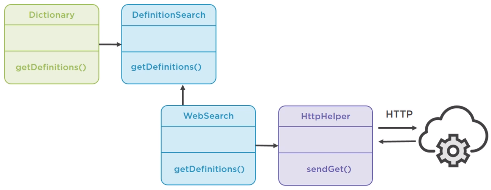
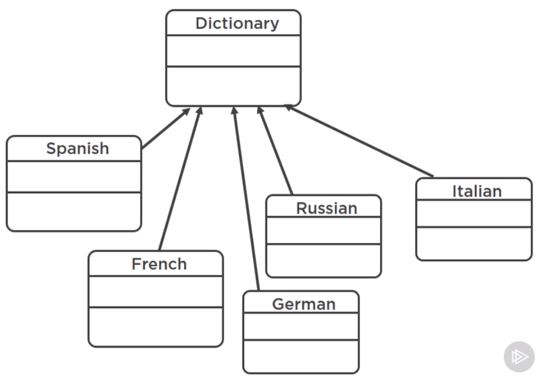

<br>

## Table of contents
- [Given problem](#given-problem)
- [Using Dependency Inversion principle]()
- [Using static factory method]()
- [Using factory method pattern]()
- [Using abstract factory pattern]()
- [Wrapping up]()


<br>

## Given problem

Supposed that we have a project that is used to search a word. The information of our words is got from the multiple services. Below is the structure of some parts in our application.



We have a **Dictionary** class with a single method **getDefinitions()**. It delegates this task to an implementation of definition search service, which uses the native HttpClient to talk to a real Web service.

Below is the source code of **WebServiceDefinitionSearch.java** and **Dictionay.java** file.

```java
public class Dictionary {
    private final DefinitionSearch search;

    public Dictionary() {
        this.search = new WebServiceDefinitionSearch();
    }

    public List<String> getDefinitions(String word) {
        return search.getDefinition(word);
    }
}

public class WebServiceDefinitionSearch implements DefinitionSearch {
    private static final String URL = "...";
    private final HttpHelper httpHelper;

    public WebServiceDefinitionSearch() {
        this.httpHelper = new HttpHelper();
    }

    @Override
    public List<String> getDefinition(String word) {
        String responseBody = this.httpHelper.sendGet(URI + word);
        return extractDefinitions(responseBody);
    }
}

public static main(String[] args) {
    Dictionary d = new Dictionary();
    List<String> definitions = d.getDefinitions("computer");
    definitions.forEach(System.out::println);
}
```

Currently, our project is working fine with English dictionary, but one day, it needs to support the multiple languages such as French, Spanish, ... But in Dictionary class, we are using the no-arg constructor, so we can not let client code decide which language they want. Then, we need the dedicated class for each language, and that would result in way too many classes.



Another problem is the stability of our unit tests.

```java
@Test
public void dictTest() {
    Dictionary d = new Dictionary();
    List<String> definitions = d.getDefinitions("hello");
    assertEquals(definitions.size(), 3);
}
```

In an above unit test, we create a web service object inside the constructor of **Dictionary** class. The Dictionary class forces us to rely on a real Web service, which is relatively slow on potentially unstable. It means that if our URI in **WebServiceDefinitionSearch** class is wrong, then our service is not working.

Below is the benefits and drawbacks of no-arg constructor.
- Benefits

    - Simple client code

- Drawbacks

    - Inflexible when we have multiple languages because we are using the default language is English.
    - Unstable tests because we also need to change when having a new requirement.


<br>

## Using Dependency Inversion principle

We can solve the above issues by using Dependency Injection principle. It means that we do not initilize the instance of DefinitionSearch in Dictionary class, we will pass its instance as parameter of Dictionary constructor.

```java
public Dictionary(DefinitionSearch search) {
    this.search = search;
}
```

So, in our test case, we have:

```java
private class DummyService implements DefinitionSearch {
    @Override
    public List<String> getDefinition(String word) {
        return null;
    }
}

@Test
public void mockTest() {
    Dictionary d2 = new Dictionary(new DummyService());
}
```

Then, below is the source code of **main()** method.

```java
public static void main(String[] args) {
    Dictionary d2 = new Dictionary(new WebServiceDefinitionSearch());
    List<String> definition2 = d2.getDefinitions("book");
    definition2.forEach(System.out::println);
}
```

So, using dependency injection, we have some benefits and drawbacks:
- Benefits

    - stable tests
    - flexible

- Drawbacks

    - The client code becomes more complicated. It needs to know about and provides search object to the Dictionary.

And we didn't solve the problem of providing dictionaries in different languages. But **WebServiceDefinitionSearch** instance is dependency which language to search. So, we will define the enum type of **Language**.

```java
public enum Language {

    ENGLISH("en"),

    SPANISH("es");

    private String language;

    Language(String language) {
        this.language = language;
    }

    @Override
    public String toString() {
        return this.language;
    }
}

public class WebServiceDefinitionSearch implements DefinitionSearch {
    // ...
    private Language language;

    // ...

    public WebServiceDefinitionSearch(Language language) {
        this.httpHelper = new HttpHelper();
        this.language = language;
    }

    public WebServiceDefinitionSearch(HttpHelper httpHelper, Language language) {
        this.httpHelper = httpHelper;
        this.language = language;
    }

    // modify the getDefinition() method to adapt with language
    @Override
    public List<String> getDefinition(String word) {
        String responseBody = this.httpHelper.sendGet(URI + word + "&lang=" + this.language);
    }
}
```

So, our source code in main() method looks like:

```java
public static void main(String[] args) {
    Dictionary d = new Dictionary(new WebServiceDefinitionSearch(new HttpHelper(), Language.SPANISH));
    List<String> definitions = d.getDefinitions("hola");
    definitions.forEach(System.out::println);
}
```

But our code has become even more complicated. So how to solve this issue?

<br>

## Using static factory method


<br>

## Using factory method pattern


<br>

## Using abstract factory pattern


<br>

## Wrapping up


<br>

Refer:

[Java: Refactoring to Design Patterns by Andrejs Doronins](https://app.pluralsight.com/library/courses/java-refactoring-design-patterns/table-of-contents)

[Refactoring by Martin Fowler]()

[Refactoring to Patterns by Joshua Kerievsky]()

[Effective Java by Joshua Block]()

[Head First Design Patterns]()

[Design Patterns: Elements of Reusable Object-Oriented Software by GoF]()