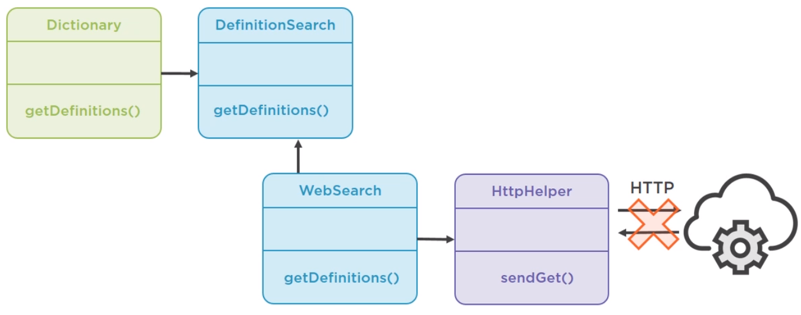
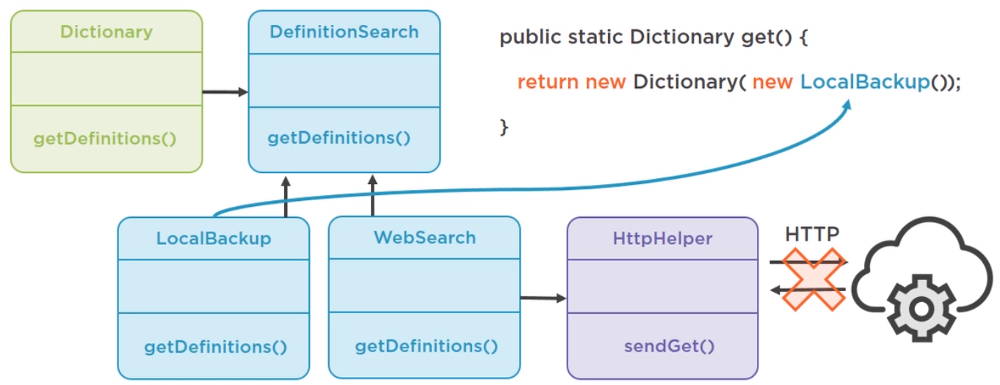
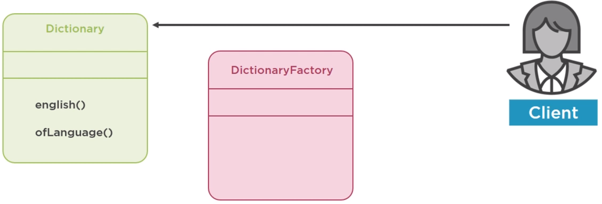
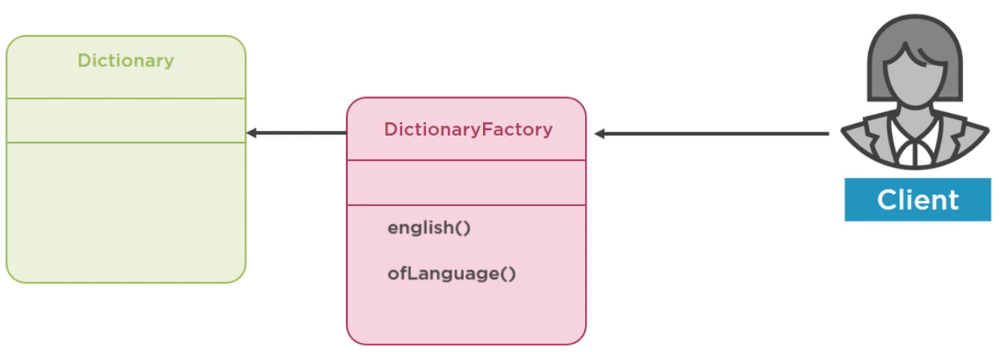
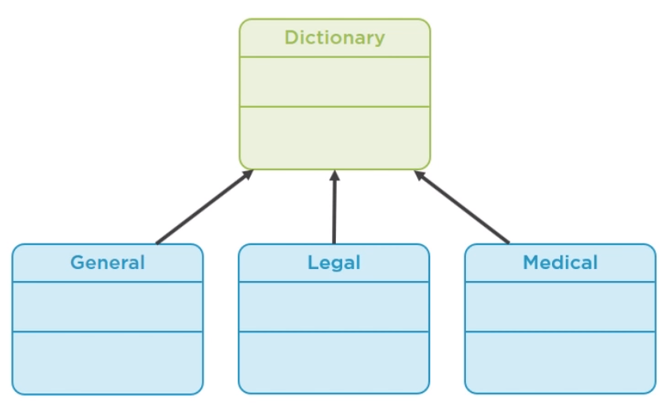

<br>

## Table of contents
- [Given problem](#given-problem)
- [Using Dependency Inversion principle]()
- [Using static factory method]()
- [Using factory method pattern]()
- [Using abstract factory pattern]()
- [Wrapping up]()


<br>

## Given problem

Supposed that we have a project that is used to search a word. The information of our words is got from the multiple services. Below is the structure of some parts in our application.


We have a **Dictionary** class with a single method **getDefinitions()**. It delegates this task to an implementation of definition search service, which uses the native HttpClient to talk to a real Web service.

Below is the source code of **WebServiceDefinitionSearch.java** and **Dictionay.java** file.

```java
public class Dictionary {
    private final DefinitionSearch search;

    public Dictionary() {
        this.search = new WebServiceDefinitionSearch();
    }

    public List<String> getDefinitions(String word) {
        return search.getDefinition(word);
    }
}

public class WebServiceDefinitionSearch implements DefinitionSearch {
    private static final String URL = "...";
    private final HttpHelper httpHelper;

    public WebServiceDefinitionSearch() {
        this.httpHelper = new HttpHelper();
    }

    @Override
    public List<String> getDefinition(String word) {
        String responseBody = this.httpHelper.sendGet(URI + word);
        return extractDefinitions(responseBody);
    }
}

public static main(String[] args) {
    Dictionary d = new Dictionary();
    List<String> definitions = d.getDefinitions("computer");
    definitions.forEach(System.out::println);
}
```

Currently, our project is working fine with English dictionary, but one day, it needs to support the multiple languages such as French, Spanish, ... But in Dictionary class, we are using the no-arg constructor, so we can not let client code decide which language they want. Then, we need the dedicated class for each language, and that would result in way too many classes.


Another problem is the stability of our unit tests.

```java
@Test
public void dictTest() {
    Dictionary d = new Dictionary();
    List<String> definitions = d.getDefinitions("hello");
    assertEquals(definitions.size(), 3);
}
```

In an above unit test, we create a web service object inside the constructor of **Dictionary** class. The Dictionary class forces us to rely on a real Web service, which is relatively slow on potentially unstable. It means that if our URI in **WebServiceDefinitionSearch** class is wrong, then our service is not working.

Below is the benefits and drawbacks of no-arg constructor.
- Benefits

    - Simple client code

- Drawbacks

    - Inflexible when we have multiple languages because we are using the default language is English.
    - Unstable tests because we also need to change when having a new requirement.


<br>

## Using Dependency Inversion principle

We can solve the above issues by using Dependency Injection principle. It means that we do not initilize the instance of DefinitionSearch in Dictionary class, we will pass its instance as parameter of Dictionary constructor.

```java
public Dictionary(DefinitionSearch search) {
    this.search = search;
}
```

So, in our test case, we have:

```java
private class DummyService implements DefinitionSearch {
    @Override
    public List<String> getDefinition(String word) {
        return null;
    }
}

@Test
public void mockTest() {
    Dictionary d2 = new Dictionary(new DummyService());
}
```

Then, below is the source code of **main()** method.

```java
public static void main(String[] args) {
    Dictionary d2 = new Dictionary(new WebServiceDefinitionSearch());
    List<String> definition2 = d2.getDefinitions("book");
    definition2.forEach(System.out::println);
}
```

So, using dependency injection, we have some benefits and drawbacks:
- Benefits

    - stable tests
    - flexible

- Drawbacks

    - The client code becomes more complicated. It needs to know about and provides search object to the Dictionary.

And we didn't solve the problem of providing dictionaries in different languages. But **WebServiceDefinitionSearch** instance is dependency which language to search. So, we will define the enum type of **Language**.

```java
public enum Language {

    ENGLISH("en"),

    SPANISH("es");

    private String language;

    Language(String language) {
        this.language = language;
    }

    @Override
    public String toString() {
        return this.language;
    }
}

public class WebServiceDefinitionSearch implements DefinitionSearch {
    // ...
    private Language language;

    // ...

    public WebServiceDefinitionSearch(Language language) {
        this.httpHelper = new HttpHelper();
        this.language = language;
    }

    public WebServiceDefinitionSearch(HttpHelper httpHelper, Language language) {
        this.httpHelper = httpHelper;
        this.language = language;
    }

    // modify the getDefinition() method to adapt with language
    @Override
    public List<String> getDefinition(String word) {
        String responseBody = this.httpHelper.sendGet(URI + word + "&lang=" + this.language);
    }
}
```

So, our source code in main() method looks like:

```java
public static void main(String[] args) {
    Dictionary d = new Dictionary(new WebServiceDefinitionSearch(new HttpHelper(), Language.SPANISH));
    List<String> definitions = d.getDefinitions("hola");
    definitions.forEach(System.out::println);
}
```

But our code has become even more complicated. So how to solve this issue?

<br>

## Using static factory method

To solve an above problem, we can use creation method or static factory method.

For example, with creation method or factory method.

```java
// creation method or factory method
public DictionaryCopier {

    // ...

    public copy(Dictionary d) {
        Dictionary copy = /*clone it */;
        return copy;
    }

    public static copy(Dictionary d) {
        Dictionary copy = /*clone it */;
        return copy;
    }

}

// ClientApp.java
Dictionary d1 = new Dictionary();

// call a creation method
Dictionary d2 = new DictionaryCopier().copy(d1);

// call a static method
Dictionary d3 = DictionaryCopier.copy(d1);

```

The **copy()** method is called **creation method**, or **factory method**, a method that creates and returns a new object.

In the case of the **static factory method**, the code is the almost same. We just add ```static``` keyword to this **copy()** method. It means that creation methods and static factory methods are pratically the same.

So, in this our case, we only need the static factory method.

For example, some static factory methods in Java.

```java
Calendar.getInstance();

String.valueOf(true);

LocalDate.of(2019, 01, 01);

Optional.empty();

Collections.unmodifiableCollection(...);
```

Come back to our problem, we will define the static factory method for some languages in **WebServiceDefinitionSearch** class.

```java
public class WebServiceDefinitionSearch implements DefinitionSearch {
    public static WebServiceDefinitionSearch newInstance() {
        return new WebServiceDefinitionSearch(new HttpHelper(), Language.ENGLISH);
    }

    public static WebServiceDefinitionSearch newForeignLanguageInstance(Language language) {
        return new WebServiceDefinitionSearch(new HttpHelper(), language);
    }
}
```

Then, in Dictionary class, we will define some methods for English dictionary or Spanish Dictionary.

```java
public class Dictionary {

    public static Dictionary english() {
        return new Dictionary(newInstance())
    }

    public static Dictionary spanish() {
        return new Dictionary(newForeignLanguageInstance(Language.SPANISH));
    }

    public static Dictionary withLanguage(Language language) {
        return new Dictionary(new newForeignLanguageInstance(language));
    }

}
```

Now, we have the code in the client side looks like:

```java
public static void main(String[] args) {
    Dictionary d4 = Dictionary.english();
    Dictionary d5 = Dictionary.spanish();

    List<String> definitions4 = d4.getDefinitions("tea");
    definitions4.forEach(System.out::println);

    List<String> definitions5 = d4.getDefinitions("hola");
    definitions4.forEach(System.out::println);
}
```

So, we can find that when we need english or spanish dictionary, we only need to call **Dictionary.english()** method or **Dictionary.spanish()** method. We don't need to know how it gets constructed. It's really concise, easy to read, understand, and change.

If our english dictionary gets called very frequently, we might want to cache this value. Then, we will modify our Dictionary class.

```java
public class Dictionary {
    private static final Dictionary ENG = new Dictionary(newForeignLanguageInstance(Language.ENGLISH));

    // ...

    public static Dictionary english() {
        return ENG;
    }

}
```

Now we have another situation where this might be useful. Imagine that the web service is is down, but we do not want to wait for it to be backup. So we should fail back on local dictionary with the limited support. But that's better than nothing.



We could create another implementation of the search service and then swap it if we need. We want to swap this at runtime, not changed the code, recompile and deliver a new version.



So, we will define the local backup version for our web service.

```java
public class LocalBackupDefinitionSearch implements DefinitionSearch {
    public static LocalBackupDefinitionSearch newInstance() {
        return new LocalBackupDefinitionSearch();
    }

    @Override
    public List<String> getDefinition(String word) {
        String content;
        try {
            content = Files.readString(Paths.get("resources/BackupLocalDefinitions.json"), StandardCharsets.UTF_8);
        } catch (IOException e) {
            throw new UnCheckedIOException(e);
        }

        String sub1 = content.substring(content.indexOf("word\": \"" + word) + 4);
        String sub2 = sub1.substring(0, sub1.indexOf("word\": \""));

        return extractDefinitions(sub2);
    }
}
```


<br>

## Using factory method pattern

1. Given problem

    Supposed that our dictionary becomes more complex over time. We might add a synonym finder or example provider dependencies as new features.

    ```java
    public class Dictionary {
        // ...

        public static Dictionary withLanguage(Language language) {
            return new Dictionary(newInstance(),
                                  new SynonymFinder(),
                                  new ExampleProvider());
        }
    }
    ```

    It makes our code base more complexity. But they do not do anything useful. So, basically, our static factory method doesn't write in one line of code.

2. Solution

    So, it would be resonable to move them to a dedicated class. Just move the static methods to a dedicated factory class
    
    
    
    and then let the client use that to create dictionaries.

    

    Then, we have our factory method pattern.

    ```java
    public class SimpleDictinaryFactory {
        public static Dictionary newDictionaryWith(Language language) {
            return new Dictionary(new newForeignLanguageInstance(language));
        }

        public static Dictionary english() {
            return new Dictionary(newInstance())
        }

        public static Dictionary spanish() {
            return new Dictionary(newForeignLanguageInstance(Language.SPANISH));
        }

    }
    ```

    But our factor method pattern uses switch statement to return subtypes.

    Our Dictionary class is used for common things. But in real life, there are many specialized dictionaries such as legal dictionary, medical dictionary, ...

    

    So, we will create dedicated classes for each.
    - We need to create an enum type of DictionaryType for multiple Dictionary's type.

        ```java
        public enum DictionaryType {
            
        }
        ```

    - Our current implementation of Dictionary class is for common things. So, we will rename this dictionary class to **GeneralDictionary** class.
    - Create an interface Dictionary with a single method and make our GeneralDictionary implements this interface.

        ```java
        public interface Dictionary {
            List<String> getDefinitions(String word);
        }

        public class GeneralDictionary implements Dictionary {
            // do something
        }
        ```
    
    - Then create our LegalDictionary class.

        ```java
        public class LegalDictionary implements Dictionary {
            private Language language;

            poublic LegalDictionary(Language language) {
                this.language = language;
            }

            public List<String> getDefinitions(String word) {
                return List.of("Not implemented yet");
            }

        }
        ```


<br>

## Using abstract factory pattern


<br>

## Wrapping up

- The static factory method uses to construct the complex objects.


<br>

Refer:

[Java: Refactoring to Design Patterns by Andrejs Doronins](https://app.pluralsight.com/library/courses/java-refactoring-design-patterns/table-of-contents)

[Refactoring by Martin Fowler]()

[Refactoring to Patterns by Joshua Kerievsky]()

[Effective Java by Joshua Block]()

[Head First Design Patterns]()

[Design Patterns: Elements of Reusable Object-Oriented Software by GoF]()