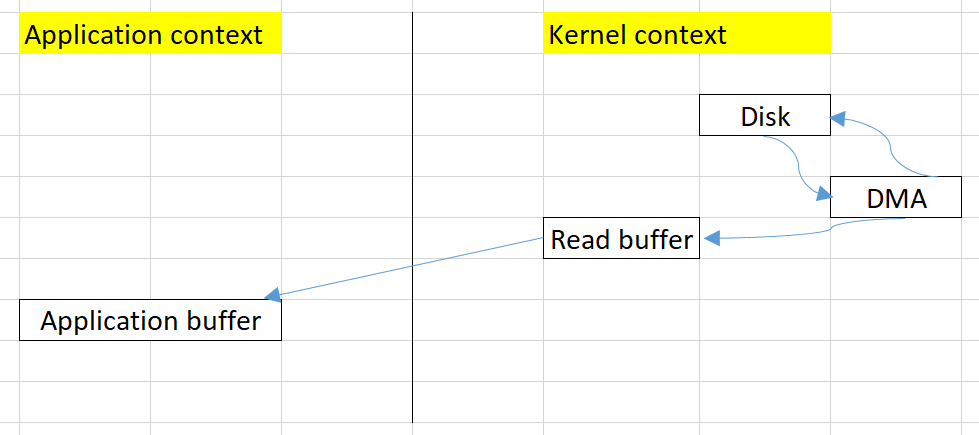
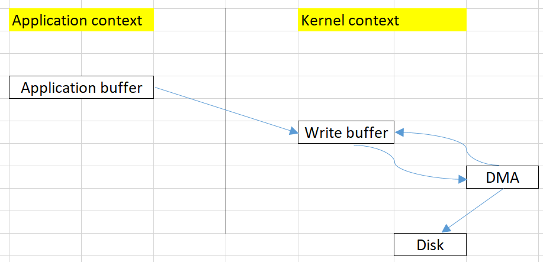

<br>

## Table of contents
- [Given problem](#given-problem)
- [Solution with Zero copy](#solution-with-zero-copy)
- [When to use](#when-to-use)
- [Applications and Examples](#applications-and-examples)
- [Wrapping up](#wrapping-up)


<br>

## Given problem

Suppose that we need to copy the content of a file to an another file. Using Java we can have the source code.

```java
FileInputStream in = new FileInputStream("in.txt");
FileOutputStream out = new FileOutputStream("out.txt");
int c;

while ((c = in.read()) != -1) {
    out.write(c);
}

in.close();
out.close();
```

Normally, it is the basic way when we are working with file. But we do not understand about the drawbacks of this way. So, belows are some steps of Read operation and Write operation.

1. Read operation

    

    To take a look at this read operation of the above problem, we can have some notes:
    - There are **two copy operations**.

        - First copy operation is that copy from **disk** to **read buffer** in **kernel context**.
        - Second copy operation is that copy from **read buffer** to **application buffer** of **application context**.

    - There are **two context switching** between **application context** and **kernel context**.

        - The first context switching is when we call **read()** method in application, then we need to call **sys_read()** method to read data from the file.
        - The second context switching is when we need to copy from **read buffer** of **kernel context** to **application buffer** of **application context**.

2. Write operation

    

    To take a look at this write operation of the above problem, we can have some notes:
    - There are two copy operations.

        - 
        - 

    - There are two context switching between application context and kernel context.


<br>

## Solution with Zero copy


<br>

## When to use


<br>

## Applications and Examples


<br>

## Wrapping up


<br>

Refer:

[https://developer.ibm.com/articles/j-zerocopy/](https://developer.ibm.com/articles/j-zerocopy/)

[https://labs.septeni-technology.jp/none/zero-copy-va-toi-uu-data-transfer/](https://labs.septeni-technology.jp/none/zero-copy-va-toi-uu-data-transfer/)

[https://en.wikipedia.org/wiki/Zero-copy](https://en.wikipedia.org/wiki/Zero-copy)