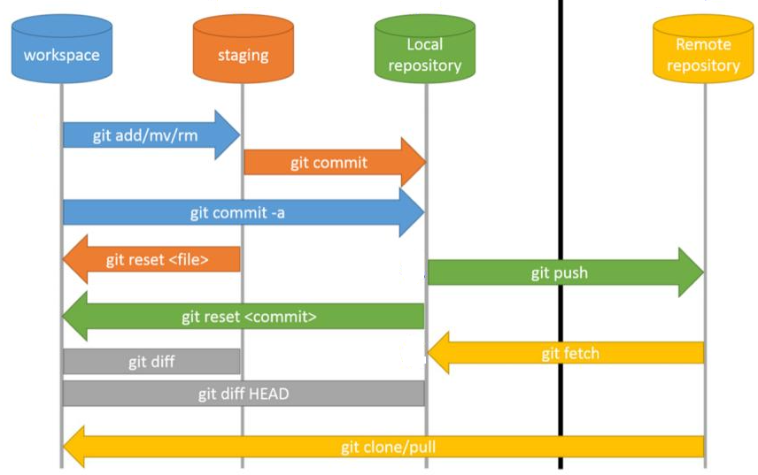

<br>

## Table of Contents
- [Given problem](#given-problem)
- []()
- []()
- []()
- []()
- []()


<br>

## Given problem

Normally, when working with Git, the local modifications will be staged or indexed. Then they will be considered as a commit with a specific version - SHA1 in the local repository. To synchronize between the local repository and the remote repository, we need to use **git push** command.

But there are some cases that we want to do with these commits such as revert or undo our actions, recommend the already commits, ...

How do we deal with it?

<br>

## The structure of Git

Before going straight forward to our problems, we will look at an image that describe the flows of Git.



So, belows are actions of **git commit** command.
- Using **git add** command to index all untracked or modified files before using **git commit** command.

- Syntax

    ```bash
    git commit <options>
    ```

    The meaning of some options:
    - **-a** ot **--all**: automatically stage files that have been modified or deleted. It does not affect to the new files.

    - **-C <commit>** or **--reuse-message=<commit>**: use the message of the specific commit.

    - **-c <commit>** or **--reedit-message=<commit>**: edit the commit message by using editor.

    - **-m** or **--message=<msg>**: define a message for our commit.

    - **--allow-empty-message**: when using script files with git, we can use this option.

    - **--amend**: it will modify the last commit by adding the current changes to it.

        ```bash
        git commit --amend
        ```

<br>

## Push commits to the remote branch

1. To the remote branch that has already existed

    ```bash
    # if we are in the local branch that is correpsonding the remote branch
    git push
    ```

2. To the new branch that hasn't already existed in remote repository

    ```bash
    git push -u origin <branch-name>
    ```

    **-u** means **--set-upstream**.

<br>

## Take a commit from a branch to the other branch

1. Syntax

    ```bash
    git cherry-pick
    ```

2. 


<br>

## Revert commits of a branch

1. Using git reset command


2. Using git checkout command


3. Using git revert command


<br>

## Remove a commit

1. Syntax

    ```bash
    
    ```


<br>

## 


<br>

## 


<br>

## Wrapping up


<br>

Refer:

[https://kipalog.com/posts/Undo--mot-commit-trong-git-tree](https://kipalog.com/posts/Undo--mot-commit-trong-git-tree)

[https://quantrimang.com/hoat-dong-update-trong-git-157692](https://quantrimang.com/hoat-dong-update-trong-git-157692)

[https://medium.com/@nguynthanhhip/m%E1%BB%99t-s%E1%BB%91-c%C3%A2u-l%E1%BB%87nh-git-ph%E1%BB%95-bi%E1%BA%BFn-b5d5f63b7ddc](https://medium.com/@nguynthanhhip/m%E1%BB%99t-s%E1%BB%91-c%C3%A2u-l%E1%BB%87nh-git-ph%E1%BB%95-bi%E1%BA%BFn-b5d5f63b7ddc)

[https://quantrimang.com/hoat-dong-update-trong-git-157692](https://quantrimang.com/hoat-dong-update-trong-git-157692)

[https://dodangquan.blogspot.com/2019/01/revert-initial-git-commit.html](https://dodangquan.blogspot.com/2019/01/revert-initial-git-commit.html)

[https://dodangquan.blogspot.com/2018/10/git-delete-branch-by-pattern.html](https://dodangquan.blogspot.com/2018/10/git-delete-branch-by-pattern.html)

[https://www.programmersought.com/article/60051711556/](https://www.programmersought.com/article/60051711556/)

