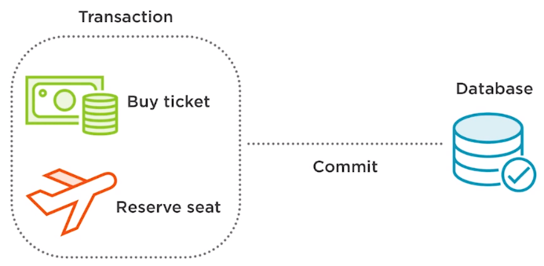

<br>

## Table of contents
- [Introduction to Transaction](#introduction-to-transaction)
- [Using transaction with Spring](#using-transaction-with-spring)
- [Implementing declarative transaction management](#implementing-declarative-transaction-management)
- [Implementing programmatic transaction management](#implementing-programmatic-transaction-management)
- [Understanding programmatic transaction management and declarative transaction management](#understanding-programmatic-transaction-management-and-declarative-transaction-management)
- [Wrapping up](#wrapping-up)


<br>

## Introduction to Transaction
1. Transaction

    

    The first thing that we need to know is what a transaction actually is. A series actions that are treated as a single unit of work is consider as transaction. Although there are multiple actions in a single transaction, all should either fail as a group or complete entirely as a group.

    When a single action in the group fails, all actions should be rolled back. If all actions complete, then the transaction should be permanently committed. There are four key properties to transactions that can be easily remembered using the ACID acronym.
    - Atomicity, a transaction consists of a series of actions, and the approach is an all-or-nothing approach. The transaction must either fully happen or not happen at all. It cannot partially complete.
    - Consistency, a transaction is committed once all of its actions have completed. This keeps our data in a consistent state.
    - Isolation, each transaction is isolated from other transactions to ensure that data is not corrupted. Isolation ensures that one transaction cannot read data from another transaction.
    - Durability, a durable transaction is one that cannot be undone by system failure typically because it is written to persistent storage.

2. Transaction Management

    Transaction management ensures data consistency and integrity. The ability to properly manage transactions is essential to enterprise application development because most enterprise apps almost always persists data to a database. Without transaction management, data could end-up in an consistent state and become corrupted.

    To understand the importance of the trasanction, think of a common example, buying a airline ticket online using a credit card.
    
    

    In an online airline, ticket booking system, a booking may consists of two separate actions that together form a single transaction, paying for the seat and then reserving a seat and then reserving a seat, and removing it from inventory for the customer that just paid. Now think of the situation where the amount is charged to the credit card but a seat is never reserved nor confirmed for the passenger due to a system error. The data is left in an inconsistent state. The booking transaction should use transaction management so that both steps are performed as a single unit of work and all complete entirely as a group or fail as a group are rolled back.

    ```java
    try {
        conn = dataSource.getConnection();
        conn.setCommit(false);
        ticket.buy()
        seat.reseve();
        conn.commit();
    } catch (SQLException e) {
        conn.rollback();
    }
    ```

    In this scenario, setting the correct boundaries for the transaction is important. When should a transaction start? When should a transaction end? When should the transaction be committed to the database? And when should data be rolled back in the case of exception?

    Without transaction management, our data would be left in an inconsistent state. We are lucky that Spring provides transaction management support.

    In a typical environment, there are two types of transactions, global and local.
    - Global transactions are used when multiple resources manage the transactions and are typically managed by the application server, allowing for access to multiple resources like message queues, relational databases, ...
    - Local transactions are typically associated with a specific resource like a JDBC connection, and this resource manages the transaction. Local transactions do not typcially run in a global environment.

3. The advantage of Spring framework

    The Spring framework allows transactions to be managed seamlessly by offering a consistent programming model across global and local transactions. Essentially code is written once benefitting from different transaction management strategies within different environement.

    Spring provides supports for programmatic transaction management. Now this is where the developer writes custom code to manage the transaction and set boundaries. Spring also provides support for declarative transaction management, which allows developers to seperate transaction management from the business code.

    Spring supports isolation levels that help developers avoid problems that may arise when multiple transactions in the application are operating concurrently on the same data.

<br>

## Using transaction with Spring


<br>

## Implementing declarative transaction management


<br>

## Implementing programmatic transaction management


<br>

## Understanding programmatic transaction management and declarative transaction management


<br>

## Wrapping up


<br>

Refer:

[Data Transactions with Spring](https://app.pluralsight.com/library/courses/data-transactions-spring/table-of-contents)