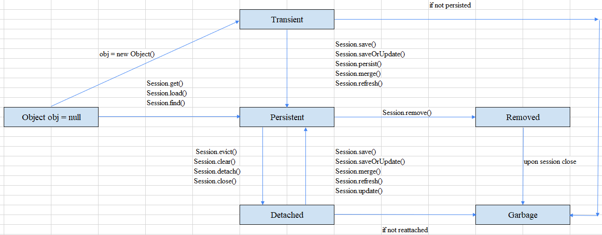

<br>

## Table of contents
- [Given problem](#given-problem)
- [Solution of Hibernate framework](#solution-of-hibernate-framework)
- [Benefits and Drawbacks](#benefits-and-drawbacks)
- [Wrapping up](#wrapping-up)


<br>

## Given problem


<br>

## Solution of Hibernate framework

Before jumping directly into the lifecycle of the entity's state in Hibernate, we need to be aware of some concepts's definition.
1. Entity Manager Factory

    It is a factory class of EntityManager. It is used to create multiple instances of EntityManager class.

    If we need to access multiple databases, we must configure one EntityManagerFactory per a database.

2. Persistence Context

3. EntityManager

    **EntityManager** is an interface provides some operations to interact with entities that are managed by Persistence Context. An **EntityManager** is associated with a persistence context.

    From Hibernate framework 5.2 and above, **Session** interface extends from **javax.persistence.EntityManager**.

    ```java
    public interface Session extends SharedSessionContract, EntityManager, HibernateEntityManager, AutoCloseable, Closeable {
        // ...
    }
    ```

    But from the lower Hibernate versions, **Session** interface doesn't extend from JPA's EntityManager.

    ```java
    public interface Session extends SharedSessionContract, java.io.Closeable {
        // ...
    }
    ```

    So, we need to take care which version that we currently use it.

    There are two types of **EntityManager**:
    - Container-managed

        The container-managed **EntityManager** means that the lifecycle of the **EntityManager**'s instances are completely in charge of the Spring container or Java EE's CDI, or briefly called as IoC container. It means that the flow of a transaction such as start a transaction, commit a transaction, and rollback, and the allocation, deallocation of an EntityManager managed by the IoC container.

        Suppose that our application has multiple **EntityManager**s, each operation of **EntityManager** will transform from an entity's A state to B state. But we know that a Persistence Context is a place that managed entities of our application, a question rises in our mind: **Can the B state of that entity be reflected to that same entity that is used by another EntityManager?**.

        The answer is **Yes, it can**. The Persistence Context is automatically propagated with the current JTA transaction, and **EntityManager** references that are mapped to the same persistence unit provide access to the persistence context within that transaction. By automatically propagating the persistence context, the Spring' beans or JavaEE's application components don't need to pass references to EntityManager instances to each other in order to make changes within a single transaction.

        To use properly an **EntityManager** in a Spring's Bean or JavaEE's application component, inject it with an annotation **@PersistenceContext**:

        ```java
        @PersistenceContext
        private EntityManager em;
        ```

    - Application-managed

        The application-managed EntityManager means that the **EntityManager**'s instances are managed by ourself or our applicaltion. 

        To answer an above question about the state of an entity in the container-managed EntityManager, the Persistence Context isn't propagated to Spring Beans or JavaEE's application components, and the lifecycle of EntityManager is managed by the applicaton.

        When to use:
        - When applications need to access a persistence context that is not propagated with the JTA transaction across **EntityManager** instances in a particular Persistence Unit. In this case, each **EntityManager** creates a new, isolated persistence context. The **EntityManager** and its associated persistence context are created and destroyed explicitly by the application.

        - When directly injecting **EntityManager** instances can't be done because **EntityManager** instances are not thread-safe. **EntityManagerFactory** instances are thread-safe.

        To utilize correctly a EntityManager instance, we can do like that.

        ```java
        // create EntityManagerFactory
        // 1st way:
        @PersistenceContext
        private EntityManagerFactory emf;

        // 2nd way
        private EntityManagerFactory emf = Persistence.createEntityManagerFactory(Constant.DEFINED_UNIT_NAME);

        // create EntityManager
        EntityManager em = emf.createEntityManager();
        ```

    The **EntityManager** instances are not thread-safe, so it doesn't work right away in a concurrent environment, then we need to use a single **EntityManager** per request. We need to take care about using an **EntityManager** instance. Because in Spring framework, the default scope of bean is singleton, so when we inject an container-managed EntityManager instance into a bean by an annotation **@PersistenceContext**, it means that we currently utilize that **EntityManager** instance as a singleton object. This is a bug.

    According to [https://www.baeldung.com/hibernate-entitymanager](https://www.baeldung.com/hibernate-entitymanager), we find that Spring container or Java EE CDI will inject a special proxy instead of a simple EntityManager. Spring injects a proxy of type **SharedEntityManagerCreator**. Every time we use the injected EntityManager, this proxy will either reuse the existing **EntityManager** or create a new one. The conclusion for this problem is that the container ensures that each **EntityManager** is confined to one thread.

4. Persistence Unit

    A persistence unit specifies all entity tables, which are managed by the EntityManagers of the application. Each persistence unit contains all classes representing the data stored in a single database.

    Normally, to provide the entity tables's name as a persisten unit, we should fill its name when [configured in an EntityManagerFactory](https://docs.oracle.com/cd/E19798-01/821-1841/bnbrj/index.html).

5. Entity

    An entity is a lightweight persistent domain object. Each entity class will represent a table in our database, and an entity's instance will contain the data of a single row of that table.

    Each entity will have an **id** field that represents the primary key in the table.

    To define correctly an Entity class, we need to follow [some requirements](https://docs.oracle.com/cd/E19798-01/821-1841/6nmq2cpai/index.html):
    - The class must be annotated with the javax.persistence.Entity annotation.

    - The class must have a public or protected, no-argument constructor. The class may have other constructors.

    - The class must not be declared final. No methods or persistent instance variables must be declared final.

    - If an entity instance is passed by value as a detached object, such as through a session bean’s remote business interface, the class must implement the Serializable interface.

    - Entities may extend both entity and non-entity classes, and non-entity classes may extend entity classes.

    - Persistent instance variables must be declared private, protected, or package-private and can be accessed directly only by the entity class’s methods. Clients must access the entity’s state through accessor or business methods.

A this time, we will continue to discuss about the lifecycle of an entity or about the entity's states.

Below is an image that describe the relationship between an entity's state.



1. Transient state

2. Persistent state

3. Detached state

4. Removed state

<br>

## Benefits and Drawbacks


<br>

## Wrapping up

- With the container-managed EntityManager, the persistence context is shared across the multiple Spring Beans or JavaEE's application components. Otherwise, it's not right for the application-managed EntityManager.

- 

- 

<br>

Refer:

[https://ducmanhphan.github.io/2020-02-16-the-architecture-of-JPA/](https://ducmanhphan.github.io/2020-02-16-the-architecture-of-JPA/)

[https://medium.com/@superjunior.dev/hibernate-ph%C3%A2n-bi%E1%BB%87t-c%C3%A1c-h%C3%A0m-save-persist-update-merge-saveorupdate-c1140663bc59](https://medium.com/@superjunior.dev/hibernate-ph%C3%A2n-bi%E1%BB%87t-c%C3%A1c-h%C3%A0m-save-persist-update-merge-saveorupdate-c1140663bc59)

[https://www.baeldung.com/jpa-hibernate-persistence-context](https://www.baeldung.com/jpa-hibernate-persistence-context)

[https://docs.jboss.org/hibernate/orm/4.0/devguide/en-US/html/ch03.html](https://docs.jboss.org/hibernate/orm/4.0/devguide/en-US/html/ch03.html)

[https://stackoverflow.com/questions/19930152/what-is-persistence-context](https://stackoverflow.com/questions/19930152/what-is-persistence-context)

[https://docs.jboss.org/hibernate/entitymanager/3.6/reference/en/html_single/#architecture](https://docs.jboss.org/hibernate/entitymanager/3.6/reference/en/html_single/#architecture)

[https://docs.oracle.com/javaee/7/api/javax/persistence/EntityManager.html](https://docs.oracle.com/javaee/7/api/javax/persistence/EntityManager.html)

[https://docs.oracle.com/javaee/7/tutorial/persistence-intro003.htm](https://docs.oracle.com/javaee/7/tutorial/persistence-intro003.htm)