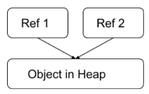
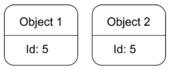
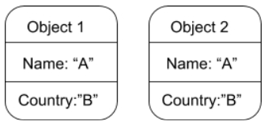

 

## Table of contents

 

## Given problem

 

## Solution of Entity pattern

 

## Some types of equality

There are three types of equality.
1. Reference equality

    

    Reference equality means that two objects are deemed to be equal if they reference the same address in the memory.

2. Identifier equality

    

    Identifier equality implies a class has an ID field. Two instances of such a class would be equal if they have the same idenfifiers.

3. Structural equality

    

    

 

## 

 

## Wrapping up

 

Refer:

[https://labs.septeni-technology.jp/technote/on-currying-and-partial-function-application/](https://labs.septeni-technology.jp/technote/on-currying-and-partial-function-application/)