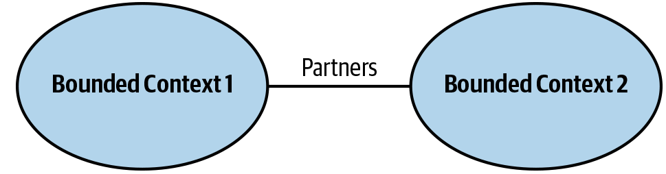
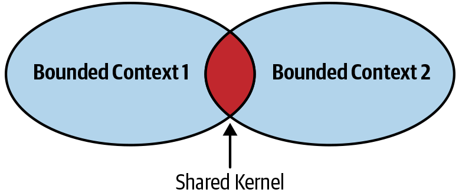

<br>

## Table of contents
- [Given problem](#given-problem)
- [Solution with Bounded Contexts](#solution-with-bounded-contexts)
- [Some types of the Bounded Contexts' relationship](#some-types-of-the-bounded-contexts'-relationship)
- [Some common problems in Bounded Contexts](#some-common-problems-in-bounded-contexts)
- [Benefits and Drawbacks](#benefits-and-drawbacks)
- [Wrapping up](#wrapping-up)


<br>

## Given problem


<br>

## Solution with Bounded Contexts

1. Introduction to Bounded Context

    The term **bounded context** refers to the circumstances in which certain words of the ubiquitous language have certain meaning. Each context uses a particular dialect of the ubiquitous language, and each one is optimized to solve a specific problem.

2. The relationship between Bounded Contexts and CAP Theorem

    Bounded contexts also offer benefits over enterprise data models in terms of the CAP theorem. An enterprise data model represents one tightly interconnected cluster of nodes in the distributed system where consistency is prioritized over availability. Any party that needs a consistent view of any part of the enterprise needs to make a connection to this one cluster. The more consumers that connect to it, the less available it becomes. The only way to combat this trend is to reduce the likehood of a network partition by spending more money on expensive hardware and network management.

    An enterprise model forces us to scale up rather than scaling out, but a bounded context represents a smaller cluster of nodes. It's decoupled from the other contexts. Because it has its own model, it's not reliant upon its connection to those other contexts. It can make decisions based only on the information that it has on hand. A bounded context could be written to favor availability over consistency. If the system of record is down, then the downstream system is unaffected. It already has a cache of the data that it needs organized and optimized for the problems that it is designed to solve. This isn't automatic. We have to conscientiously choose to build this kind of capability using CQRS, Event Sourcing, or any the other patterns and techniques, but this is a choice that we don't easily have if we use an enterprise data model.

3. Some examples about Bounded Contexts

    - Student Management System

        In this system, a student can register the online courses, pay for their courses, and then they will be tagged in these courses. Next, students and teachers will be annouced when a course starts.

        Based on their features, we have 4 bounded contexts:
        - Registration

            This is the first step to process the course registration of a student.

        - Payment

            This bounded context will be responsible for:
            - processing the course fee based on the information of a student's account bank.
            - take note the status of payment for their course.
            - pay money for teachers.

        - Scheduler

            After finishing the course's payment completely, the Scheduler bounded context will take action.
            - preventing the duplication or overlap times between courses.
            - check whether or not the teachers/courses are available.

        - Notification

    - Pharmacy application

        In the pharmacy network, we found that we had three bounded context. These were ```Rebates```, ```Sales```, and ```Performance```.

        - The Rebates bounded context captured all the rules of the rebate contracts. It was primarily the domain of the account manager. They would specify the measured product groups for each of the Rebates, their measurement methods, and the awarded tiers, and they would set up the roles of the contracts.

        - The Sales bounded context recorded the sales history of each member. Information from the e-commerce and fulfillment systems fed into the sales area.

        - The Performance bounded context calculated the performance of each member toward each of the rebates. It combined the rebated specifications with the sales data to perform its calculations. It presented the outcome of these calculation in the form of report cards for the members to view online.

        For example, in the Rebate context, we were primarily interested in providing the account manager with the capability of editing the roles of a rebate contract, but once a rebate enters the performance context, it needs to be optimized for a different purpose. In Performance context it needs to be optimized for rapid calculation. The data structures that we chose in each context were subtly different to satisfy each need.

        In the Rebate context, they tended to be more mutable and interactive so that the account managers could make changes, but in the Performance context, they tended toward immutable and pluggable strategies so that we could form them into a pipeline of calculations.

<br>

## Some types of the Bounded Contexts' relationship

1. Bounded Contexts's relationship

    In each bounded context, we will use ubiquitous language to model the business objects. There is no relationship between domain models of the other bounded contexts. The biggest benefits of this way is that it isolates the complexity of our business logic, and reduce the effects of the changes from the customer's requirements.

    But a question arises in our mind: **Do the bounded contexts have the relationship together?**. The answer is that absolutely they have, simply because to run completely the business logic, we need to combine bounded contexts together.

    Belows are some pattern groups that describe the relationships and integrations between bounded contexts.
    - Cooperation
    - Customer-Supplier
    - Seperate ways

2. Types of Bounded Contexts' relationship

    Supposed that in our project, each team will manage one bounded context. So, to understand about the relationship between bounded contexts, we need to be aware of the constraints between teams in a project.

    - Cooperation

        Cooperation patterns relate to the bounded contexts implemented by teams with well-established communication.

        Naturally, this requirement is fullfilled for bounded contexts that are implemented by the same team. It also applies to teams that have dependent goals, where the success of one team depends on the other's and vice versa. Again, the main criterion is the quality of the team's communication and collaboration.

        - Partnership

            In the partnership model, the integration between bounded contexts is coordinated in an ad hoc manner. A team can notify a second one about a change in the API, and the second team will cooperate and adapt. No drama or conflicts.

            

            The coordination of integration is two-way. No one team dictates the language that is used for defining the contracts. The teams can work out the differences, and choose the most appropriate solution. Also, both sides cooperate in solving any integration issues that might come up. Neither team is interested in blocking the other one.

            Well-established collaboration practices, high levels of commitment, and frequent synchronizations between teams are all required for successful integration in this manner.

            Note that this pattern might not be a good fit for geographically distributed teams, since it may present synchronization and communication challenges.

        - Shared Kernel

            The shared kernel is a more formal way of defining a contract between multiple bounded contexts. Here, instead of ad hoc integrations, the contract is defined explicitly in a compiled library—the shared kernel. The library defines the integration methods and language used by both bounded contexts.

            

            The shared kernel is both referenced and owned by multiple bounded contexts. Each team is free to modify the compiled library that defines the integration contract. A change to the contract can break the other team's build, though; hence, as in the partnership case, this pattern requires high levels of commitment and synchronization between teams.

            A peculiar detail about the shared kernel pattern is that in a way, it contradicts a core principle of bounded contexts: that only one team can own a bounded context. Here we extract a shared part of multiple bounded contexts into its own bounded context. As a result, the shared bounded context is jointly owned by multiple teams.

            The key to implementing the shared kernel pattern is to keep the scope of the shared kernel small, and limited to the integration contract only.

        One team owning multiple bounded contexts
        - It's worth mentioning that a shared kernel is a natural fit for integrating bounded contexts that are owned and implemented by the same team. In such a case, an ad hoc integration of the bounded contexts can “wash out” the contexts’ boundaries over time. A shared kernel can be used for explicitly defining the integration contract.

            Moreover, in this scenario, the one team ownership principle is not broken—both bounded contexts are implemented by the same team.

    - Customer-Supplier


        - Conformist


        - Anticorruption layer


        - Open-Host service

    - Seperate Ways

        - Communication Issues


        - Generic Subdomains


        - Model Differences


        - 


3. Context Maps


<br>

## Some common problems in Bounded Contexts

1. The difference between Model and Domain Model


2. The difference between sub-domain and bounded context


<br>

## Benefits and Drawbacks

1. Benefits


2. Drawbacks


<br>

## Wrapping up


<br>

Refer:

[Modelling Bounded Contexts with the Bounded Context Canvas: A Workshop Recipe](https://medium.com/nick-tune-tech-strategy-blog/modelling-bounded-contexts-with-the-bounded-context-design-canvas-a-workshop-recipe-1f123e592ab)

[DDD Strategic Patterns: How To Define Bounded Contexts](https://codeburst.io/ddd-strategic-patterns-how-to-define-bounded-contexts-2dc70927976e)

[BoundedContext](https://martinfowler.com/bliki/BoundedContext.html)

[Practical DDD: Bounded Contexts + Events => Microservices](https://www.infoq.com/presentations/microservices-ddd-bounded-contexts/)

[https://vngeeks.com/bounded-context/](https://vngeeks.com/bounded-context/)

[https://dzone.com/articles/implementing-a-bounded-context](https://dzone.com/articles/implementing-a-bounded-context)

[Defining Bounded Contexts — Eric Evans at DDD Europe](https://www.infoq.com/news/2019/06/bounded-context-eric-evans/)

[Discovering the Domain Architecture](https://www.microsoftpressstore.com/articles/article.aspx?p=2248811)

[https://www.oreilly.com/library/view/what-is-domain-driven/9781492057802/ch04.html](https://www.oreilly.com/library/view/what-is-domain-driven/9781492057802/ch04.html)