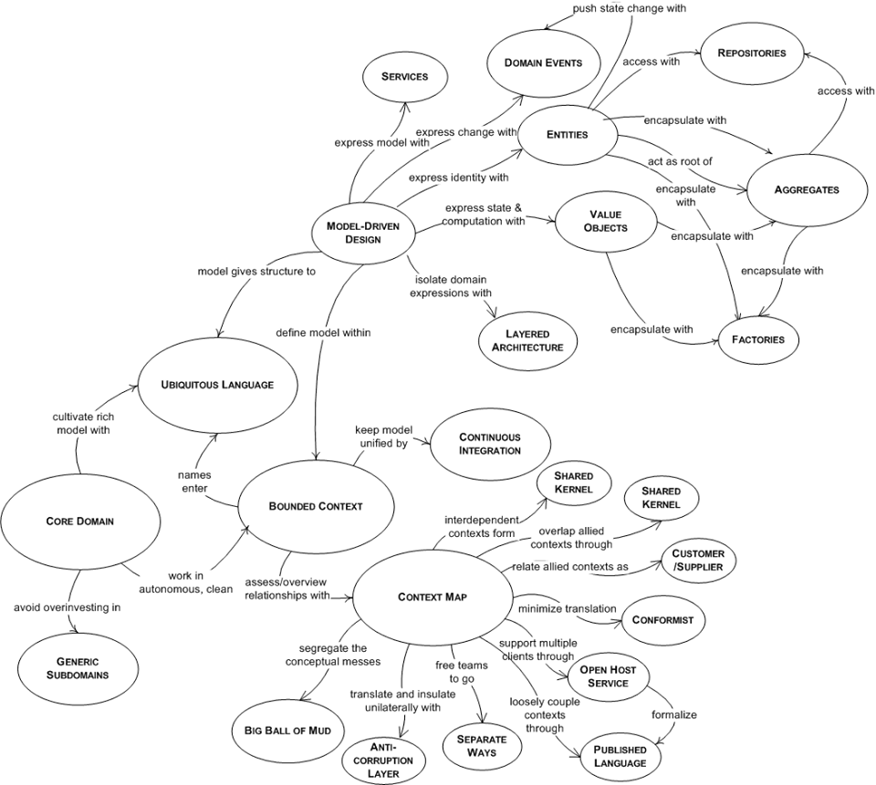
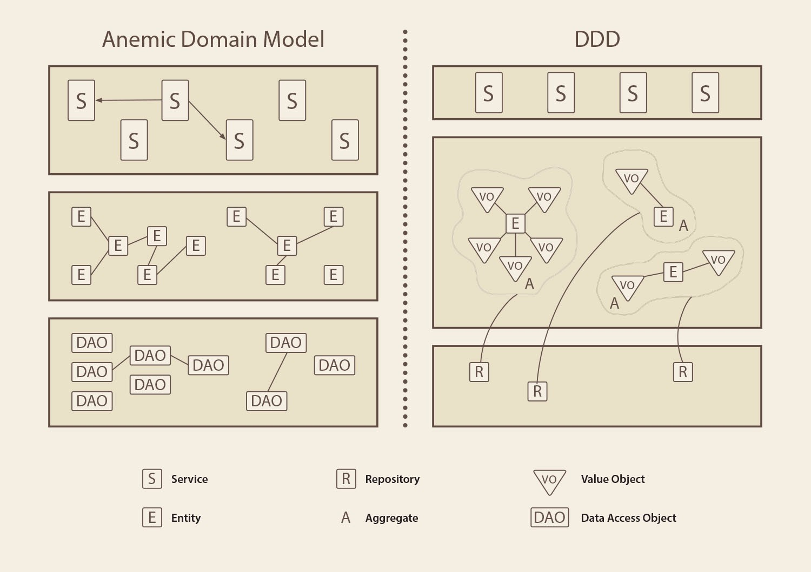

<br>

## Table of contents
- [Given problem](#given-problem)
- [Solution with Domain Model pattern](#solution-with-domain-model-pattern)
- [Source code](#source-code)
- [When to use](#when-to-use)
- [Benefits and Drawbacks](#benefits-and-drawbacks)
- [Wrapping up](#wrapping-up)

<br>

## Given problem

We knew that 3-layer architecture can be depicted as the following image.


The Domain layer wil contain the business logic that implements some operations such as validation, business rules, ... Then, in reality, the service classes will posses these implementations.

And the data of our Domain is represented through by Entities. Each entity will have its own identity. It means that we can differentiate between entities relied on their identity. Next, entities are also reflected to the records in the database. To persist entities, the service classes will call the repository object to do that job.

From my understanding about Domain Model, we have the concept Anemic Domain Model that has the relationship between the service classes and entities.

```
Anemic Domain Model = Entity + Service
```

Drawbacks of Anemic Domain Model:
- The approach of Anemic Domain Model is the data first, not domain logic. So, it doesn't adapt to the changes of the customer' s requirements.

- Lack of encapsulation.

    To know more about encapsulation in object-oriented programming, we can refer to the following [link](https://ducmanhphan.github.io/2019-12-19-encapsulation-in-object-oriented-programming/).

- Difficult to maintain because the business (domain) logic will be used to expand in multiple layers. So when we want to add a new functionality or fix an existed feature, it is a conundrom.

- The domain will be splitted in the multiple layers such as persistence layer, or sometimes, web layer. 

Therefore, how do we solve the anemic domain model's problems? 

<br>

## Solution with Domain Model pattern

To summary about some patterns of Domain-Driven Design, we can refer to the below image.



But in this article, we only concentrate mostly on the Domain Model pattern.
1. Definition of Domain Model


2. Types of Domain Model

    - Anemic Domain Model


        It's a model which seperates data and operation working with them from each other. In most of the time, our domain consists of two separated classes. One is the entity, which is holding data, the other is the stateless service, which operates with an entity. We may use more than one service class to operates with an entity.

        Entity is simply a class that contains some necessary information that will be saved to database. Normally, we use entity to map a record from a table to an object in our program by taking advantage of ORM framework such as Hibernate, Eclipse Link, Entity framework, ...

        Stateless service is a class that implements business logic, not contains data model. Normally, it is only a method, and interact with an entity. A stateless service can be called the other stateless services, or call the DAO in the persisten layer to communicate with a database.

        Drawbacks of Anemic Domain Model:
    - Rich Domain Model


        

<br>

## Source code


<br>

## When to use


<br>

## Benefits and Drawbacks


<br>

## Wrapping up

- Business logic contains domain logic and application logic.

    - Domain logic does something purely with the problem domain such as strategies for calculating revenue recognition on a contract. Domain logic contains validation, calculations, and business rules.

    - Application logic has to do with application responsibilities such as notifying contract administrators, and integrated applications, or revenue recognition calculations.

        Application logic is sometimes referred to as **workflow logic**:

<br>

Refer:

[https://danielrusnok.medium.com/what-is-anemic-domain-model-and-why-it-can-be-harmful-2677b1b0a79a](https://danielrusnok.medium.com/what-is-anemic-domain-model-and-why-it-can-be-harmful-2677b1b0a79a)

[https://blog.pragmatists.com/domain-driven-design-vs-anemic-model-how-do-they-differ-ffdee9371a86](https://blog.pragmatists.com/domain-driven-design-vs-anemic-model-how-do-they-differ-ffdee9371a86)

[https://www.martinfowler.com/bliki/AnemicDomainModel.html](https://www.martinfowler.com/bliki/AnemicDomainModel.html)

[https://enterprisecraftsmanship.com/posts/always-valid-domain-model/](https://enterprisecraftsmanship.com/posts/always-valid-domain-model/)

[https://enterprisecraftsmanship.com/posts/domain-model-purity-lazy-loading/](https://enterprisecraftsmanship.com/posts/domain-model-purity-lazy-loading/)

[]()

[]()

[]()