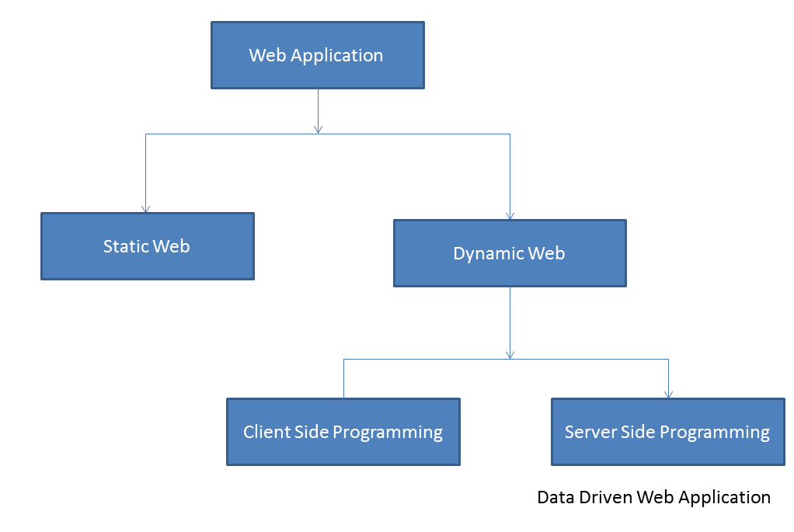
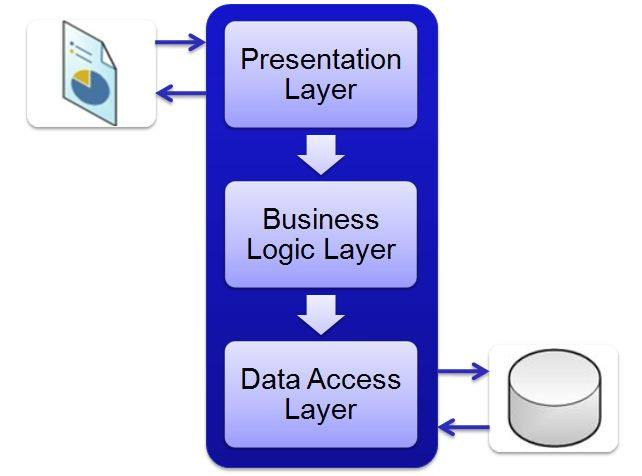
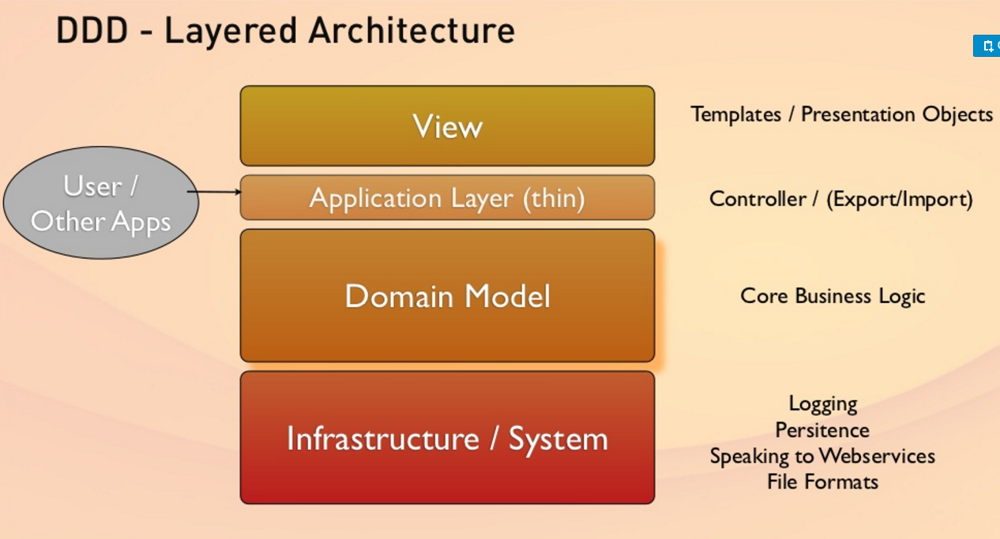
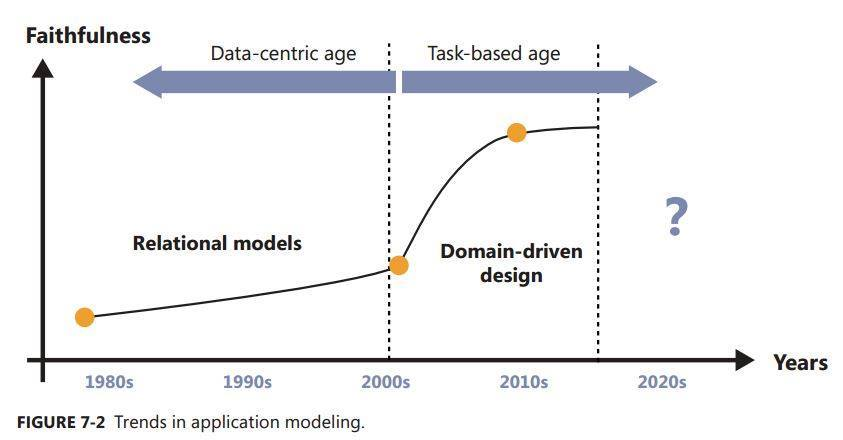

Vốn dĩ chưa có ý định viết về Domain Driven Design nhưng hôm nay vớ phải cái dự án làm outsource cho khách hàng có dùng cái này nên viết cái bài này để dọn đường cho anh em trước khi triển khai dự án.

Mặc dù outsource là việc làm bất đắc dĩ trong thời điểm khó khăn hiện nay, nhưng tinh thần tiến công của startup là không thay đổi. Mà đã làm startup thì  đối diện với bất cứ điều gì suy nghĩ đầu tiên bật ra trong đầu cũng là “Start with why?”.  Vậy thì Domain Driven Design là cái quái gì và tại sao lại cần phải dùng đến nó?  Nó  có phải là thứ bổ béo gì không mà phải mất công lằng nhằng tìm hiểu?

Trở ngại lớn đối với nhận thức của con người là khi chúng ta phải đối mặt với những cái mới tức là những  thứ  hoàn toàn không quen thuộc chúng ta cảm thấy mơ hồ vì không biết bấu víu vào đâu, và cách để con người lĩnh hội và nắm bắt được những cái mới là đưa nó về những cái cũ đã biết.

Một thứ mà chúng ta đã quá quen thuộc là khái niệm ứng dụng web, tuy nhiên không phải  developer nào cũng  để ý đặt câu hỏi xem có những loại ứng dụng web nào?  Chúng ta cùng nhìn lại hình dưới đây để điểm qua lịch sử phát triển của các ứng dụng web.  



Ứng dụng web chia ra làm 2 loại là web tĩnh  ( static web ) và web động ( dynamic web ). Khái niệm web tĩnh có lẽ đã trở nên mờ nhạt với nhiều người vì nó được sử dụng từ nhiều năm trước thời kỳ đầu của kỹ nguyên web.  Nó được gọi là tĩnh vì nội dung của trang web không thay đổi khi nó được load trên browser,  người dùng chỉ nhìn thấy một nội dung mới khi họ click vào 1 hyperlink nào đó trên trang và 1 trang web khác với nội dung cố định được load về.Các trang web hiện thời mà chúng ta đang truy nhập tất nhiên là loại web động với nội dung thường xuyên biến đổi và phong phú hơn web tĩnh rất nhiều.  Song  Dynamic web cũng được chia làm 2 loại.Một loại là DOM Scripting dựa trên việc sử dụng ngôn ngữ phía client là javascript để thao tác trên Document Object Model ( Chữ viết tắt là DOM ) để biến đổi nội dung trang web nên nó được gọi là Client Side Programming và trang web mà browser đọc được là DHTML viết tắt của ```Dynamic Html=Html+ Javascript```

Còn loại còn lại là Server Side Programming  bởi vì nội dung trang web được xử lý  trên server  để trả về cho browser. Và vì những nội dung hiển thị trên trang web được lấy từ database lên, khi thông tin trong database được cập nhật thì nội dung hiển thị trên trang web cũng được tự động cập nhật theo nên loại web này được gọi là data driven web và nó cũng là loại ứng dụng web phổ biến nhất hiện nay.


Đến đây thì chúng ta đã thấy là 1 Web Application quen thuộc được nhìn dưới một khái niệm có vẻ mới là Data Driven Web. Khái niệm này tương thích với kiến trúc ứng dụng 3 lớp mà chúng ta vẫn thường thấy.   



Vì nó là thứ thường thấy và quá quen thuộc nên chẳng mấy ai đề cập rằng kiến trúc này thuộc loại kiến trúc Data Driven Design và chỉ khi xuất hiện khái niệm Domain Driven Design thì chúng ta mới cần lật lại mô hình kiến trúc cũ để tạo ra một tương quan so sánh giữa 2 mô hình mới và cũ. Vậy những điểm cơ bản giống và khác nhau giữa 2 loại mô hình kiến trúc ( architectural pattern )  này là gì.

Ứng dụng Data Driven Design còn có một tên gọi khác là Database Centric Application tức là ứng dụng lấy database làm trung tâm, coi database trái tim của ứng dụng. Tại sao ư? Chẳng  phải cách làm truyền thống của chúng ta khi xây dựng một ứng dụng thì việc đầu tiên của chúng ta làm sẽ là thiết kế database trước đúng không?  Vì database là yếu  tố tĩnh nhất của ứng dụng. Chúng ta thiết kế một schema tĩnh cho data trước tiên và mọi thứ sẽ lấy nó làm gốc.  Đó là lý do mà tầng Data Access  Layer trong mô hình 3 lớp là tầng đáy ở vị trị cái gốc của một thân cây. Tầng Presentation thì phụ thuộc và tầng Business Logic và tầng Business Logic lại phụ thuộc vào tầng Data Access Layer.  Đây là cách thiết kế : Orientation to Data hay còn gọi là Data Driven Design.

Ngoài loại Orientation To Data thì còn 1 số Orientation khác là Orientation to Action ( và implementation cụ thể của nó là Event Driven Programming  và Aspect Oriented Programing ) hay Orientation to Interface nhưng thôi mấy thằng này hôm nay không đem ra đâm chém ở đây, chúng ta chỉ lôi cổ thằng mà chúng ta quan tâm là Orientation to Logic đó chính là Domain Driven Desgin.

Nhưng cái tên  đó nó đã nêu ra ý đồ mà lão quái Eric Evans muốn đưa ra khi lão ấy phịa ra khái niệm Domain Drivent Design là muốn tập trung vào Domain, focus chính vào logic của bài toán chứ không phải là dữ liệu. Ở đây trái tim của ứng dụng sẽ nằm ở Domain chứ không phải Database như cách thiết kế các ứng dụng theo mô hình 3 lớp hiện thời.

Bây giờ câu hỏi why tiếp tục là tại sao lão ấy lại muốn focus vào Domain thay vì Data, lâu nay chúng ta vẫn thiết kế như thế kia đã thấy chết ai đâu?

Thường thì một giải pháp bao giờ cũng xuất hiện sau vấn đề, tức là chúng ta sẽ phải húc đầu vào đá trước và thấy đau rồi mới tính đi đường khác chứ không dung rỗi hơi mà đi kiếm dây thừng để trèo qua một khoảng không. Lão Eric kia cũng chẳng phải thần thánh gì cho cam, chẳng qua hơn chúng ta ở chỗ kinh nghiệm húc đầu vào đá mấy lần rồi nên lão mới nghĩ ra môn công phu mới kia.

Thực tế mà nói mô hình thiết kế 3 lớp có rất nhiều ưu điểm, nó rất dễ sử dụng và dễ implement. Vấn đề nảy sinh từ thực tế là  Data Driven Design lại khó tương thích với khái niệm lập trình hướng đối tượng OOP.  Trong các ứng dụng điển hình có rất nhiều phần code xử lý các task không liên quan đến logic nghiệp vụ ( Domain ) như truy cập file, mạng  hay database, các phần này thường được gọi là plumping code và được nhúng trực tiếp vào trong Business Object và nhiều Business Logic cũng được nhúng vào Behavior của UI Widget hay Script của Database, điều này thường xảy ra vì nó làm chúng ta phát triển ứng dụng một cách nhanh chóng. Việc này dẫn đến phần lớn thời gian phát triển ứng dụng ( Development Time ) của Developer là dành cho việc viết các plumping code thay vì viết Real Business Logic, nó làm cho thiết kế của chúng ta bị mất đi tính hướng đối tượng trong thực tế.

Ngoài ra khi logic của nghiệm vụ được trộn với các layer khác khiến cho việc đọc hiểu và suy nghĩ về logic của ứng dụng trở nên khó khăn hơn đối với những người ngoài. Chỉ một thay đổi nhỏ ở tầng UI cũng có thể dẫn tới việc thay đổi tầng logic và ngược lại khi thay đổi một business rule của ứng dụng đòi hỏi chúng ta phải quan tâm đến từng chi tiết nhỏ phía UI cũng như Database để đáp ứng được sự thay đổi này.

Trong những ứng dụng nhỏ thì vấn đề này là invisible và chúng ta không nhìn thấy. Ở các ứng dụng cỡ vừa ( medium-size ) thì vấn đề này đã tồn tại và bắt đầu dẫn đến tình trạng phá vỡ các thiết kế chuẩn ( Anti-pattern) . Và  đối với các ứng dụng lớn thì nó trở thành vấn đề nghiêm trọng và cần có action thích hợp để thay đổi, lúc đó chúng ta phải cầu cứu tới Domain Driven Design.

Lý do mà Data Driven Design thất bại là vì khi phát triển ứng dụng lớn thì Data Master là Technical Expert, họ hiểu về kỹ thuật nhưng lại không hiểu về các lĩnh vực chuyên sâu cụ thể ( Domain ) chẳng hạn như Y tế, Ngân hàng. Để hiểu được sâu logic của những bài toán trong lĩnh vực này cần đến các Domain Expert như là Bác sĩ hay Banker và các tiếp cận theo hướng Domain Driven Design huy động được contribution của các Domain Expert trong việc tham gia thiết kế khiến cho các context của ứng dụng nằm trong tầm kiểm soát tốt hơn. 



Ở đây mô hình Domain Driven Design vẫn giữ lại những ưu điểm của mô hình kiến trúc phân lớp ( Layered Archiecture ) để đảm bảo nguyên lý Seperation of Concern. Các phần logic xử lý khác nhau sẽ được cô lập ra khỏi các phần khác làm tăng tính Lose Coupling của ứng dụng và tính dễ đọc ( readity ) và dễ maintain source cũng như úng dụng khi có thay đổi logic của từng layer thì không ảnh hướng đến các layer khác.

Riêng phần Domain Model sẽ là phần core logic, trái tim của ứng dụng có dấu ấn rất lớn của các Domain Expert trong việc thiết kế nó. Còn phần database vốn được xem là trái tim của ứng dụng trong mô hình cũ sẽ được externalize ra ngoài thành một phần độc lập với logic nằm trong phần Infrastructure xếp chung với các cross-cutting concerns khác của ứng dụng, và khi business rule của ứng dụng có thay đổi thì nó cũng không ảnh hưởng nhiều đến phần này.



Tóm lại vai trò của 2 hướng tiếp cận trong việc thiết kế ứng dụng là khá rõ ràng. Data Driven Design sẽ chiếm ưu thế đối với các ứng dụng cỡ vừa và nhỏ còn Domain Driven Design là kẻ chiến thắng đối với các hệ thống lớn. Domain Driven Design sẽ làm phức tạp hóa các giải pháp khi đưa nó vào áp dụng trong các hệ thống nhỏ và yêu cầu nhiều về resource ( con người ) hơn trong việc phát triển và làm chậm time to market của sản phẩm. Vì vậy cần rất thận trọng khi lựa chọn Domain Driven Desgin cho hệ thống của mình. 

Bài viết đươc cung cấp bởi Mr Thành Nguyễn -  http://bit.ly/2e8siZX 
Bạn muốn tham gia vào chia sẻ và học hỏi sâu hơn về DDD ? Hãy join cùng chúng tôi: http://bit.ly/itec-ddd-fbevent