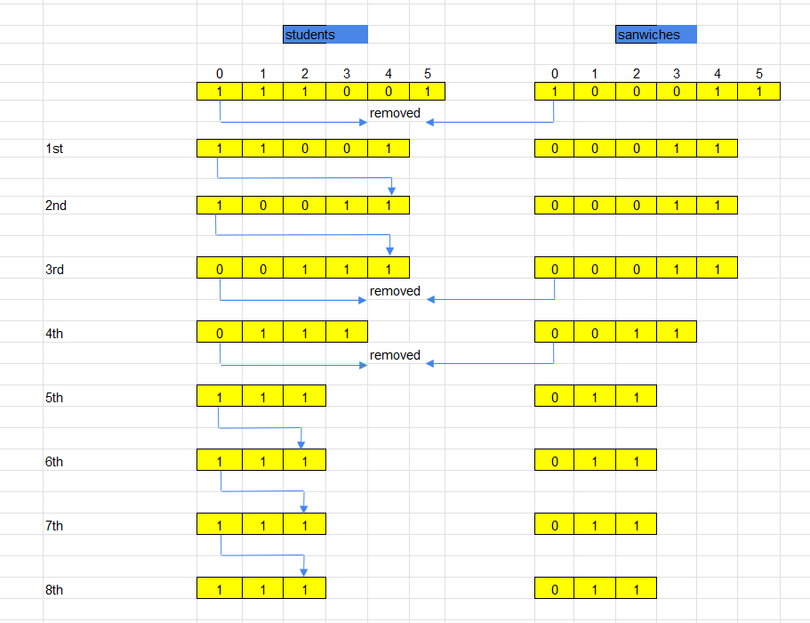

<br>

## Table of contents
- [Given problem](#given-problem)
- [Using brute force algorithm](#using-brute-force-algorithm)
- [Optimized the above solution](#optimized-the-above-solution)
- [Wrapping up](#wrapping-up)


<br>

## Given problem

The school cafeteria offers circular and square sandwiches at lunch break, referred to by numbers `0` and `1` respectively. All students stand in a queue. Each student either prefers square or circular sandwiches.

The number of sandwiches in the cafeteria is equal to the number of students. The sandwiches are placed in a `stack`. At each step:
- If the student at the front of the queue `prefers` the sandwich on the top of the stack, they will `take it` and leave the queue.
- Otherwise, they will `leave it` and go to the queue's end.

This continues until none of the queue students want to take the top sandwich and are thus unable to eat.

You are given two integer arrays `students` and `sandwiches` where `sandwiches[i]` is the type of the `i​​​​​​th` sandwich in the stack (`i = 0` is the top of the stack) and `students[j]` is the preference of the `j​​​​​​th` student in the initial queue (`j = 0` is the front of the queue). Return *the number of students that are unable to eat*.

```
Example 1:
Input: students = [1,1,0,0], sandwiches = [0,1,0,1]
Output: 0 
Explanation:
- Front student leaves the top sandwich and returns to the end of the line making students = [1,0,0,1].
- Front student leaves the top sandwich and returns to the end of the line making students = [0,0,1,1].
- Front student takes the top sandwich and leaves the line making students = [0,1,1] and sandwiches = [1,0,1].
- Front student leaves the top sandwich and returns to the end of the line making students = [1,1,0].
- Front student takes the top sandwich and leaves the line making students = [1,0] and sandwiches = [0,1].
- Front student leaves the top sandwich and returns to the end of the line making students = [0,1].
- Front student takes the top sandwich and leaves the line making students = [1] and sandwiches = [1].
- Front student takes the top sandwich and leaves the line making students = [] and sandwiches = [].
Hence all students are able to eat.

Example 2:
Input: students = [1,1,1,0,0,1], sandwiches = [1,0,0,0,1,1]
Output: 3
```

Constraints:
- `1 <= students.length, sandwiches.length <= 100`
- `students.length == sandwiches.length`
- `sandwiches[i]` is `0` or `1`.
- `students[i]` is `0` or `1`.


<br>

## Using brute force algorithm

Below is the sequence of steps for this problem:



From the image above, we can see that:
- From the 1st step to 5th step, we are doing like the mechanism of this problem.

    - Remove elements from both `students` and `sandwiches` arrays when both they have the same value.
    - Otherwise, push the current element to the end of the `students` array.

- From 5th step to 8th step, there's no element of `students` array that matches to the top element of `sandwiches` array.

    It means that how many times we moved the non-matched element to the end of `students` array is the number of students that are unable to eat. And it is also the termination condition of this loop.

In this way, we will simulate this problem by using the Java's `Queue` interface.

```java
class Solution {
    public int countStudents(int[] students, int[] sandwiches) {
        Queue<Integer> qStudents = new LinkedList<>();

        for (int value : students) {
            qStudents.add(value);
        }

        int topPositionOfSandwich = 0;
        int numStudentsUnableEat = 0;
        while (!qStudents.isEmpty() && numStudentsUnableEat < qStudents.size()) {
            if (sandwiches[topPositionOfSandwich] == qStudents.peek()) {
                numStudentsUnableEat = 0;

                ++topPositionOfSandwich;
                qStudents.poll();
            } else {
                ++numStudentsUnableEat;

                qStudents.add(qStudents.poll());
            }
        }

        return numStudentsUnableEat;
    }
}
```

The complexity of this way:
- Time complexity: O(n)
- Space complexity: O(n)


<br>

## Optimized the above solution  

As we have just seen the solution above, we take care the order of each student in `students` array. But actually, we don't need. We can only take a look the number of students that like eating square sandwiches and circular sandwiches.

If the number of circular sandwiches is equal to the number of students that like eating circular sandwiches, and if it is true for the square sandwiches and the number of students that like eating square sandwiches, then there's no students unable to eat. 

```java

```

The complexity of this way:
- Time complexity: O(n)
- Space complexity: O(1)


<br>

## Wrapping up


<br>

Refer:

[1700. Number of Students Unable to Eat Lunch](https://leetcode.com/problems/number-of-students-unable-to-eat-lunch/)