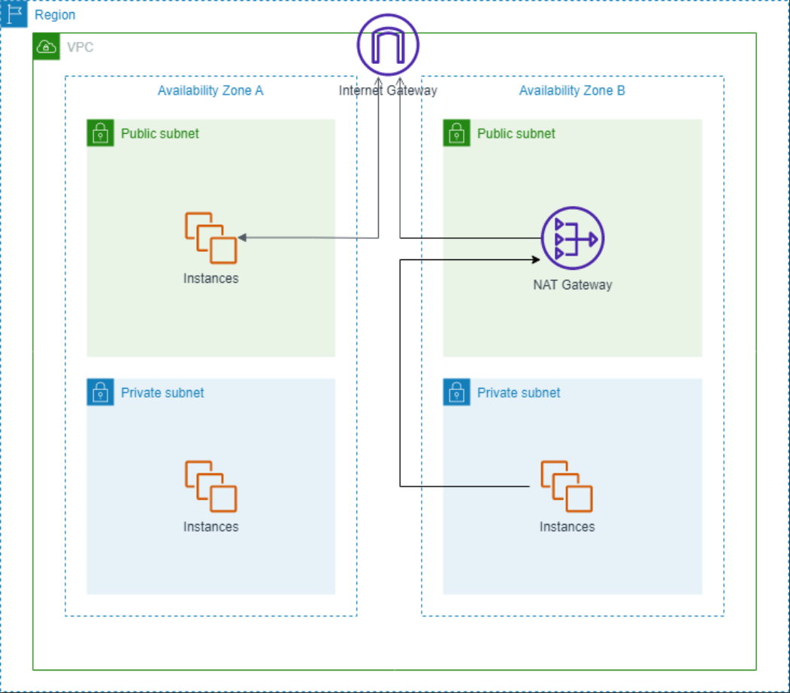

 

## Table of contents
- [Given problem](#given-problem)
- [VPC](#vpc)

    - [Introduction to VPC](#introduction-to-vpc)
    - [Limitations of VPC](#limitations-of-vpc)
    - [Some questions for VPC](#some-questions-for-vpc)

- [Subnets](#subnets)

    - [Public Subnets](#public-subnets)
    - [Private Subnets](#private-subnets)
    - [CIDR](#cidr)

- [How to configure VPC and Subnets](#how-to-configure-vpc-and-subnets)

    - [Configuration for VPC](#configuration-for-vpc)
    - [Configuration for Subnets](#configuration-for-subnets)

- [Wrapping up](#wrapping-up)

 

## Given problem

Nowadays, most of the projects will be deployed on Cloud. Some cloud providers that we know such as Amazon Web Service, Google Cloud, Azure, ... After some steps like analyze domains, design systems, and choose tech stacks and cloud providers, we will need to design the infrastructure of our system on the cloud.

Today, we will learn the VPC - Virtual Private Network that is the important part in AWS. And how to create it by using AWS Management Console. Our design will be looked like the below image.

 

## VPC

### Introduction to VPC

VPC is an acronym for "Virtual Private Cloud". To understand this concept, we need to go into each word like **Virtual** and **Private**.
- **Virtual**.

    AWS will provide services like EC2, S3, SQS, ... to different customers. It means that these customers can use the same infrastructure like hardware, network, ... But these customers will have different demands like, with OS, they want to use Windows, Linux. So AWS will use the virtual technologies to support it. To make it easy to digest, we can think of the virtual machines like Virtual Box, VMWare.

- **Private**.

    Due to the security factor, each customer will want our service isolates to others. So it provides the mechanisms like encrypted connections, to secure their customers' systems.

Therefore, from the above parts, VPC is a private network within AWS. We will deploy our services in VPC.

Some notes of VPC:
- If we don't create any other VPC, AWS provides the default VPC.
- A VPC will exists in one region.

    We can not setup a VPC spans different regions.

- Due to the fact that a region has multiple Availability Zones, a VPC can span AZs in one region.

    From the above image in [Given problem](#given-problem) section, we can see that VPC can span Availability Zone A and Availability Zone B.

### Limitations of VPC

- By default, there are 5 VPCs/Region.

### Some questions for VPC

1. Why do we need VPC?

    From the explainations in [Introduction to VPC](#introduction-to-vpc) section, we can have answer for this question.

2. Why AWS allows only 5 VPCs/Region?

    When searching this question, I found [the answer that gives the reasonable ideas](https://qr.ae/pKlIar):
    - Limiting resource consumption.
    - Encouraging best practices.
    - Promoting modular design.
    - Simplifying management.

    --> But the other question appears in my mind: **Why the default number of VPC is 5? Why not 2, 3, 4, or other nunmbers?**

 

## Subnets

After setup VPC completely, the next step is setup its subnets. Subnet is a way that you partition your network inside a VPC. Based on that, each resource will be assigned an IP address. Then, they can communicate with each other, or with Internet through Internet Gateway - mapping the local IP to real IP on Internet and vice versa.

There are two tyes of subnets:
1. Public subnets.
2. Private subnets.

### Public Subnets

### Private Subnets

### CIDR

### Router Tables

 

## How to configure VPC and Subnets

### Configuration for VPC

### Configuration for Subnets

 

## Wrapping up

