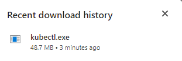
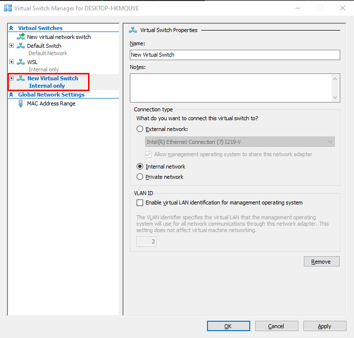
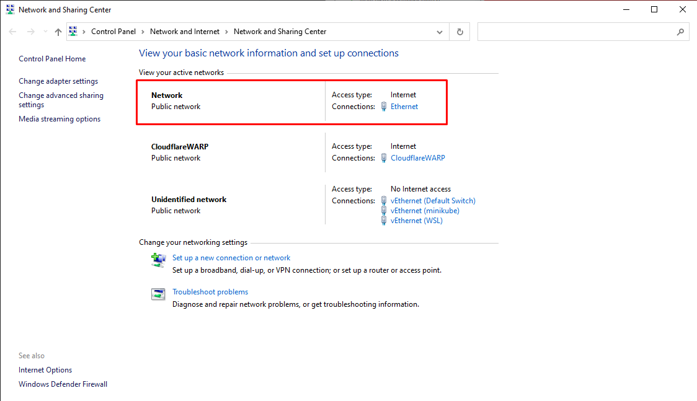

<br>

## Table of contents
- [Pre-requisites](#pre-requisites)
- [Step 1: Install kubectl](#step-1-install-kubectl)
- [Step 2: Install Minikube](#step-2-install-minikube)
- [Step 3: Setup connections for Minikube](#step-3-setup-connections-for-minikube)
- [Some issues while installing Kubernetes](#some-issues-while-installing-kubernetes)
- [Wrapping up](#wrapping-up)


<br>

## Pre-requisites

1. Windows 10 Enterprise, Pro, or Education.

    Windows 10 Home will not be compatible with Docker Desktop and Kubernetes, just because **Virtual Machine Platform** and **Hyper-V** functionality is not provided on Windows 10 Home.

2. Enable Virtual Machine Platform and WSL 2.

    Go to this page: [Install WSL 2 and configure it on Windows 10](https://gailloty.net/Rstudio-server-windows/install-wsl-2-and-configure-it-on-windows-10.html) and do the same steps.

3. Enable Hyper-V.

    Follow the instructions to enable Hyper-V on this page: [Install Hyper-V on Windows 10](https://learn.microsoft.com/en-us/virtualization/hyper-v-on-windows/quick-start/enable-hyper-v).

    

4. Installed Docker Desktop.

    In this item, we can refer to the following article: [Understanding about Docker](https://ducmanhphan.github.io/2020-05-07-understanding-about-docker/#how-to-setup-docker).


<br>

## Step 1: Install kubectl

- Firstly, go to the following page of Kubernetes: [https://kubernetes.io/docs/tasks/tools/](https://kubernetes.io/docs/tasks/tools/).

    

- Then, select [Install kubectl on Windows](https://kubernetes.io/docs/tasks/tools/install-kubectl-windows/) item.

    

    In this step, we will follow **Install kubectl binary curl on Windows** section.

    - Download the kubectl with version - 1.29.0.

        

        Then, we have:

        

    - Next step is that we will add the path of kubectl to the **Environment Variables** of Windows.

        Before doing this, we need to take care the note of Kubentes about kubectl of Docker Desktop for Windows like the below image.

        

        Then, start to setup PATH of kubectl for Environment Variables.
        
        
        
        Choose the **Path** of User Variables section. And add our path of kubectl executable file into it.
 
        

        Click OK button.

    - Verify the kubectl file is installed correctly or not by using cmd or powershell.

        ```bat
        kubectl version --client

        kubectl version --client --output=yaml
        ```

        So, we installed kubectl successfully.

        


<br>

## Step 2: Install Minikube

- Go to the **Installation** section of the following page: https://minikube.sigs.k8s.io/docs/start/.

    

- Download the executable file of Minikube.

    

- Add the path of Minikube to the **Path** of **User Variables** on Windows 10.

    

- Install that executable file of Minikube like the below image.

    

- Testing the Minikube.

    Run the following commands:
    - `minikube start`
    - `minikube start --vm-driver="hyperv" --hyperv-virtual-switch="minikube"`

    But we also run into the following issue:

    

    To solve this issue, we will go to the next step: [Step 3: Setup connections for Minikube](#step-3-setup-connections-for-minikube).


<br>

## Step 3: Setup connections for Minikube

1. Setup Hyper-V Manager.

    - Go to the **Hyper-V Manager** by searching it on Windows's Start.

        

        Then, we have:

        

    - Select the **DESKTOP-HKLMQUVE** item under Hyper-V Manager.

        

    - Select Virtual Switch Manager on the left side of **Actions** dialog.

    - Choose the **New virtual network switch** item under **Virtual Switches**.

        Then, choose **Internal** for the question: What type of virtual switch do you want to create?

        

        Click **Create Virtual Switch** button. Then, we have:

        

    - Setup the **New Virtual Switch Internal Only**.

        Change the **Name** field to **minikube**. Then, choose the **Internal network**.

        
        
        Click OK button.

2. Setup Networks on Windows 10.

    - Go to the **Network and Sharing Center** dialog.

        

    - Choose the **Ethernet** in Connections.

        

    - Click **Properties** button on this dialog, and go to the **Sharing** tab.

        

    - Choose a checkbox **Allow other network users to connect through this computer's internet connection**. Then, Choose the **Home networking connection** with **vEthernet (minikube)** option.

        

        Click OK button.

3. Verify minikube again.

    Run the following commands:
    - `minikube start --vm-driver="hyperv" --hyperv-virtual-switch="minikube"`

    We still run into the issue with the message: "Hyper-V was unable to find a virtual machine with name "minikube".".

    

    Below are some solutions for the above issue:
    - First way.

        Due to the fact that we use the VPN of CloudFlare, it cause this issue. Run the below commands:

        ```
        minikube delete --all

        minikube start --driver=hyperv --force
        ```

        Then, we have:

        

    - Second way.
    
        When running the following command by using external virtual switch:

        ```
        minikube start --hyperv-use-external-switch
        ```

        It works.


<br>

## Some issues while installing Kubernetes

1. When running `minikube start`, we will run into the following error: "Unable to resolve the current Docker CLI context "default"".

    Try to update your active context of docker which Minikube will pick up.

    ```
    docker context use default
    ```   


<br>

## Wrapping up


