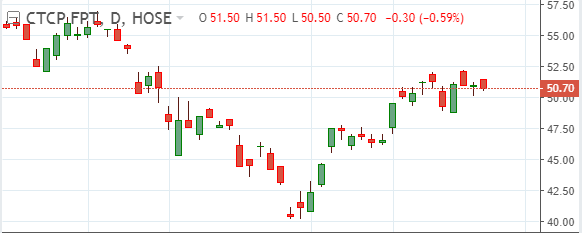

 

## Table of Contents
- [Introduction to candle stick chart](#introduction-to-candle-stick-chart)
- 
- 
- [Wrapping up](#wrapping-up)

 

## Introduction to candle stick chart

Biểu đồ dạng nến có tên tiếng anh là **Candlestick chart**.

 

## 

 

## 

 

## 

 

## 

 

## Wrapping up

 

Tham khảo:

