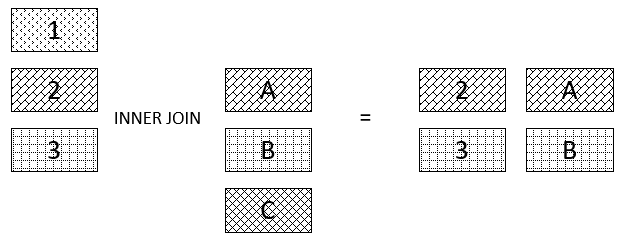
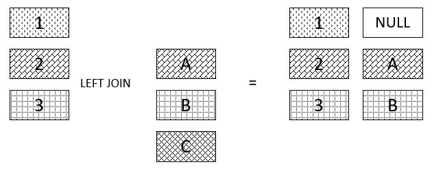
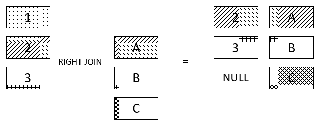

In MySQL, there are so many commands that you need to master to implement the most difficult statements in the real world. Understanding the tricky is always necessary to improve the speed when writing commands.

In this article, we will learn something about the way to write specific requirements in reality. And we will study how to create CRUD operations in MySQL.

Assuming that you the database have some the following tables:

```
customers(id, name, address, email, cdate, mdate)
orders(id, date, customer_id, cdate, mdate)
orderdetails(id, order_id, product_id, quantity, unit_price)
products(id, name, quantity, price, cdate, mdate)
```

<br>

## Table of Contents
- [Date Calculations](#date-calculations)
- [Limit clause](#limit-clause)
- [Group by clause](#group-by-clause)
- [Inner Join clause](#inner-join-clause)
- [Left join clause](#left-join-clause)
- [Right join clause](#right-join-clause)
- [CRUD Operations](#crud-operations)

<br>

## Date Calculations
With the above database, assuming that you have a question: "List all new customers that buy products in January, 2019".

When you saw *January* month, immediately, what is function to return the month from the **date** data type? Query statement looks like this.

```sql
select id, name, month(cdate) as NewMonth
from customers
where year(cdate) = 2019 and month(cdate) = 1
order by month(cdate);
```

The **month()** function will return the value from 1 to 12. 

The **year()** function will return an integer that is a year.

To calculate the age of something or the time segment, use **TIMESTAMPDIFF(YEAR, birth, CURDATE())**.

To add a time interval to a given date, use **DATE_ADD()** function.

For example:

```sql
SELECT name, cdate FROM pet
WHERE MONTH(cdate) = MONTH(DATE_ADD(CURDATE(),INTERVAL 1 MONTH));
```

Some useful functions for calculating date, it is like **dayofmonth()** function.

<br>

## Limit clause
Which case can you apply the limit clause? It is the question when you read verbally about it. So, you can answer this question by applying it with the case that need to answer some question:

```
- List 10 best selling product
- List the nth best selling product.
```

Code sql: 

```sql
select product_id, sum(quantity) as TotalQuantity
from orderdetails
group by product_id
order by sum(quantity) desc
limit 10;
```

<br>

## Group by clause
When you want to filter the number of something or do numeric with each column, you should use **Group by**.

**Group by** clause groups a set of rows into a set of summary rows by values of columns or expressions. The **Group by** clause returns one row for each group. In other words, it reduces the number of rows in the result set.

We often use the GROUP BY clause with aggregate functions such as SUM, AVG, MAX, MIN, and COUNT.

To filter groups returned by **Group by** clause, use a **Having** clause.

For example: List all customers with the times they buy products.

```sql
select customerId, name, count(*)
from customers
inner join invoices using (customerId)
group by customerId;
```

<br>

## Inner Join clause
Before doing anything else with **Inner join**, follows some criterias:
- First, the main table that appears in the *from* clause.
- Second, the table that you want to join with the main table, which appears in the **Inner join** clause. In theory, you can join a table with many other tables. For a better performance, limit the number of tables to join.
- Third, the join condition or join predicate. The join condition appears after the *ON* keyword of the **Inner join** clause. The join condition is the rule for matching rows in the main table with the rows in the other table.



Syntax: 

```sql
SELECT column_list
FROM t1
INNER JOIN t2 ON join_condition1
INNER JOIN t3 ON join_condition2
...
WHERE where_conditions;
```

or 

```sql
SELECT column_list
FROM t1
INNER JOIN t2 using (common_column_name)
...
WHERE where_conditions;
```

**How does inner join works?**

For each row in the t1 table, the INNER JOIN clause compares it with each row of the t2 table to check if both of them satisfy the join condition. When the join condition is met, the INNER JOIN will return a new row which consists of columns in both t1 and t2 tables.

Notice that the rows in both t1 and t2 tables have to be matched based on the join condition. If no match found, the query will return an empty result set. This logic is also applied when you join more than 2 tables.

<br>

## Left join clause


Syntax: 

```sql 
SELECT 
    t1.c1, t1.c2, t2.c1, t2.c2
FROM
    t1
        LEFT JOIN
    t2 ON t1.c1 = t2.c1;
```

When you join the t1 table to the t2 table using the LEFT JOIN clause, if a row from the left table t1 matches a row from the right table t2 based on the join condition ( t1.c1 = t2.c1 ), this row will be included in the result set.

In case the row in the left table does not match with the row in the right table, the row in the left table is also selected and combined with a “fake” row from the right table. The fake row contains NULL for all corresponding columns in the SELECT clause.

In other words, the LEFT JOIN clause allows you to select rows from the both left and right tables that are matched, plus all rows from the left table ( t1 ) even with no matching rows found in the right table ( t2 ).

<br>

## Right join clause


Syntax: 

```sql
SELECT 
    * 
FROM t1
    RIGHT JOIN t2 ON join_predicate;
```

or 

```sql
SELECT 
    * 
FROM t1
    RIGHT JOIN t2 USING (common_column_name);
```

All rows from the t2 table (right table) will appear at least once in the result set.

Based on the join_predicate, if no matching row from the t1 table (left table) exists, NULL will appear in columns from the t1 table for the rows that have no match in the t2 table.

<br>

## CRUD Operations


Refer: 

https://dev.mysql.com/doc/mysql-tutorial-excerpt/5.7/en/date-calculations.html

https://dba.stackexchange.com/questions/52476/how-to-get-a-list-result-of-best-selling-items

http://www.mysqltutorial.org/mysql-inner-join.aspx

