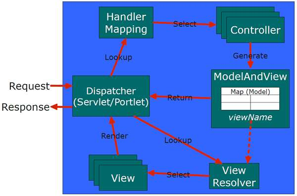

Spring MVC is the framework that helps our build the huge project. It divide project into smaller things such Model, View, Controller. It makes all members in team can be easily understand the whole structure of project. It reduces the number of bugs in developing the new functionalities in project. Because each part can be in charge of a specific target. We can find the position where bug happens immediately.

In this article, we will find out about the structure of Spring MVC and how Spring MVC works. Understanding them make us confident to use with Spring Boot or some other structures in Spring framework.

## Table of Contents
- [Introduction to Spring MVC](#introduction-to-spring-mvc)
- [How Spring MVC works](how-spring-mvc-works)
- [Disadvantages of Spring MVC](#disadvantages-of-spring-mvc)
- [Advantages of Spring MVC](#advantages-of-spring-mvc)

 

## Introduction to Spring MVC

 

## How Spring MVC works

Views are in charge of rendering the actual HTML interface, usually by the execution of some template engine like Thymeleaf.

ViewResolvers are the objects in charge of obtaining View objects for a specific operation and locale. Typically, controllers ask ViewResolvers to forward to a view with a specific name (a String returned by the controller method), and then all the view resolvers in the application execute in ordered chain until one of them is able to resolve that view, in which case a View object is returned and control is passed to it for the renderization of HTML.

 

## Disadvantages of Spring MVC

 

## Advantages of Spring MVC

 

Refer:

[https://www.intertech.com/Blog/how-to-use-springs-webapplicationinitializer/](https://www.intertech.com/Blog/how-to-use-springs-webapplicationinitializer/)

[https://docs.spring.io/spring/docs/3.0.0.M3/reference/html/ch16s02.html](https://docs.spring.io/spring/docs/3.0.0.M3/reference/html/ch16s02.html)

[https://stackify.com/spring-mvc/](https://stackify.com/spring-mvc/)

[https://javadeveloperzone.com/spring-mvc/spring-multi-controller/](https://javadeveloperzone.com/spring-mvc/spring-multi-controller/)

[https://crunchify.com/spring-mvc-how-to-access-modelmap-values-in-a-jsp/](https://crunchify.com/spring-mvc-how-to-access-modelmap-values-in-a-jsp/)

[https://www.thymeleaf.org/doc/tutorials/3.0/thymeleafspring.html](https://www.thymeleaf.org/doc/tutorials/3.0/thymeleafspring.html)
