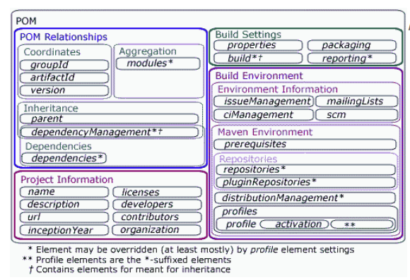

Maven is a tool for managing resource objects or package in Java. It is as same as npm in Node.js. When you want to build a enormous project, absolutely, you need maven. 

Understanding some tricky things about maven will help you easily to write code, use so many packages effectively. You do not manually add many packages into your project. To configure maven, you will cope with understanding some parameter in POM file.

In this article, we will find informations about configuring POM file.

<br>

## Table of Contents
- [Introduction to structure project in Maven](#introduction-to-structure-project-in-maven)
- [POM file in Maven project](#pom-file-in-maven-project)
- [Add specific package into project through pom file](#add-specific-package-into-project-through-pom-file)
- [How the Maven works](#how-the-maven-works)
- [Important note](#important-note)

<br>

## Standard structure in Maven project
The below is the image about standard folder structure in maven project. 

```
your-app-name
|-- pom.xml
`-- src
    |-- main
    |   |-- java
    |   |   `-- com
    |   |       `-- your-company-name
    |   |           |-- config
    |   |           |   |-- Config.java
    |   |           |   `-- WebInitializer.java
    |   |           |
    |   |           `-- controllers
    |   |               `-- Controller.java
    |   |-- resources     
    |   `-- webapp     
    |       `-- WEB-INF
    |           `-- jsp
    |               `-- index.jsp 
    `-- test
        `-- java
            `-- com
                `-- your-company-name
                    `-- app
                        `-- AppTest.java
```

The followings is the table explains the meanings of each path in your folder structure.

|          Path           |           Meanings            |
| ----------------------- | ----------------------------- |
| src/main/java           | Application/Library sources   |
| src/main/resources      | Application/Library resources |
| src/main/webapp         | Web application sources       |
| src/main/filters        | Resource filter files         |
| src/test/java           | Test sources                  |
| src/test/resources      | Test resources                | 
| src/test/filters        | Test resource filter files    |
| src/it                  | Integration tests             |

At the top level, files descriptive of the project is a **pom.xml** file.

There are just two sub folders: **src** and **target**. The **target** directory is used to contains all output of the build. The **src** directory contains all the source material for building the project, its site and so on.


<br>

## POM file in Maven project
A POM - Project Object Model is an xml files that contains all informations about project and configuration details used by Maven to build the project. 

All our informations will be contained in **project** tag. To be default, some parameters of project will be inserted in pom.xml.



```xml
<project ...>
    <modelVersion>4.0.0</modelVersion>

    <!-- POM relationships -->
    <groupId>...</groupId>
    <artifactId>...</artifactId>
    <version>...</version>
    <parent>...</parent>
    <dependencyManagement>...</dependencyManagement>
    <dependencies>...</dependencies>
    <modules>...</modules>

    <!-- Project information -->
    <name>...</name>
    <description>...</description>
    <url>...</url>
    <inceptionYear>...</inceptionYear>
    <licenses>...</licenses>
    <developers>...</developers>
    <contributors>...</contributors>
    <organization>...</organization>

     <!-- Build Settings -->
    <packaging>...</packaging>
    <properties>...</properties>
    <build>...</build>
    <reporting>...</reporting>

    <!-- Build Environment -->

    <!-- Environment Information -->

    <issueManagement>...</issueManagement>
    <ciManagement>...</ciManagement>
    <mailingLists>...</mailingLists> 
    <scm>...</scm>
  
    <!-- Maven Environment -->

    <prerequisites>...</prerequisites>
    <repositories>...</repositories>
    <pluginRepositories>...</pluginRepositories>
    <distributionManagement>...</distributionManagement>
    <profiles>...</profiles>    
</project>
```

With:
- groupId: a name of your company, ...
- artifactId: a name of package, project
- version: a version of project
- packaging: there are two values: jar & war. jar - library or java application; war - web application.
- modelVersion: its value will be always 4.0.0 for Maven 2.x POMs.

Note about **jar**, **war** files:
- .jar files: The .jar files contain libraries, resources and accessories files like property files.
- .war files: The war file contains the web application that can be deployed on any servlet/jsp container. The .war file contains jsp, html, javascript and other files necessary for the development of web applications.

<br>

## Add specific packages into project through pom file
In order to import many libraries into our project through Maven, insert informations about these libraries into **dependencies** tag in pom.xml.

**properties** tag helps our define many constant variables, make our do not concern about some problems when we change this value at the other places. It makes our code synchronous. It will used to tell Maven use a specified JDK version to compile the source code.

Belows are the definitions of some common packages that will use for Spring MVC.

```xml
<properties>
    <project.build.sourceEncoding>UTF-8</project.build.sourceEncoding>		
    <maven.compiler.source>1.8</maven.compiler.source>
    <maven.compiler.target>1.8</maven.compiler.target>

    <spring.version>4.0.0.RELEASE</spring.version>
    <jstl.version>1.2</jstl.version>
    <javax.servlet.version>3.0.1</javax.servlet.version>
</properties>

<dependencies>
    <dependency>
        <groupId>javax</groupId>
        <artifactId>javaee-web-api</artifactId>
        <version>7.0</version>
        <type>jar</type>
    </dependency>
    
    <dependency>
        <groupId>org.springframework</groupId>
        <artifactId>spring-core</artifactId>
        <version>${spring.version}</version>
    </dependency>
    
    <dependency>
        <groupId>org.springframework</groupId>
        <artifactId>spring-web</artifactId>
        <version>${spring.version}</version>
    </dependency>
    
    <dependency>
        <groupId>org.springframework</groupId>
        <artifactId>spring-webmvc</artifactId>
        <version>${spring.version}</version>
    </dependency>

    <!-- junit 5, unit test -->
    <dependency>
        <groupId>org.junit.jupiter</groupId>
        <artifactId>junit-jupiter-engine</artifactId>
        <version>5.3.1</version>
        <scope>test</scope>
    </dependency>

    <!-- unit test -->
    <dependency>
        <groupId>org.hamcrest</groupId>
        <artifactId>hamcrest-library</artifactId>
        <version>1.3</version>
        <scope>test</scope>
    </dependency>

    <!-- for web servlet -->
    <dependency>
        <groupId>javax.servlet</groupId>
        <artifactId>javax.servlet-api</artifactId>
        <version>${javax.servlet.version}</version>
        <scope>provided</scope>
    </dependency>

    <!-- use for SHA hashing -->
    <dependency>
        <groupId>commons-codec</groupId>
        <artifactId>commons-codec</artifactId>
        <version>1.11</version>
    </dependency>

    <!-- use for hibernate -->
    <dependency>
        <groupId>hibernate</groupId>
        <artifactId>hibernate</artifactId>
        <version>3.0.3</version>
        <scope>compile</scope>
    </dependency>
</dependencies>
```

**scope** tag will help our restrict the usage of libraries. Because some libraries can be used for unit testing, the other can be provided at runtime by the application server.

Maven provides four dependency scopes:
- compile: A compile-scope dependency is available in all phases. It is the default value.
- 

<br>

## How the Maven works
Firstly, we add informations about libraries that we need into **dependencies** tag, then, we save the pom.xml file. Maven will send these informations to its cloud repository. Next, it will download these libraries into local repository of Maven. 

To check the path of this local repository, you can open **User setting** of Netbeans or Eclipse. Finally, Maven will add the path of each libraries into **Dependencies** folder in Netbeans.

<br>

## Important note


<br>

Refer: 

http://www.java2s.com/Tutorials/Java/Maven_Tutorial/1020__Maven_POM_File.htm

https://o7planning.org/vi/10411/quan-ly-cac-phu-thuoc-trong-maven

https://o7planning.org/vi/10131/huong-dan-su-dung-maven-cho-nguoi-moi-bat-dau

https://maven.apache.org/guides/introduction/introduction-to-the-standard-directory-layout.html

https://www.javaworld.com/article/2071772/java-app-dev/the-maven-2-pom-demystified.html

https://www.javaworld.com/article/2072203/build-ci-sdlc/an-introduction-to-maven-2.html

<br>

**JAR**, **WAR** files

https://en.wikipedia.org/wiki/WAR_(file_format)

https://en.wikipedia.org/wiki/JAR_(file_format)

https://web.archive.org/web/20120626012843/http://java.sun.com/developer/Books/javaprogramming/JAR/basics

https://web.archive.org/web/20120626020019/http://java.sun.com/j2ee/tutorial/1_3-fcs/doc/WCC3.html

https://maven.apache.org/guides/getting-started/maven-in-five-minutes.html

http://www.vogella.com/tutorials/ApacheMaven/article.html