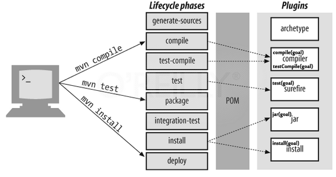

To build the small project, actually, we do a little operations such as typing Ctrl + Shift + B to build project and F5 to run. It is a pieces of cake to implement manually. 

But the huge problems will happen when we have to make a big project such as we do not build one by one libraries, or run test of each project. Therefore, Maven will appear as superman to help our automatically do some specific operations in the project.

<br>

## Table of Contents
- [Introduction to project lifecycles](#introduction-to-project-lifecycles)
- [Default lifecycle](#default-lifecycle)
- [Goals and phases](#goals-and-phases)

<br>

## Introduction to project lifecycles
In Maven, there are three built-in lifecycles:
- default: lifecycle handles project deployment.
- clean: lifecycle handles project cleaning.
- site: lifecycle handles the creation of project's site documentation.


<br>

## Default lifecycle
The **default lifecycle** includes some following phases:



The meaning of each phases is:
- generate-sources: generates any extra source code needed for the application, which is generally accomplished using the appropriate plugins.
- compile: compiles the project source code.
- test-compile: compiles the project unit tests.
- test: runs the unit tests (typically using JUnit) in the src/test folder.
- package: squeezes the compiled code into its distributed format such jar, war, ...
- integration-test: Processes and deploys the package if necessary into an environment where integration tests can be run.
- install: installs the package into the local repository, for use as a dependency in other projects locally.
- deploy: done in an integration or release environment, copies the final package to the remote repository for sharing with other developers and projects.

In default lifecycle or the other lifecycles, these lifecycle phases are implemented continuously.

For example: 
- Command ```mvn deploy``` runs, all of the lifecycle phases before **deploy** will be executed first.
- Command ```mvn install``` runs, the lifecycle phases in order (generate-sources, compile, test-compile, ...) will be implemented before executing **install** phase.
- Command ```mvn clean install``` tells the Maven to do the **clean** action in each module (clear any compiled files) before running the **install** action for each module.

  A **target** folder holds Maven-generated temporary files and artifacts. There are times when the **target** folder becomes huge or when certain files that have been cached need to be cleaned out of the folder. The **clean** goal accomplishes exactly that, as it attempts to delete the target folder and all its contents.

<br>

## Plugin Goals


<br>

Refer:

**Make own project lifecycle**

http://bethecoder.com/applications/tutorials/design-patterns/java-design-patterns/state-project-life-cycle-example.html

https://maven.apache.org/guides/introduction/introduction-to-the-lifecycle.html#Lifecycle_Reference

https://www.javaworld.com/article/2072203/build-ci-sdlc/an-introduction-to-maven-2.html

http://www.codetab.org/apache-maven-tutorial/maven-lifecycle-and-goals/

http://www.codetab.org/apache-maven-tutorial/maven-plugin-goals/