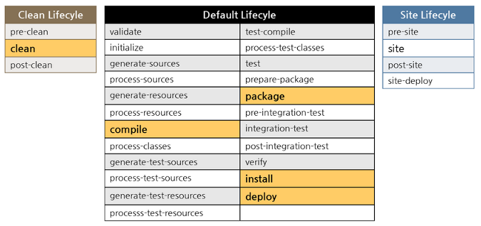

## Table of Contents

 

## Project lifecycles
In Maven, there are three built-in lifecycles:
- default: lifecycle handles project deployment.
- clean: lifecycle handles project cleaning.
- site: lifecycle handles the creation of project's site documentation.

 

Refer:

http://bethecoder.com/applications/tutorials/design-patterns/java-design-patterns/state-project-life-cycle-example.html

https://maven.apache.org/guides/introduction/introduction-to-the-lifecycle.html#Lifecycle_Reference