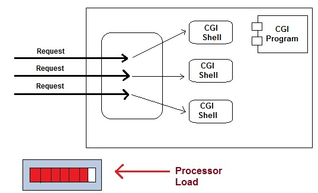
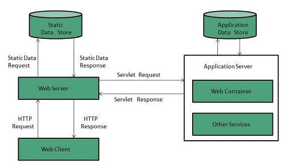
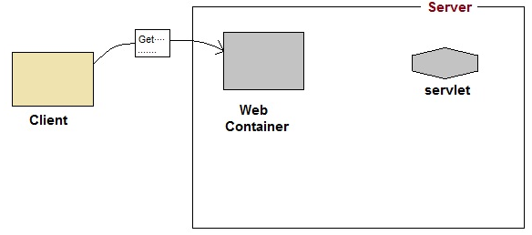
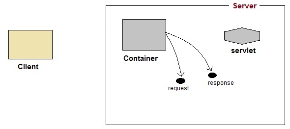
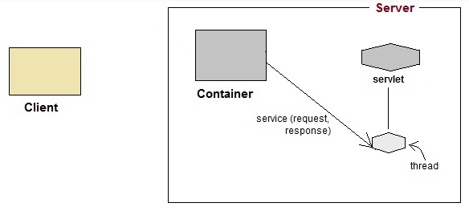
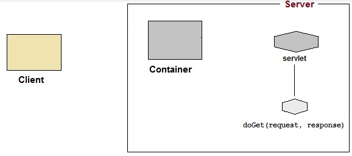
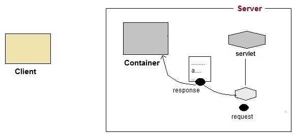
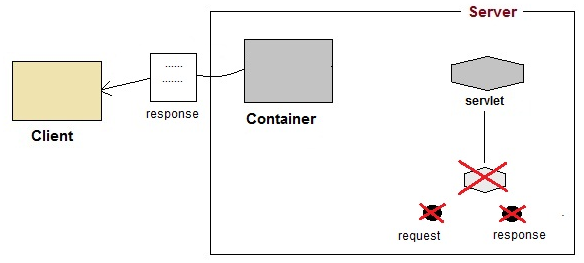

Beside understanding [how JSP works](https://DucManhPhan.github.io/2019-01-25-How-jsp-works), we will still need to understand how Servlet works in the server-side. It also helps you delve deeper into Java web programming, especially Spring MVC, Boot.

In this article, we will find out about Servlet and comparing it with CGI. Almost information is referenced from this [link]().

<br>

## Table of Contents
- [Why Servlet is created](#why-servlet-is-created)
- [Introduction to Servlet](#introduction-to-servlet)
- [How Servlet works](#how-servlet-works)
- [Disadvantages of Servlet](#disadvantages-of-servlet)
- [Advantages of Servlet](#advantages-of-servlet)

<br>

## Why Servlet is created
When servlet was not created, people used to CGI (Common Gateway Interface) to create web applications.

CGI is the first technology used to generate dynamic contents. CGI is not a programming language, rather it is an interface (or a set of rules) that allows an input from a web server and produce an output in the form of HTML page. A CGI script can be written in a verity of languages such as C, C++, VB, Perl, Fortran and Java. Out of these, Perl is most commonly used.

The steps that CGI program works:
- User clicks a link that has URL to a dynamic page instead of a static page.
- The URL decides which CGI program to execute.
- Web Servers run the CGI program in seperate OS shell. The shell includes OS environment and the process to execute code of the CGI program.
- The CGI response is sent back to the Web server, which wraps the response in an HTTP response and send it back to the Web browser.



So, the disadvantages of CGI are:
- CGI takes so much time to create the new process for every requests and requires server resources. So, it will limit the number of requests that a server can handle.
- platform dependent.
- CGI is not scalable.
- not secure.

Therefore, Servlet is created to restrict the drawbacks of CGI.

<br>

## Introduction to Servlet
Servlet is a technology used to create the dynamic web applications that accept a user request, process it on server side, then, return responses to the user.

The above definition of Servlet is so common. So, go into detail, a Servlet is a class that handles requests, processes them and reply back with a response.

To understand some definitions that are relevant to a servlet, we will see the below image:



Web Server is a computer where the web content is stored. Web container or Servlet container manages the life cycle of a servlet instance and requests from the end user. Web container is responsible for initializing the servlet or creating a new thread to handle the requests. Web container creates multiple threads to process multiple requests to a single servlet.

At the moment, we will have a question - Which part of Java is responsible for get request from user and tranfer it to the Web Container? I do not make sure this answer is right. But I will check it later. So, fighting.

Because web server is only a computer. It is a hardware, not software or driver. It only provides network card for us, not turn signals in HTTP protocol into something that Web container can understand.

We have to remember that each computer have a specific IP, and HTTP protocol have a specific port. When we enter the URL link, it will resolve into IP address. Then, to abide by the rule of 7-layer OSI, it will compact our signals and information about HTTP protocol into one. Then, send it to the computer have the specific IP address. So we will access this computer through HTTP protocol. (At this point, the firewall in web server can reject this connection.) Immediately, JRE - Java Runtime Environment is always listening at this port, JRE only prepare to grasp this connection. When connected, JRE will pass it to the Web Container.

Next, we will find out How servlet works when Web container receives requests.

<br>

## How Servlet works
This part is completely referernced from the website [studytonight.com](https://www.studytonight.com/servlet/how-a-servlet-application-work.php).

1. User sends requests for a servlet by clicking a link that has URL to a servlet.

    

2. The container finds the servlet using **deployment descriptor** and creates two objects
Two objects are corresponding
- HttpServletRequest
- HttpServletResponse

    

3. Then the container creates and allocates a thread for that request and calls the Servlet's ```service()``` method and passes the **request**, **response** objects as arguments.

    

4. The ```service()``` method, then decides which servlet method, ```doGet()``` or ```doPost()``` to call, based on **HttpRequestMethod** sent by client. Suppose the client sent an HTTP Get request, so the ```service()``` will call Servlet's ```doGet()``` method.

    

5. Then the Servlet uses response object to write the response back to the client.

    

6. After the ```service()``` method is completed the **thread** dies. And the request and response objects are ready for **garbage collection**.

    


With the above steps, we will understand the background of the servlet's work. But to be aware of deeper servlet such as dispatcher servlet, JSP life cycle, ..., we will dig into the servlet in the other article.

<br>

## Disadvantages of Servlet
- Designing in servlet is difficult and slows down the application.
- Writing complex business logic makes the application difficult to understand.

<br>

## Advantages of Servlet
- Portability: portable across OS and across web servers.
- Power: Harness the full power of the core Java APIs such as networking and URL access, multithreading, image manipulation, data compression, JDBC, Object Serialization.
- Efficiency and Endurance: Memory resident, so invocation highly efficient—no process to spawn or interpreter to invoke.
- Safety: Support safe programming since inherit Java’s strong type safety, exception-handling mechanism.
- Elegance: Code is clean, object-oriented, modular, and simple (i.e.. Session tracking, cookie)
- Integration: Tightly integrated with the server—translate file paths, perform logging, check authorization, and MIME type mapping.

<br>

Refer: 

https://www.tutorialspoint.com/jsp/jsp_overview.htm

https://docs.oracle.com/javaee/5/tutorial/doc/bnafe.html

https://www.studytonight.com/servlet/introduction-to-servlet.php

https://www.studytonight.com/servlet/how-a-servlet-application-work.php

http://www-it.fmi.uni-sofia.bg/courses/WDB/references/CGI_Developer_Guide/CH1.HTM

http://ecomputernotes.com/servlet/intro/differencebetweenservletandcgi

https://www.baeldung.com/intro-to-servlets

**Advantages and Disadvantages of Servlet**

http://msmuthuimm031.blogspot.com/2011/10/what-are-advantages-and-disadvantages.html

https://myjavadoubts.blogspot.com/2016/06/10-limitations-of-servlets.html