In this turorial, we will find out about how to configure Tomcat in eclipse, and how to configure Tomcat to deploy web application.

<br>

## Table of contents
- [Configure Tomcat in Eclipse](#configure-tomcat-in-eclipse)
- [Configure Tomcat server to deploy web application](#configure-tomcat-server-to-deploy-web-application)
- [Understanding about some configuration files in Tomcat](#understanding-about-some-configuration-files-in-tomcat)
- [Some errors in Eclipse when configure Tomcat](#some-errors-in-eclipse-when-configure-tomcat)
- [Wrapping up](#wrapping-up)


<br>

## Configure Tomcat in Eclipse
- The first thing we have to do is to download ```Apache Tomcat``` in a link such as [https://tomcat.apache.org/download-90.cgi](https://tomcat.apache.org/download-90.cgi).

    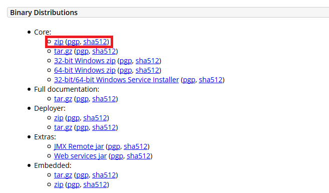

- Unzip this file and we have;

    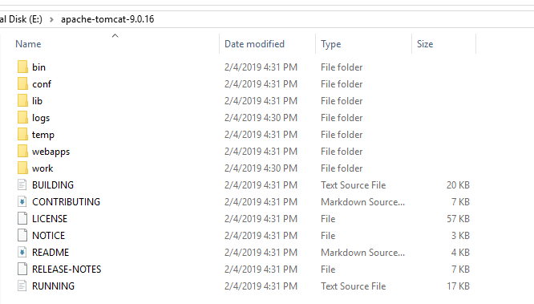

- This step we will add Tomcat into our Eclipse:

    

    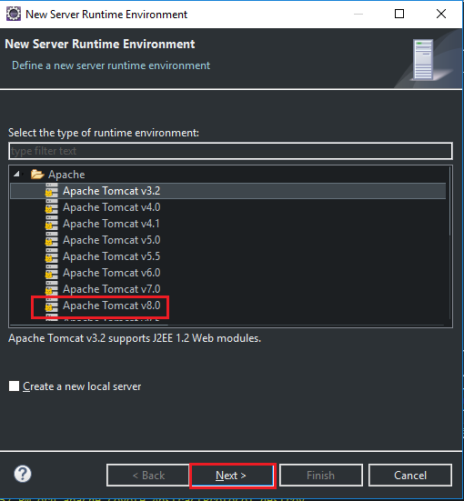

    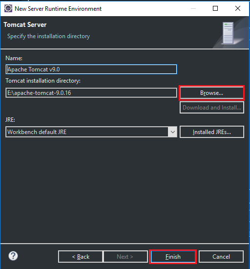

    And click ```Apply and Close``` to agree our Tomcat version.

<br>

##  Configure Tomcat server to deploy web application
After we unzip Tomcat file, we will do somethind like: 
- specify JDK for Tomcat.
- Open ```startup.bat``` file in ```bin``` folder of Tomcat. (With Linux/Ubuntu OS, we have ```startup.sh``` file).

    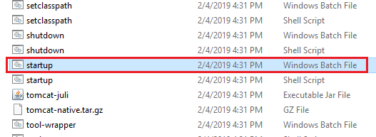

- We will add some code into ```startup.bat``` file.

    ```bat
    # With Windows
    set JAVA_HOME="C:\Program Files\Java\jdk1.8.0_181"

    # With Linux/Ubuntu
    JAVA_HOME="/usr/lib/jvm/open-jdk"
    ```

    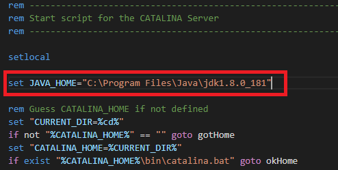

- Next, we will configure for account to use Tomcat. Open ```tomcat-users.xml``` in ```conf``` folder.

    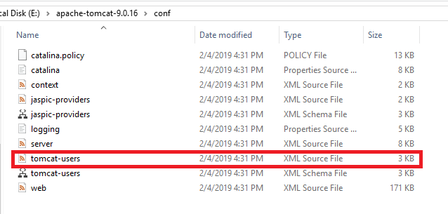

    Tomcat was defined 4 roles: 
    - ```manager-gui``` - allows access to the HTML GUI and the status pages
    - ```manager-script``` - allows access to the text interface and the status pages
    - ```manager-jmx``` - allows access to the JMX proxy and the status pages
    - ```manager-status``` - allows access to the status pages only

    We can declare a user with 4 roles

    ```xml
    <role rolename="manager-gui"/>
    <role rolename="manager-script"/>
    <role rolename="manager-jmx"/>
    <role rolename="manager-status"/>
    
    <user username="tomcat"
        password="mypassword"
        roles="manager-gui,manager-script,manager-jmx,manager-status"/>
    ```

    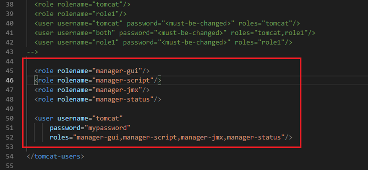

- To run Tomcat, we double click into ```startup.bat``` file. (or ```startup.sh``` file if we use Linux/Ubuntu).

- On browser, we type ```localhost:8080```.

    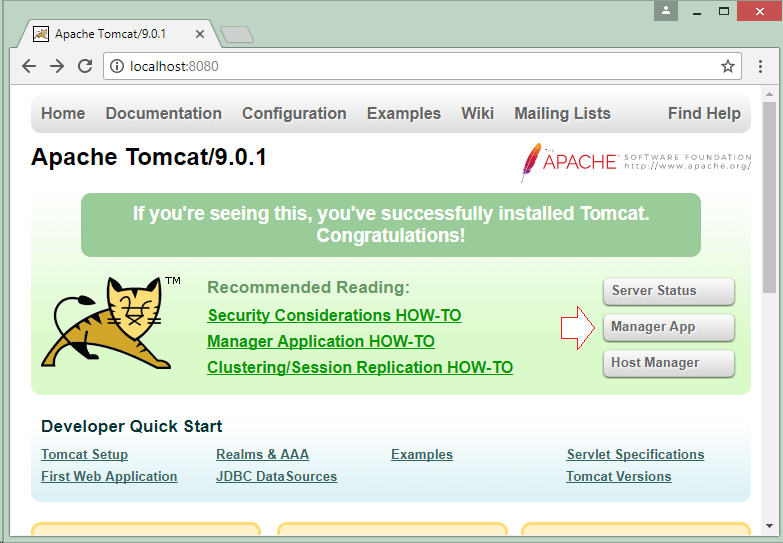

- With Tomcat, we have authenticate ```username```/```password``` that we write in ```tomcat-users.xml``` file.

    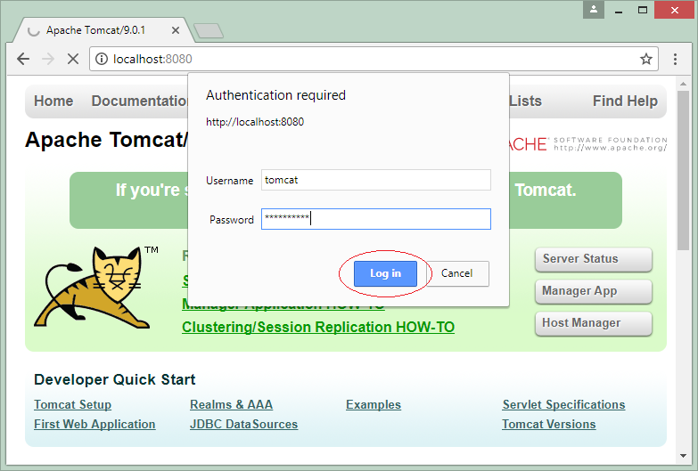

- In Tomcat, we have ```/manager``` (Tomcat Manager Application) is the most important. It will help us to manage Tomcat, and we can access it with following path: ```localhost:8080/manager```.

    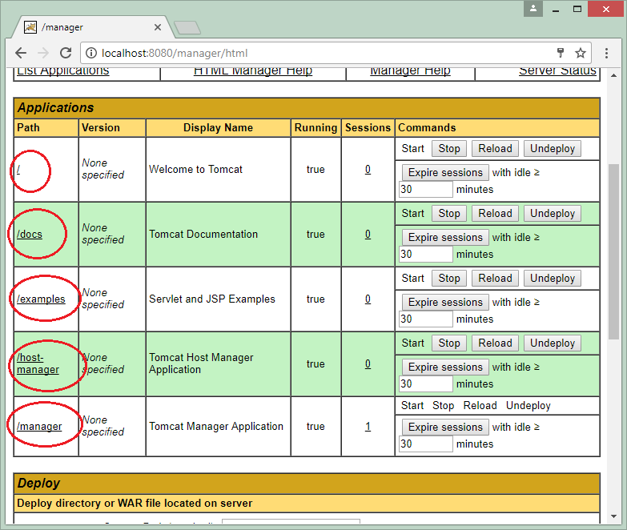

- In order to deploy web application to Tomcat, we can do the following image.

    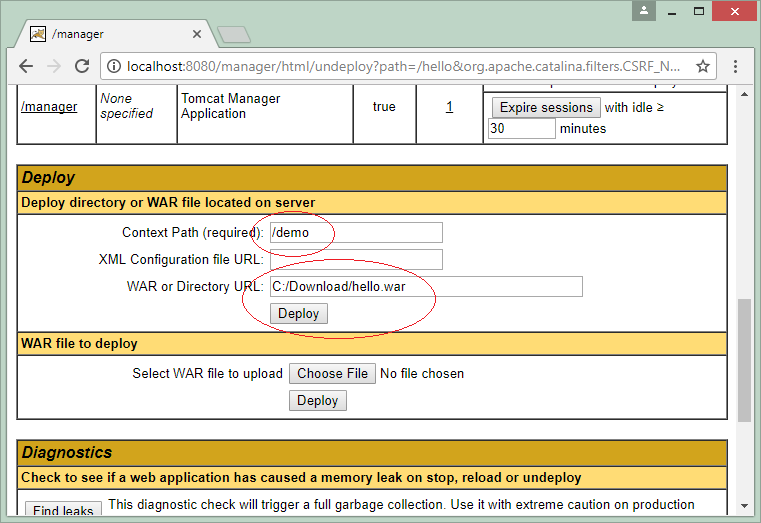

- After that, demo application will be deployed to Tomcat.

    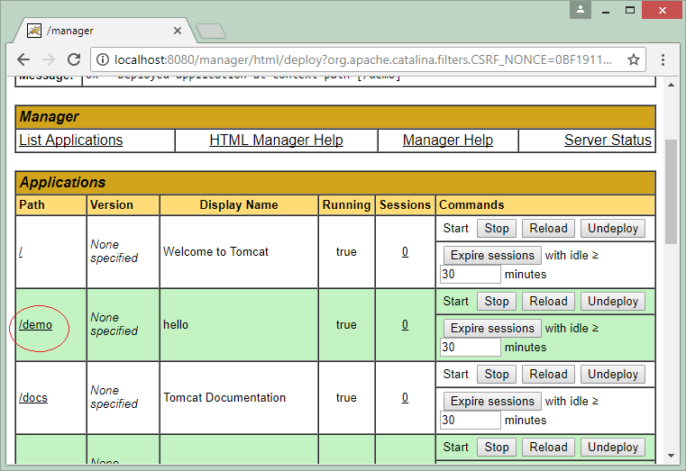

- Run demo application, we have:

    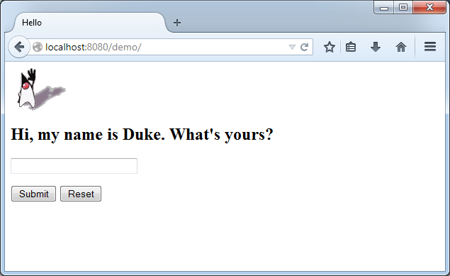


<br>

## Some errors in Eclipse when configure Tomcat
- ```WARNING: Unable to load server configuration from ... server.xml```
    
    We only need to copy a path ```E:\apache-tomcat-9.0.16\conf``` into our path where has error.

- ```Getting 404 - Page not found error```

    

    We can solve this error that follows some steps:
    - Step 1

        - Go to Eclipse IDE
        - Click on Servers Tab
        - Double click on Tomcat v9.0 Server at localhost

            

    - Step 2

        - New Apache Tomcat configuration page will open
        - Go to ```Server Location``` section
        - Select ```Use Tomcat installation``` (takes control of Tomcat installation)

            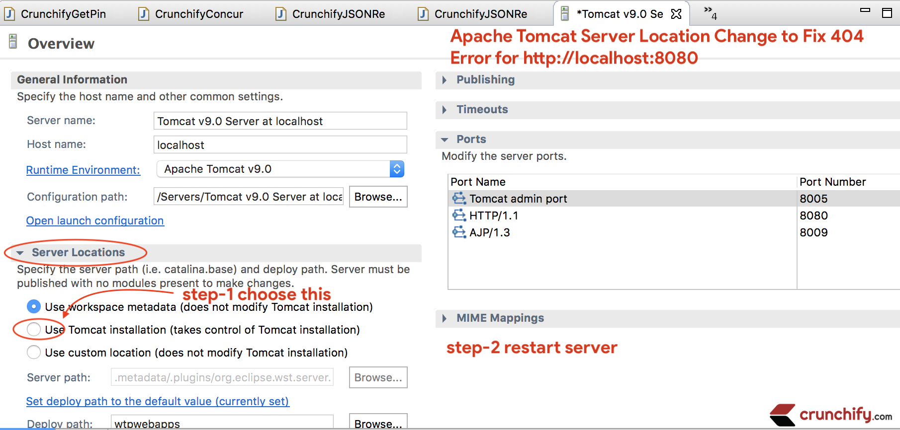

    - Step 3

        - Save configuration
        - ```Restart``` Server by right clicking on tomcat server and click ```Restart```
        - Visit ```http://localhost:8080``` again and now you should see working tomcat page

            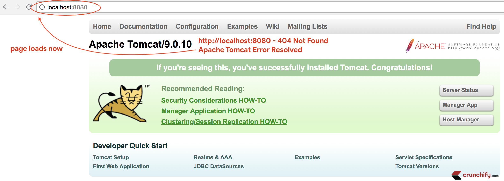

<br>


Refer:

[https://o7planning.org/vi/11583/cai-dat-va-cau-hinh-tomcat-server](https://o7planning.org/vi/11583/cai-dat-va-cau-hinh-tomcat-server)

[https://crunchify.com/tomcat-starts-but-home-page-does-not-open-on-browser-with-url-http-localhost8080/](https://crunchify.com/tomcat-starts-but-home-page-does-not-open-on-browser-with-url-http-localhost8080/)