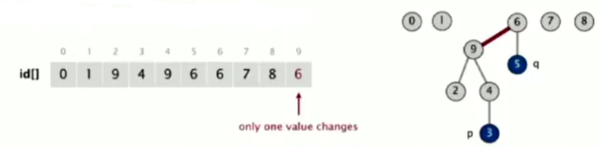
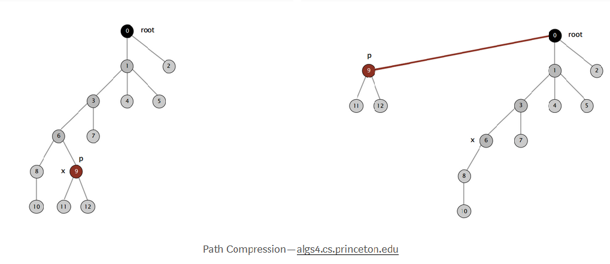

In this tutorial, we will discuss about Quick - Union to understand all of it. Then, we can know about which problem will be applied Quick-Union.

<br>

## Table of contents
- [Introduction to Quick Union](#introduction-to-quick-union)
- [Source code](#source-code)
- [Drawbacks of Quick Union](#drawbacks-of-quick-union)
- [Application of Union-Find](#application-of-union-find)
- [Wrapping up](#wrapping-up)

<br>

## Introduction to Quick Union
A disjoint-set is a data structure that keeps track of a set of elements partitioned into a number of disjoint (non-overlapping) subsets. A Union-Find algorithm is an algorithm that performs two useful operations on such a data structure:

- Find: Determine which subset a particular elements is in. This can be used for determining if two elements are in the same subset.
- Union: Join two subsets into a single subset.

And Quick Union is one of the implementations of Union-Find algorithm.

Some implementations of Union-Find algorithm:
- Quick Find
- Quick Union
- Weighted quick union
- Weighted quick union with path compression

<br>

## Source code
- Data structure

    - Integer array id[] of size N.
    - Interpretation: id[i] is parent of i.
    - Root of i is: id[id[id[...id[i]...]]]

- Find operation: check if p and q have the same root.

    

- Union operation: to merge components containing p and q, change all entries whose id equals id[p] and id[q]. So, we have a problem: many values can be changed.

    

```java
public class QuickUnionUF {
    
    private int[] id; 
       
    // set id for each object to itself 
    // (N array accesses)
    public QuickUnionUF(int N) {
        id = new int[N];
        for (int i = 0; i < N; ++i) {
            id[i] = i;
        }
    }
       
    // chase parent pointers until reach root 
    // (depth of i array accesses)
    private int root(int i) {   // find operation
        while (i != id[i]) {
            i = id[i];
        }
        
        return i;
    }
    
    // check if p and q have same root
    // (depth of p and q array accesses)
    public boolean connected(int p, int q) {
        return root(p) == root(q);
    }
    
    // change root of p to point to root of q (depth of p and q array acceses)
    public void union(int p, int q) {
        int i = root(p);
        int j = root(q);
        
        id[i] = j;
    }
}
```


<br>

## Drawbacks of Quick Union
- Cost model: number of array access (for read and write)

    |   algorithm    |  initialize  | union  |  find   |
    | -------------- | ------------ | ------ | ------- |
    | quick-find     | N            | N      | 1       |
    | quick-union    | N            | N (*)  | N (worst case) | 

    ```*``` : includes cost of finding roots. 

- Quick-find defect
    - Union too expensive (N array accesses)
    - Trees are flat, but too expensive to keep them flat

- Quick-union defect 
    - Trees can get tall
    - Find operation is too expensive (could be N array accesses)

    SO, we could wind up with a long skinny tree. Of each object just pointing to next and then to do a find operation for object at the bottom would involve going all the way through the tree. 

    Costing involving in the array accesses is just to do the find operation and that's going to be slow if we have a lot of operations.
    
    Finally, the maximum number of array accesses during a find operation when using the quick-union on n elements is linear.

<br>

## Quick-Union Improvements
- Weighted quick-union

    - How to improve:
        - Modify quick-union to avoid tall trees.
        - Keep track of size of each tree (number of object)
        - Balance by linking root of smaller tree to root of larger tree (reasonable alternatives: union by height or rank).

    

    - Source code
        - Data structure: same as quick-union, but maintain extra array sz[i] to count number of objects in the tree rooted at i.
        - Find operation: 
            - Identical to quick-union.
            - Takes time proportional to depth of p and q.

            ```java
            return root(p) == root(q);
            ```
        - Union operation: Modify quick-union to:
            - Link root of smaller tree to root of larger tree.
            - Update the sz[] array.
            - Takes constant time, given roots.

                ```java
                int i = root(p);
                int j = root(q);

                if (i == j) return;

                if (sz[i] < sz[j]) {
                    id[i] = j;
                    sz[j] += sz[i];
                } else {
                    id[j] = i;
                    sz[i] += sz[j];
                }
                ```

        - Proposition: Depth of any node x is at most ```lgN```.

            lg = base-2 logarithm.

            

            |    algorithm   |  initialize   |  union  |  connected   |
            | -------------- | ------------- | ------- | ------------ |
            | quick-find     | N             | N       | 1            |
            | quick-union    | N             | N *     | N            |
            | weighted QU    | N             | lgN *   | lgN          |

            ```*```: includes cost of finding roots.

            Pf. When does depth of x increase?

            Increases by 1 when tree T1 containing x is merged into another tree T2.
            - The size of the tree containing x at least doubles since |T2| >= |T1|.
            - Size of tree containing x can double at most lgN times. 

                

            Q: Stop at guaranteed acceptable performance?
            A: No, easy to improve further.

- Path compression

    Quick union with path compression: Just after computing the root of p, set the id of each examined node to point to that root.

    

    - Two-pass implementation: add second loop to ```root()``` to set the id[] of each examined node to the root.

    - Simpler one-pass variant: Make every other node in path point to its grandparent (thereby halving path length).

        ```java
        private int root(int i) {
            while (i != id[i]) {
                id[i] = id[id[i]];
                i = id[i];
            }

            return i;
        }
        ```
    
    Note: In pratice, no reason not to! Keep tree almost completely flat.

- Weighted quick-union with path compression

    [Hopcroft-UIman, Tarjan] Starting from an empty data structure, any sequence of M union-find ops on N objects makes <= c(N + Mlg*N) array accesses.
    - Analysis can be improved to N + M*α(M, N)
    - Simple algorithm with fascinating mathematics.

        |      N     |    lg*N    |
        | ---------- | ---------- |
        | 1          | 0          |
        | 2          | 1          |
        | 4          | 2          |
        | 16         | 3          |
        | 65536      | 4          | 
        | 2^65536    | 5          |

        Iterate log function

    Linear-time algorithm for M union-find ops on N objects?
    - Cost within constant factor of reading in the data.
    - In theory, ```Weight Quick-Union with Path Compression``` is not quite linear.
    - In practice, ```Weight Quick-Union with Path Compression``` is linear.

- Summary

    - Bottom line: ```Weighted quick union (with path compression)``` makes it possible to solve problems that could not otherwise be addressed.

        |         algorithm        |        worst-case time         |
        | ------------------------ | ------------------------------ |
        | quick-find               | M N |
        | quick-union              | M N |
        | weighted Quick-Union     | N + MlogN |
        | QU + path compression    | N + MlogN |
        | weighted QU + path compression | N + Mlg*N |

        M union-find operations on a set of N objects.

        For example:

        10^9 unions and finds with 10^9 objects
        - WQUPC reduces time from 30 years to 6 seconds.
        - Super computer won't help much; good algorithm enables solution.


<br>

## Application of Union-Find
- Percolation
- Games (Go, Hex)
- Dynamic connectivity
- Least common accessor
- Equivalence of finite state automata
- Hoshen-Kopelman algorithm in physics
- Hinley-Milner polymorphic type inference
- Kruskal's minimum spanning tree algorithm
- Compiling equivalence statements in Fortran
- Morphological attribute openings and closings
- Matlab's ```bwlabel()``` in image processing

<br>

## Wrapping up
- When opening one new site in the percolation simulation, how many times is ```union()``` called? 

    --> Solution: 0, 1, 2, 3 or 4. It is called for each neighboring site that is already open. There are 4 possible neighbors, but some of them may not already be open.

- Social network connectivity. 

    Given a social network containing nnn members and a log file containing m timestamps at which times pairs of members formed friendships, design an algorithm to determine the earliest time at which all members are connected (i.e., every member is a friend of a friend of a friend ... of a friend). Assume that the log file is sorted by timestamp and that friendship is an equivalence relation. The running time of your algorithm should be mlog⁡n or better and use extra space proportional to n.

- Union-find with specific canonical element.

    Add a method ```find()``` to the union-find data type so that ```find(i)``` returns the largest element in the connected component containing iii. The operations, ```union()```, ```connected()```, and ```find()``` should all take logarithmic time or better.

    For example, if one of the connected components is {1,2,6,9}, then the ```find()``` method should return 999 for each of the four elements in the connected components.

- Successor with delete. 

    Given a set of nnn integers S={0,1,...,n−1} and a sequence of requests of the following form:

    - Remove xxx from SSS
    - Find the successor of x: the smallest y in SSS such that y ≥ x.

    design a data type so that all operations (except construction) take logarithmic time or better in the worst case.

<br>

Refer:

[https://stackoverflow.com/questions/43036204/what-is-the-time-complexity-of-quick-union](https://stackoverflow.com/questions/43036204/what-is-the-time-complexity-of-quick-union)

[https://www.hackerearth.com/practice/data-structures/disjoint-data-strutures/basics-of-disjoint-data-structures/tutorial/](https://www.hackerearth.com/practice/data-structures/disjoint-data-strutures/basics-of-disjoint-data-structures/tutorial/)

[https://www.geeksforgeeks.org/union-find/](https://www.geeksforgeeks.org/union-find/)