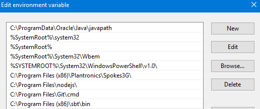
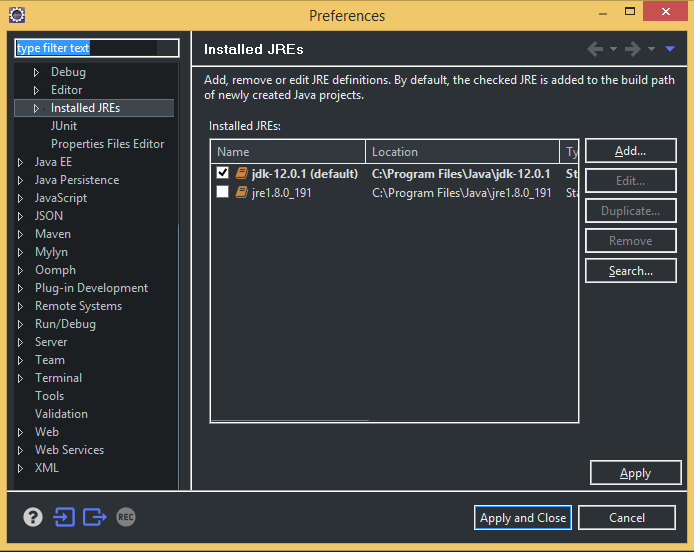
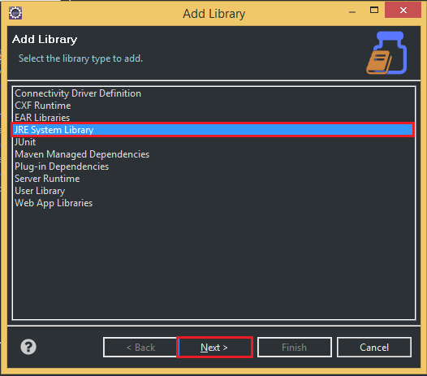
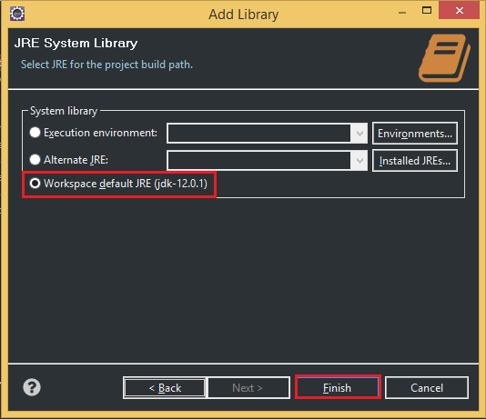

When we need to install JDK 12 to utilize some new features in Java 12, we will encounter some problems that are related to multiple versions of JDK.

Now, in this article, we will fix them. Let's go.

## Table of contents
- [The problem's context](#the-problem's-context)
- [Solution for this problem](#solution-for-this-problem)
- [Use batch file to setup environment variable](#use-batch-file-to-setup-environment-variable)
- [Remove old JDK, JRE version, setup JDK and JRE 12 in Eclipse](#remove-old-JDK-JRE-version-setup-JDK-and-JRE-12-in-eclipse)
- [Wrapping up](#wrapping-up)

<br>

## The problem's context
In our computer, we installed the JDK 8, but now we also want to install JDK 12. After downloading and installing completely, in Eclipse, we find that eclipse does not realize the syntaxes in Java 12.

So, when we type command in CMD, we have:

```
java -version
javac -version
```

--> Result: Version of java: 1.8.191 and version of javac: 12.0.1

Two above version is not the same.

<br>

## Solution for this problem
- The first thing that we need to do is to set environment variable ```JAVA_HOME``` to our directory of JDK version 12.

- The second thing is that we need to look at the ```System variables```. 

    

    We have ```C:\Program Files (x86)\Common Files\Oracle\Java\javapath``` in Windows 8 or ```C:\ProgramData\Oracle\Java\javapath``` in Windows 10 is at the first in ```PATH```. So, we need to change ```%JAVA_HOME%\bin``` that is at the first in ```PATH```.

<br>

## Use batch file to setup environment variable

```batch
@echo off
echo Setting JAVA_HOME
set JAVA_HOME=C:\Program Files\Java\jdk-12.0.1

echo setting PATH
set PATH=C:\Program Files\Java\jdk-12.0.1\bin;%PATH%

echo Display java version
java -version
```

<br>

## Remove old JDK version, setup JDK and JRE 12 in Eclipse
1. At ```Window/Preferences```, jump to ```Java/Installed JREs```, add the path of JDK 12: ```C:\Program Files\Java\jdk-12.0.1```.   

    

- At ```Project/Properties```, look at ```Java Build Path``` --> ```Libraries``` tab, select ```Add Library```.

    

    

    

<br>

## Wrapping up
- Understanding about some parts in JDK, JRE.
- Use command line to setup environment variables.

<br>

Refer:

[https://superuser.com/questions/1057532/how-to-change-java-version-on-windows-10](https://superuser.com/questions/1057532/how-to-change-java-version-on-windows-10)

[https://blogs.oracle.com/pranav/switch-between-different-jdk-versions-in-windows](https://blogs.oracle.com/pranav/switch-between-different-jdk-versions-in-windows)

[https://coderanch.com/t/701603/java/JRE-JDK](https://coderanch.com/t/701603/java/JRE-JDK)