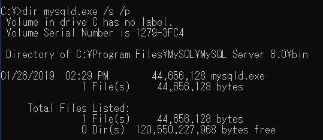
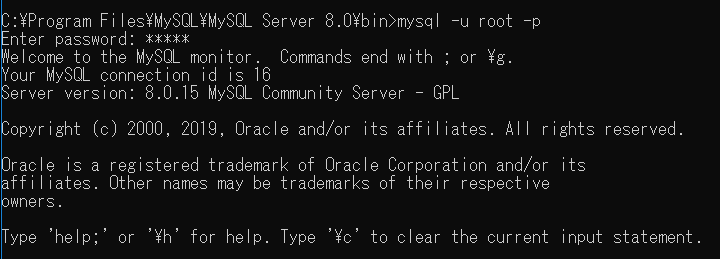
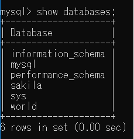
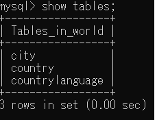
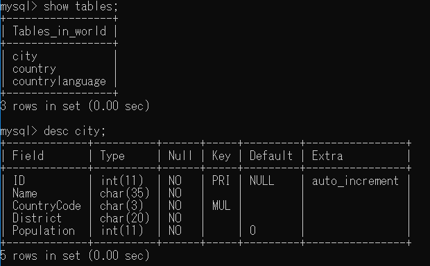
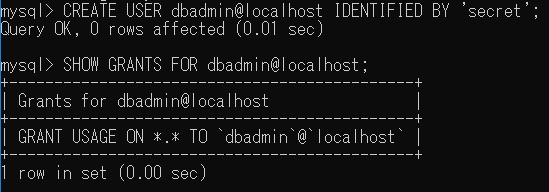
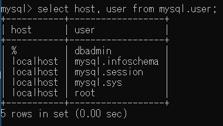

When we are working with database, we usually use UI to interact with database such as MySQL Workbench, PgAdmin 3, 4, ... But when we want to do something deeper with databases such as granting permission for people to access our database, what did we do?

So, in this article, we will guidle you how to use command line to interact with database. 

Let's start.

<br>

## Table of contents
- [Connect to MySQL through command line](#connect-to-mysql-through-command-line)
- [Common perations with command line](#common-operations-with-command-line)
- [Wrapping up](#wrapping-up)

<br>

## Connect to MySQL through command line
In order to use command line for MySQL, we have two way:
- Use ```MySQL Command line Client```.
- Use ```Command Line prompt``` in Windows or other OSes.

We will choose ```Command Line prompt``` to do.
- ```Windows + R``` --> cmd

    

    This error comes up when user execute ```mysql``` command on default command prompt. The user should execute this command where ```mysql.exe``` file exists.

- ```cd \```

- ```dir mysqld.exe /s /p```

    It will search our directories and list the directory where ```mysqld.exe``` is located.

- After doing above step, we have the path of ```mysqld.exe```.

    So, we will change to this path: ```cd path_name```.

    

- Type command ```mysqld``` to test.

    

- Log in to mysql command line.

    ```
    mysql -u root -p
    ```

    

<br>

## Common perations with command line
- List all databases

    ```sql
    show databases;
    ```

    Then, we have:

    

- Create database

    ```sql
    CREATE DATABASE [IF NOT EXISTS] database_name
    [CHARACTER SET charset_name]
    [COLLATE collation_name]
    ```

    For example: ```CREATE DATABASE testdb;```

- Remove database

    ```sql
    DROP DATABASE [IF EXISTS] database_name;
    DROP SCHEMA [IF EXISTS] database_name;
    ```

    For example: ```DROP DATABASE IF EXISTS testdb;```

- Select one databases to implement

    ```sql
    use database_name;
    ```

- List all tables in one database

    ```sql
    show tables;
    ```

    

- List all tables in another database

    ```sql
    show tables in another_database;
    ```

    OR

    ```sql
    SELECT TABLE_NAME 
    FROM information.schema.TABLES 
    WHERE TABLE_SCHEMA = 'another_database';
    ```

- Delete table

    ```sql
    DROP TABLE IF EXISTS table_name;
    ```

- Get information of current user

    ```sql
    SELECT user();
    ```

    OR 

    ```sql
    SELECT current_user();
    ```

    OR

    ```sql
    SELECT user, host, db, command
    FROM information_schema.processlist;
    ```

    

    So, we have the current user is ```root@localhost```.

- Show the fields or schema of a database table

    Use ```desc``` command in MySQL Command Line Client.

    Assuming that we have three tables such as ```city```, ```country```, ```countrylanguage```, we want to see that structure of the city table.

    We will do the following image:

    

- List column names in database table without the table formatting

    - Start MySQL with ```-sN``` option:

        

        ```-sN``` option means:
        - ```-s, --silent```: Be more silent. Print results with a tab as separator, each row on new line.
        - ```-N, --skip-column-names```: Don't write column names in results.

    - Implementing with query

        ```sql
        mysql> SELECT column_name FROM information_schema.columns WHERE table_schema = 'YOUR_DATABASE_NAME' AND table_name = 'YOUR_TABLE_NAME';
        ```

        Or 

        ```sql
        SELECT column_name
        FROM information_schema.columns
        WHERE table_schema = 'YOUR_DATABASE_NAME' 
        AND table_name = 'YOUR_TABLE_NAME';
        ```

        

    OR we can do with the following command:

    ```sql
    SHOW COLUMNS FROM table_name;
    SHOW COLUMNS FROM database_name.table_name;
    SHOW COLUMNS FROM table_name IN database_name;
    SHOW FULL COLUMNS FROM table_name; // lists all privileges and some information in this column.
    ```

- Show all users in MySQL database

    All information of user, host is saved in ```mysql.user``` table. So, we can use a common select query to get all users in MySQL.

    Before listing all users, we can have glance to ```mysql.user``` table with command ```desc mysql.user;```. Then, we have:

    ```sql
    SELECT * FROM mysql.user;
    ```

    Or

    ```sql
    SELECT host, user FROM mysql.user;
    ```

- Create user account in MySQL

    ```sql
    CREATE USER user_account IDENTIFIED BY password;
    ```

    - The ```user_account``` is in the format ```'username'@'hostname'```.
    - The ```password``` must be in clear text. MySQL will encrypt the password before saving the user account into the ```user``` table.

    Assuming that we want to create other user, not root, such as ```dbadmin```, we have:

    

    When we use command ```SHOW GRANTS FOR dbadmin@localhost;``` to get all privileges of ```dbadmin@localhost```, we only see ``` GRANT USAGE ON *.* TO `dbadmin@localhost` ```. It means that ```dbadmin``` user account can only login to database server and has no other privileges.

    ```*.*``` means that ```database.table```.

- Perform user to connect from any host

    ```sql
    CREATE USER dbadmin@'%' IDENTIFIED BY 'secret';
    ```

    It means that we allow ```dbadmin``` user account to connect to the database server from any host.

    If we want to allow ```dbadmin``` user account to connect from any subdomain of the ```mysql.org``` host, we can use ```%``` as follows:

    ```sql
    CREATE USER dbadmin@'%.mysql.org'
    IDENTIFIED BY 'secret';
    ```

- Grant privileges for a user account

    The reason why we do need to note is that after creating a new user account, the user doesn't have any privileges. So, we have to grant the permission for a user with ```GRANT``` statement.

    ```sql
    GRANT privilege,[privilege],.. ON privilege_level 
    TO user [IDENTIFIED BY password]
    [REQUIRE tsl_option]
    [WITH [GRANT_OPTION | resource_option]];
    ```

    - First, specify one or more privileges after the GRANT keyword. If you grant the user multiple privileges, each privilege is separated by a comma. (see a list of privilege in the table below).

    - Next, specify the privilege_level that determines the level at which the privileges apply. MySQL supports global ( *.*), database ( database.*), table ( database.table) and column levels. If you use column privilege level, you must specify one or a list of comma-separated column after each privilege.

    - Then, place the user that you want to grant privileges.  If user already exists, the GRANT statement modifies its privilege. Otherwise, the GRANT statement creates a new user. The optional clauseIDENTIFIED BY allows you set a new password for the user.

    - After that, you specify whether the user has to connect to the database server over a secure connection such as SSL, X059, etc.

    - Finally, the optional WITH GRANT OPTION clause allows you to grant other users or remove from other users the privileges that you possess. In addition, you can use the WITH clause to allocate MySQL database server’s resource e.g., to set how many connections or statements that the user can use per hour. This is very helpful in the shared environments such as MySQL shared hosting.

    The followings are steps that we need to grant all privileges for a user.
    - Create a user in MySQL.

        ```sql
        CREATE USER dbadmin@localhost IDENTIFIED BY 'secret';
        ```
    
    - Display all privileges that assign to ```dbadmin@localhost```.

        ```sql
        SHOW GRANTS FOR dbadmin@localhost;
        ```

    - Grant permission for a user

        - Grant all privileges to the dbadmin@localhost user account.

            ```sql
            GRANT ALL ON *.* TO 'dbadmin'@'localhost' WITH GRANT OPTION;
            ```

            ```*.*``` means that dbadmin can access all database and all objects in the databases.

            ```WITH GRANT OPTION``` means that allows dbadmin@localhost to grant privileges to other users.

        - Grant all privileges on specific database.

            ```sql
            GRANT ALL ON world.* TO dbadmin@localhost;
            ```

        - Grant all privileges for specific user at any host.

            ```sql
            GRANT ALL ON *.* TO 'dbadmin'@'127.0.0.1' WITH GRANT OPTION;
            ```

        - Grant some specific privileges on specific database.

            ```sql
            GRANT SELECT, UPDATE, DELETE ON world.* TO dbadmin@localhost;
            ```

- Remove user in MySQL

    Before removing any users from MySQL, we need to see MySQL have which user account.

    ```sql
    SELECT host, user FROM mysql.user;
    ```

    

    Then, we will remove the ```dbadmin``` account.

    ```sql
    DROP USER [IF EXISTS] user, ...;
    ```

    The ```DROP USER``` command removes all privileges from all grant tables before removing the user account.

    And we need to remember that when a user account is logged in and has active session running. If you drop the user account, it won’t stop the open sessions. The active session will continue until user exits. 

    It’s important to note that if you don’t terminate the active sessions, the removed user, if connected to the database server, still can perform all operations until the session ends.
    
    Typically, in this case, you should shutdown user’s session immediately right before executing the ```DROP USER``` statement.
    - First, you need to identify the process id of the user by using the ```SHOW PROCESSLIST``` statement.
    - Second, you kill this process by using ```KILL id_our_session_db```.
    - Third, you execute ```DROP USER``` statement to remove user account dbadmin@localhost:

        ```sql
        DROP USER dbadmin@localhost;
        ```

<br>

## Wrapping up
- Use command line to improve the speed of implementing with MySQL, and enhace the knowledge about MySQL.

<br>

Refer:

[https://blog.sqlauthority.com/2013/11/08/mysql-how-to-find-mysqld-exe-with-command-prompt-fix-mysql-is-not-recognized-as-an-internal-or-external-command-operable-program-or-batch-file/](https://blog.sqlauthority.com/2013/11/08/mysql-how-to-find-mysqld-exe-with-command-prompt-fix-mysql-is-not-recognized-as-an-internal-or-external-command-operable-program-or-batch-file/)

[https://tableplus.io/blog/2018/08/mysql-how-to-drop-all-tables.html](https://tableplus.io/blog/2018/08/mysql-how-to-drop-all-tables.html)

[http://www.mysqltutorial.org/mysql-show-users/](http://www.mysqltutorial.org/mysql-show-users/)

[http://www.mysqltutorial.org/mysql-grant.aspx](http://www.mysqltutorial.org/mysql-grant.aspx)

[http://www.mysqltutorial.org/mysql-show-columns/](http://www.mysqltutorial.org/mysql-show-columns/)