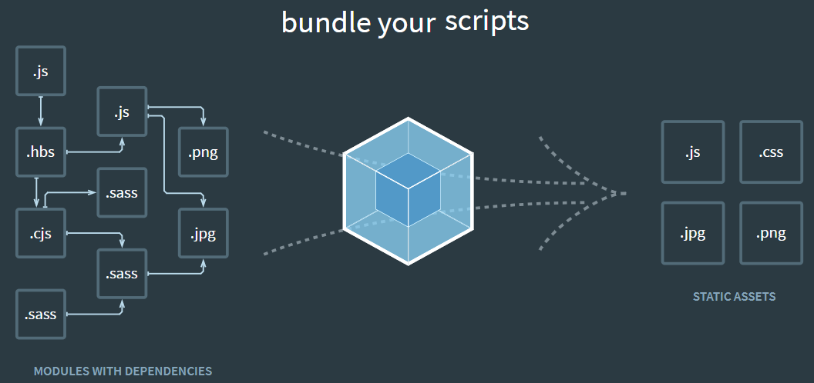

In this article, we will learn how to configure a project that use Webpack and Babel in front-end. It is a first step to work with larger project in the future. So, let's get started.


<br>

## Table of contents
- [What is Webpack ?](#what-is-webpack-?)
- [What is Babel ?](#what-is-babel-?)
- [Setup some packages Webpack and Babel](#setup-some-packages-webpack-and-babel)
- [Wrapping up](#wrapping-up)

<br>

## What is Webpack ?
- Definition of Webpack

  Webpack is a ```Module bundle```. It takes a bunch of assets such as source, images, css, ... to turn them into something that we will send to client. It means that it will package all dependencies into bundles that browser can understand.

  By default, Webpack only knows how to process ```.js``` or ```.json``` files. To do with other format files, we need to use ```Loader``` such as ```HtmlWebPackPlugin``` for html file, ...

  

- Some functionalities in webpack

  - Hot module reloading: updates React component without refresh website.
  - Lazy loading
  - Bundle splitting
  - Hashing
  - Source maps: debug minified version.

- Folder structure of Js application that use Webpack and Babel

  ```js
  - node_modules
  - dist/
  - index.html
  - src/
  - index.js
  - package.json
  - webpack.config.js
  ```

  When Webpack run, Javascript files in source folder ```/src``` will be bundled into a single Javascript file which will be placed automatically into the ```/dist``` folder.

  ```/dist``` will be used to serve our applicatioin to the browser.

- Below is the content of webpack.config.js file that we need to know:

  ```js
  const webpack = require("webpack");

  module.exports = {
    // Where to start bundling
    entry: {
      app: "./src/index.js",
      home: './src/home.js',
      contact: './src/contact.js'
    },

    // Where to output
    output: {
      // Output to the same directory
      path: __dirname,    // or path.resolve(__dirname, 'dist'),
      publicPath: '/',
      // Capture name from the entry using a pattern
      filename: "[name].js"
    },

    // How to resolve encountered imports
    module: {
      rules: [
        {
          test: /\.css$/,
          use: ["style-loader", "css-loader"],
        },
        {
          test: /\.js$/,
          use: "babel-loader",
          exclude: /node_modules/,
        },
        {
            test: /\.html$/,
            use: [
                {
                    loader: "html-loader"
                }
            ]
        }
      ],
    },

    // What extra processing to perform
    plugins: [
      new webpack.DefinePlugin({ ... }),
      new HtmlWebPackPlugin({
          template: "./src/index.html",
          filename: "./index.html"
      }),
      new CleanWebpackPlugin()
    ],

    // Adjust module resolution algorithm
    resolve: {
      alias: { ... },
    },
  };
  ```


- Some modes in Webpack

  There are two modes:
  - development: This mode will remain the structure of file, so, we can easily read source code.

    In order to use development mode, we can configure in package.json file:

    ```json
    "scripts": {
      "start": "webpack-dev-server --mode development --open --hot",
      "build": "webpack --mode development"
    }
    ```

  - production:

    To production mode, all files will be minified. So, these files will be reduced the files's size.

  

<br>

## What is Babel ?

[Babel](https://babeljs.io/docs/en/) is a toolchain that is mainly used to convert ECMAScript 2015+ code into a backwards compatible version of JavaScript in current and older browsers or environments.

<br>

## Setup some packages Webpack and Babel
1. For webpack

    To work with Webpack easily, we need to install some additional packages.

    - webpack

      ```js
      npm install --save-dev webpack webpack-cli webpack-dev-server
      ```

    - webpack-dev-server

      Use webpack with a development server that provides live reloading. This should be used for development only.

      To run our project with webpack-dev-server, we need to configure in package.json file:

      ```json
      "script": {
        "start:dev": "webpack-dev-server --config ./webpack.config.js --mode development",
        "build": "webpack --config ./webpack.config.js --mode production"
      }
      ```

      And run the following command in our terminal/console:

      ```js
      npm run start:dev
      ```

    - ```webpack-cli```

      It provides a flexible set of commands for developers to increase speed when setting up a custom webpack project.

      We can refer the [link of Webpack CLI](https://webpack.js.org/api/cli/)

    - ```html-webpack-plugin``` and ```html-loader```

      ```js
      npm install --save-dev html-webpack-plugin html-loader
      ```

      If we want to remove the ```/dist``` folder with every Webpack build, it means that the automatic generated ```dist/bundle.js``` file should be removed, and ```dist/index.html``` file will be added automatically. We do not want to create ```dist/index.html``` file manually for every Webpack build again, so, we can use ```html-webpack-plugin```.

      It will simplify creation of HTML files to serve our webpack bundles. This is especially useful for webpack bundles that include a hash in the filename which changes every compilation.

      We can refer [link about html-webpack-plugin](https://github.com/jantimon/html-webpack-plugin).

      Update some plugins in webpack.config.js file:

      ```js
      const HtmlWebPackPlugin = require("html-webpack-plugin");
      module.exports = {
        module: {
          rules: [
            {
              test: /\.(js|jsx)$/,
              exclude: /node_modules/,
              use: {
                loader: "babel-loader"
              }
            },
            {
              test: /\.html$/,
              use: [
                {
                  loader: "html-loader"
                }
              ]
            }
          ]
        },
        plugins: [
          new HtmlWebPackPlugin({
            template: "./src/index.html",
            filename: "./index.html"
          })
        ]
      };
      ```

    - clean-webpack-plugin

        Because of automatically generating ```dist/index.html``` and ```dist/bundle.js``` files, we can delete the content of our ```/dist``` folder with every Webpack build. So, we need to install ```clean-webpack-plugin```.

        ```js
        npm install --save-dev clean-webpack-plugin
        ```

    - react-hot-loader

        If we want to use hot loading module when we have changes in our files, we should use ```react-hot-loader```.

        ```
        npm install --save-dev react-hot-loader
        ```

        Add this plugin into webpack.config.js file:

        ```js
        plugins: [
          new webpack.HotMoudleReplacementPlugin()
        ],
        devServer: {
          contentBase: './dist',
          hot: true
        }
        ```

        In ```src/index.js``` file, we need to define that hot reloading is available:

        ```js
        import React from 'react';
        import ReactDOM from 'react-dom';
        const title = 'React with Webpack and Babel';

        ReactDOM.render(
          <div>{title}</div>,
          document.getElementById('app')
        );

        module.hot.accept();
        ```

2. For Babel

    - babel-loader

        It is the Webpack loader responsible for taking in the ES6 code and making it understandable by the browser.

        ```js
        npm install --save-dev babel-loader @babel/core
        ```

    - @babel/preset-env

        It is used to compile Javascript ES6 down to ES5. And ```babel-preset-es2015``` package is deprecated.

        ```js
        npm install --save-dev @babel/preset-env
        ```

    - @babel/preset-react

        Because the syntax of React will be understood by other browsers, so we need Babel to transpile React code ```JSX``` to Javascript.

        ```js
        npm install --save-dev @babel/preset-react
        ```

        Then, we will find ```.babelrc``` file to add some configuration lines:

        ```json
        {
          "presets": [
            "@babel/preset-env",
            "@babel/preset-react"
          ]
        }
        ```

        Finally, let's inform Webpack in webpack.config.js file about files with JSX extension to make sure that they run through the transpiling step:

        ```js
        module.exports = {
          entry: './src/index.js',
          module: {
            rules: [
              {
                test: /\.(js|jsx)$/,
                exclude: /node_modules/,
                use: ['babel-loader']
              }
            ]
          },
          resolve: {
            extensions: ['*', '.js', '.jsx']
          },
          output: {
            path: __dirname + '/dist',
            publicPath: '/',
            filename: 'bundle.js'
          },
          devServer: {
            contentBase: './dist'
          }
        };
        ```

3. For React.js

    Install some packages for react.js:

    ```js
    npm install react react-dom

    // use Prop-types to document our React components
    // https://reactjs.org/docs/typechecking-with-proptypes.html
    npm install --save-dev prop-types
    ```

<br>

## Wrapping up
- Understanding how Webpack works, we can easily configure all project that use Webpack and Babel.
- Remember that all above plugins or loaders that are necessary to work.


<br>

Refer:

[https://www.valentinog.com/blog/babel/](https://www.valentinog.com/blog/babel/)

[https://www.valentinog.com/blog/webpack/](https://www.valentinog.com/blog/webpack/)

[https://levelup.gitconnected.com/what-is-webpack-4fdb624597ae](https://levelup.gitconnected.com/what-is-webpack-4fdb624597ae)

[https://tech.3si.vn/2017/11/24/meo-toi-uu-hoa-webpack-bundle/](https://tech.3si.vn/2017/11/24/meo-toi-uu-hoa-webpack-bundle/)

[https://www.robinwieruch.de/webpack-setup-tutorial](https://www.robinwieruch.de/webpack-setup-tutorial)

[https://survivejs.com/webpack/what-is-webpack/](https://survivejs.com/webpack/what-is-webpack/)

[https://www.robinwieruch.de/webpack-advanced-setup-tutorial](https://www.robinwieruch.de/webpack-advanced-setup-tutorial)

[https://www.robinwieruch.de/minimal-react-webpack-babel-setup](https://www.robinwieruch.de/minimal-react-webpack-babel-setup)

[https://www.robinwieruch.de/minimal-react-webpack-babel-setup#react-webpack](https://www.robinwieruch.de/minimal-react-webpack-babel-setup#react-webpack)

[https://www.robinwieruch.de/webpack-babel-setup-tutorial](https://www.robinwieruch.de/webpack-babel-setup-tutorial)

[http://vuilaptrinh.com/2018-05-25-huong-dan-viet-code-javascript-tot-hon-voi-webpack/](http://vuilaptrinh.com/2018-05-25-huong-dan-viet-code-javascript-tot-hon-voi-webpack/)