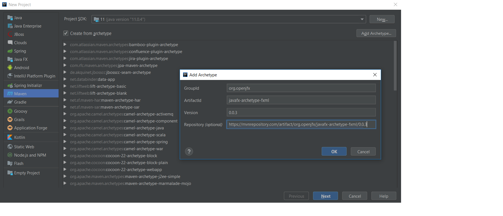
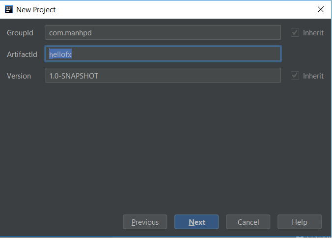
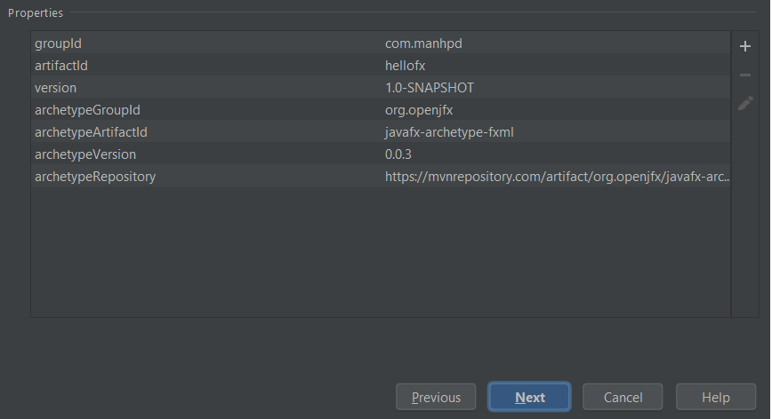
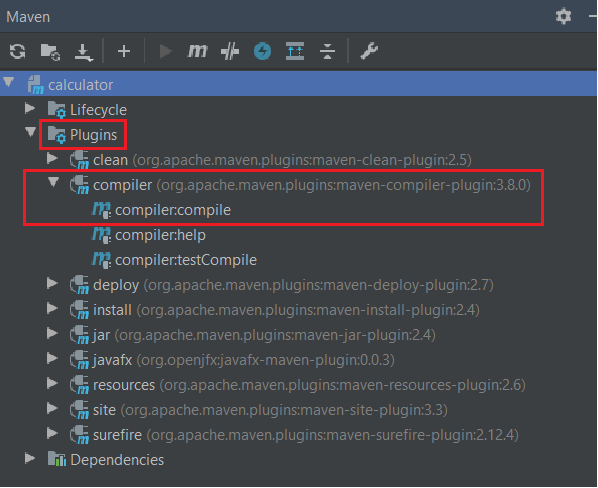

In this article, we will find something out about how to create JavaFX project with Maven. It will help us improving productivity, performance when we can program automatically small task with desktop applications.

Let's get started.

<br>

## Table of contents
- [What is JavaFX](#what-is-javafx)
- [Creating JavaFX Project with Maven](#creating-javafx-project-with-maven)
- [Wrapping up](#wrapping-up)


<br>

## What is JavaFX

According to [wikipedia.com](https://en.wikipedia.org/wiki/JavaFX), we have:

```
JavaFX is a software platform for creating and delivering desktop applications, as well as rich Internet applications that can run across a wide variety of devices.

JavaFX is intended to replace Swing as the standard GUI library for Java SE, but both will be included for the foreseeable future. JavaFX has support for desktop computers and web browsers on Microsoft Windows, Linux, and macOS. Since the JDK 11 release in 2018, JavaFX is part of the open-source OpenJDK, under the OpenJFX project.

Oracle 'Premier Support' for JavaFX is also available, for the current long-term version (Java JDK 8), through March 2022.
```

<br>

## Creating JavaFX Project with Maven
1. Use ```archetype``` in maven to create project

    When we refer to this [link](https://mvnrepository.com/artifact/org.openjfx), we can find that there are so many packages for JavaFX. But in this section, we need to focus on two archetypes that are supported by Maven.
    
    They include: 
    - [FXML JavaFX Maven Archetype](https://mvnrepository.com/artifact/org.openjfx/javafx-archetype-fxml)

        ```xml
        <dependency>
            <groupId>org.openjfx</groupId>
            <artifactId>javafx-archetype-fxml</artifactId>
            <version>0.0.3</version>
        </dependency>
        ```

    - [Simple JavaFX Maven Archetype](https://mvnrepository.com/artifact/org.openjfx/javafx-archetype-simple)

        ```xml
        <dependency>
            <groupId>org.openjfx</groupId>
            <artifactId>javafx-archetype-simple</artifactId>
            <version>0.0.3</version>
        </dependency>
        ```

    Both archetypes for JavaFX have three version, from ```0.0.1``` to ```0.0.3```.

    So, in our project, we find that ```javafx-archetype-fxml``` does not belong to current archetypes of Maven. So, we need to add ```javafx-archetype-fxml``` in our Maven.

    First, select ```File -> New -> Project -> Maven```, and enable ```Create from archetype```.

    If the JavaFX ```javafx-archetype-fxml``` has not installed yet, select ```Add archetype ...```, and fill information to follow a below dialog:

    

    Once installed, select this artifact, and Next button.

2. Create groupId, artifactId, version for our project and confirm again

    

    

3. After finishing to creat javafx project, move on ```pom.xml``` file.

    First, we can see the structure of javafx project with Maven:

    

    Second, content of ```pom.xml``` file:

    ```xml
    <project xmlns="http://maven.apache.org/POM/4.0.0" xmlns:xsi="http://www.w3.org/2001/XMLSchema-instance"
  xsi:schemaLocation="http://maven.apache.org/POM/4.0.0 http://maven.apache.org/maven-v4_0_0.xsd">
        <modelVersion>4.0.0</modelVersion>
        <groupId>com.manhpd</groupId>
        <artifactId>hellofx</artifactId>
        <version>1.0-SNAPSHOT</version>
        <properties>
            <project.build.sourceEncoding>UTF-8</project.build.sourceEncoding>
            <maven.compiler.source>11</maven.compiler.source>
            <maven.compiler.target>11</maven.compiler.target>
        </properties>
        <dependencies>
            <dependency>
                <groupId>org.openjfx</groupId>
                <artifactId>javafx-controls</artifactId>
                <version>13</version>
            </dependency>
            <dependency>
                <groupId>org.openjfx</groupId>
                <artifactId>javafx-fxml</artifactId>
                <version>13</version>
            </dependency>
        </dependencies>
        <build>
            <plugins>
                <plugin>
                    <groupId>org.apache.maven.plugins</groupId>
                    <artifactId>maven-compiler-plugin</artifactId>
                    <version>3.8.0</version>
                    <configuration>
                        <release>11</release>
                    </configuration>
                </plugin>
                <plugin>
                    <groupId>org.openjfx</groupId>
                    <artifactId>javafx-maven-plugin</artifactId>
                    <version>0.0.3</version>
                    <configuration>
                        <mainClass>com.manhpd.App</mainClass>
                    </configuration>
                </plugin>
            </plugins>
        </build>
    </project>
    ```

    Finally, we also insert some dependencies such as ```javafx-graphics```, and ```javafx-media```.

4. Run our project

    In Maven tab, we choose ```Plugins```, then ```compiler``` parent in hierarchy project. Select ```compiler:compile```.

    

    After compiling , we need to run ```Plugins -> javafx -> javafx:run```.

    [!](../img/JavaFX/setup/run-project.png)

<br>

## Wrapping up
- Understanding about how to create our javafx project.


<br>

Refer:

[https://gluonhq.com/products/javafx/](https://gluonhq.com/products/javafx/)

[https://openjfx.io/openjfx-docs/#maven](https://openjfx.io/openjfx-docs/#maven)

[https://github.com/openjfx/samples](https://github.com/openjfx/samples)

[https://github.com/openjfx/javafx-maven-plugin](https://github.com/openjfx/javafx-maven-plugin)

[https://stackoverflow.com/questions/52906773/intellij-idea-error-javafx-runtime-components-are-missing-and-are-required-t](https://stackoverflow.com/questions/52906773/intellij-idea-error-javafx-runtime-components-are-missing-and-are-required-t)

[https://mvnrepository.com/artifact/org.openjfx](https://mvnrepository.com/artifact/org.openjfx)