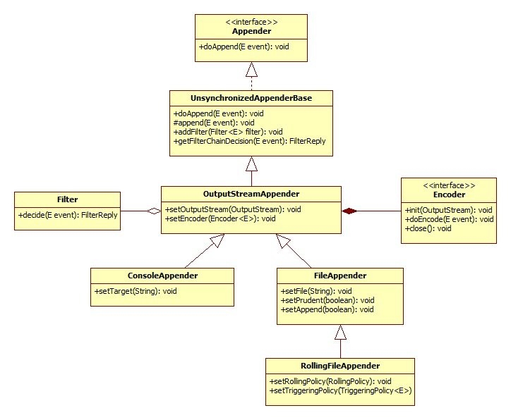

<br>

## Table of contents
- [Setup some packages for utilizing logback](#setup-some-packages-for-utilizing-logback)
- [Structure of Logback package](#structure-of-logback-package)
- [Configure Logback with xml file](#configure-logback-with-xml-file)
- [Some problems when using Logback](#some-problems-when-using-logback)
- [Wrapping up](#wrapping-up)

<br>

## Structure of Logback package
The structure of Logback framework is as same as Log4j 1.x, or Log4j 2.x. It also has same common things:
- ```Logger``` - a context for log messages. This is the class that applications interact with to create log messages.

- ```Appender``` - place log messages in which destinations such as console, file. A ```Logger``` can have more than one ```Appender```.

- ```Layout``` - it is used to format our message to display in console or file. ```Logback``` supports the creation of custom classes for formatting messages, as well as robust configuration options for the existing ones.

Below is an image that describe the structure of Logback framework.



<br>

## Setup some packages for utilizing logback
- Configuration logback in Spring boot

    ```xml
    <properties>
        <version.jcloverslf4j>1.7.29</version.jcloverslf4j>
        <version.logback>1.2.3</version.logback>
        <version.springframework>5.1.4.RELEASE</version.springframework>
    </properties>

    <dependencies>
        <dependency>
            <groupId>org.springframework</groupId>
            <artifactId>spring-context</artifactId>
            <exclusions>
                <exclusion>
                    <groupId>commons-logging</groupId>
                    <artifactId>commons-logging</artifactId>
                </exclusion>
            </exclusions>
            <version>${version.springframework}</version>
        </dependency>

        <dependency>
            <groupId>ch.qos.logback</groupId>
            <artifactId>logback-classic</artifactId>
            <version>${version.logback}</version>
        </dependency>
        <dependency>
            <groupId>org.slf4j</groupId>
            <artifactId>jcl-over-slf4j</artifactId>
            <version>${version.jcloverslf4j}</version>
        </dependency>
    </dependencies>
    ```

    Spring Boot uses Logback framework as as a default Logger.

- Configuration logback in normal Java project

    ```xml
    <properties>
        <version.slf4j>1.8.0-beta2</version.slf4j>
        <version.logback>1.2.3</version.logback>
    </properties>

    <dependencies>
        <dependency>
            <groupId>ch.qos.logback</groupId>
            <artifactId>logback-core</artifactId>
            <version>${version.logback}</version>
        </dependency>
        
        <dependency>
            <groupId>ch.qos.logback</groupId>
            <artifactId>logback-classic</artifactId>
            <version>${version.logback}</version>
        </dependency>

        <dependency>
            <groupId>org.slf4j</groupId>
            <artifactId>slf4j-api</artifactId>
            <version>${version.slf4j}</version>
            <scope>test</scope>
        </dependency>
    </dependencies>
    ```

<br>

## Configure Logback with xml file
1. Content of ```logback.xml``` file

    ```xml
    <?xml version="1.0" encoding="UTF-8"?>
    <configuration>
        <property name="HOME_LOG_PATH" value="C:/logs"/>
        <property name="PATTERN_CONSOLE" value=".%d{HH:mm:ss.SSS} [%thread] %-5level %logger{36} - %msg %n" />
        <property name="PATTERN_ROLLING_FILE" value="%d %p %c{1.} [%t] %m%n" />
        <property name="PATTERN_FILE" value="%-4relative [%thread] %-5level %logger{35} - %msg%n" />
        <property name="MAX_FILE_SIZE" value="10MB" />
        <property name="MAX_DAY_KEEP" value="60" />
        
        <appender name="consoleAppender" class="ch.qos.logback.core.ConsoleAppender">
            <encoder>
                <Pattern>${PATTERN_CONSOLE}</Pattern>
            </encoder>
            <filter class="ch.qos.logback.classic.filter.ThresholdFilter">
                <level>TRACE</level>
            </filter>
        </appender>

        <appender name="FILE" class="ch.qos.logback.core.FileAppender">
            <file>${HOME_LOG_PATH}/app.log</file>
            <append>true</append>
            <encoder>
                <pattern>${PATTERN_FILE}</pattern>
            </encoder>
        </appender>

        <appender name="fileRollingAppender" class="ch.qos.logback.core.rolling.RollingFileAppender">
            <file>${HOME_LOG_PATH}/app.log</file>

            <rollingPolicy class="ch.qos.logback.core.rolling.SizeAndTimeBasedRollingPolicy">
                <fileNamePattern>${HOME_LOG_PATH}/app.%d{yyyy-MM-dd_HH-mm}.%i.log</fileNamePattern>
                <!-- each archived file, size max 10MB -->
                <maxFileSize>${MAX_FILE_SIZE}</maxFileSize>
                <!-- total size of all archive files, if total size > 20GB,
                    it will delete old archived file -->
                <totalSizeCap>20GB</totalSizeCap>
                <!-- 60 days to keep -->
                <maxHistory>${MAX_DAY_KEEP}</maxHistory>
            </rollingPolicy>

            <encoder>
                <pattern>${PATTERN_ROLLING_FILE}</pattern>
            </encoder>
        </appender>

        <logger name="com.manhpd" level="debug" additivity="false">
            <appender-ref ref="consoleAppender" />
            <appender-ref ref="fileRollingAppender" />
        </logger>

        <root level="info">
            <appender-ref ref="consoleAppender" />
            <appender-ref ref="fileRollingAppender" />
        </root>
    </configuration>
    ```

2. How to use Logback

    ```java
    import org.slf4j.Logger;
    import org.slf4j.LoggerFactory;

    public class Application {
        
        private static final Logger logger = LoggerFactory.getLogger(HelloController.class);

        // ...

    }
    ```

3. Symbols in pattern
- ```%d{HH:mm:ss.SSS}``` - a timestamp with hours, minutes, seconds and milliseconds

- ```[%thread]``` - the level of the logging event, padded to 5 characters

- ```%-5level``` – the level of the logging event, padded to 5 characters

- ```%logger{36}``` – the name of the logger, truncated to 35 characters

- ```%msg%n``` – the log messages followed by the platform dependent line separator character

<br>

## Some problems when using Logback
- In multi-module project, for some reason, Logback is only logging from the the "main module" where the Spring application is.

    This ```main``` module is actually the also the module which is packaged as ```WAR``` which contains the rest of the modules.

    Solution: 
    - Because both ```commons-logging``` and ```jcl-over-slf4j``` are on the classpath together. Excluding ```commons-logging``` from the classpath often helps.

    - So, in parent module, we can configure it as same as configuration in [Setup some packages for utilizing logback](#setup-some-packages-for-utilizing-logback).

    - ```logback.xml``` file should present in ```main``` module that is used to package into ```jar``` or ```war``` file.

<br>

## Wrapping up
- Understand about some common parts of an architecture of Logback framework.
- Solve problems that is relevant to configure Logback in multi-module project.

<br>

Refer:

[http://logback.qos.ch/manual/architecture.html](http://logback.qos.ch/manual/architecture.html)

[https://springframework.guru/using-logback-spring-boot/](https://springframework.guru/using-logback-spring-boot/)

[https://www.codepedia.org/ama/how-to-log-in-spring-with-slf4j-and-logback/](https://www.codepedia.org/ama/how-to-log-in-spring-with-slf4j-and-logback/)

[https://www.mkyong.com/logging/logback-xml-example/](https://www.mkyong.com/logging/logback-xml-example/)

**Problems with logback**

[https://stackoverflow.com/questions/53116601/spring-boot-logback-logs-only-from-one-module](https://stackoverflow.com/questions/53116601/spring-boot-logback-logs-only-from-one-module)

[https://stackoverflow.com/questions/9088027/how-to-config-slf4jlogback-in-a-multi-module-maven-project](https://stackoverflow.com/questions/9088027/how-to-config-slf4jlogback-in-a-multi-module-maven-project)

[https://codeday.me/en/qa/20190306/8476.html](https://codeday.me/en/qa/20190306/8476.html)