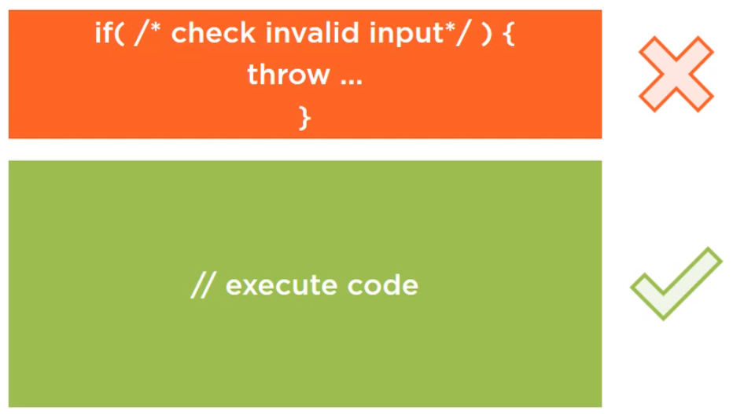
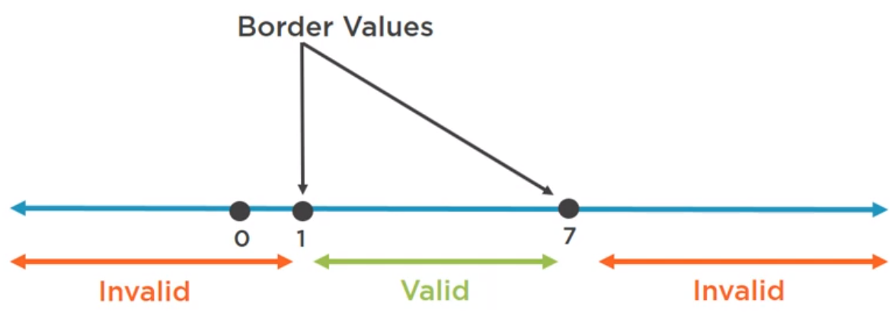
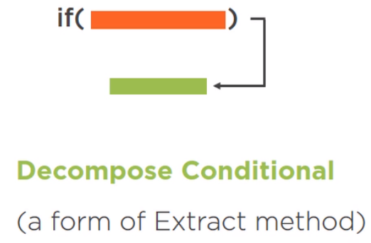
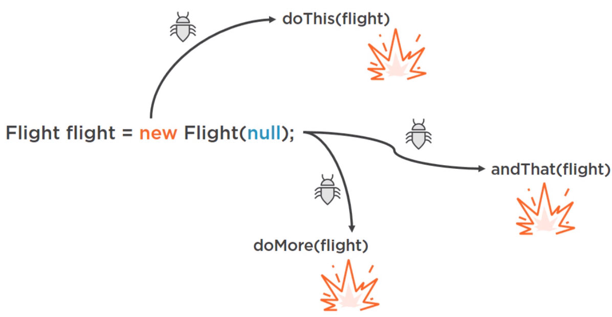
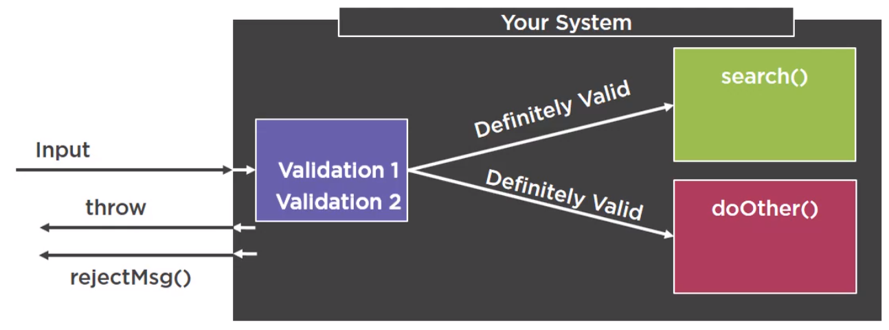

In this article, we will learn how to write better code for validating method's inputs. Use these techniques makes our code easily maintain, readable, because we will separate validation's place and logic place.

Let's get started.

<br>

## Table of contents
- [Validating method input](#validating-method-input)
- [Choosing right exceptions](#choose-right-exceptions)
- [Wrapping up](#wrapping-up)

<br>

## Validating method input
1. Guard clause - Fail fast and Return early

    With the below guard clause, we have:

    ```java
    if (/* validate input */) {
        // nothing to do    
    }
    ```

    Then, we will have three options:
    - Return early

        - ```return false;```
        - ```return;```

    - Fail fast

        ```throw new AppropriateException();```

    - Alternative execution

        - Display a user-friendly message of what went wrong.

    --> Place our Guard clauses at the very beginning.

2. Best practices and pitfalls when checking null, Strings, numbers and dates

- Validating null

    ```java
    if (value_type_1 != null) {
        if (value_type_2 != null) {
            ...
            // nothing to do
        }
    }
    ```

    To describe this situation, we have an image:

    

    As we read the code, we start off by seeing that something might be wrong. After that, we read the code that is supposed to run under normal circumstances. And at the end, we again see some code for the scenario if something goes wrong, so we have to mentally mop this code back to the beginning.

    It might seem fairly easy, but it can become a burden when reading more complex and more nested code. And then suddenly we find ourself scrolling up and down, up and down, and that's no good.

    If we put all of our input checking code at the top on throw immediately, then it becomes easier to follow like this:

    

    For example:

    ```java
    public List<String> search(String fromDest, String toDest, String departDate, int passengerNum) {
        if (fromDest == null) {
            throw new IllegalArgumentException("Argument fromDest cannot be null");
        }

        if (toDest == null) {
            throw new IllegalArgumentException("Argument toDest cannot be null");
        }

        if (departDate == null) {
            throw new IllegalArgumentException("Argument departDate cannot be null");
        }

        ...
    } 
    ```

    When we see the above code, we find that inidividual message for each input will be checked at the top method. If we have multiple arguments, then we check like the above code, so, this code looks terribly, not only the size of this method has doubled, it suffers from another problem.
    
    This code tells about one problem at a time, so if we pass ```search()``` method with three bad inputs, it will tell us that there's a problem with one. We will fix that, send the input again. The code will again reject our input, and we will have to repeat the process multiple times before we get it entirely right on.

    So, the solution for this problem is to combine all of these into a single condition. Now, we can end up with fewer lines of code on a single message.

    

    ```java
    if (fromDest == null || toDest == null || departDate == null) {
        String msg = String.format("You have provided the following arguments, none of them can be null. " + 
                                    "fromDest: %s, toDest: %s, date: %s", fromDest, toDest, departDate);

        
    }
    ```

    Conclustion:
    - If we have one or two inputs, we might as well be specific at the cost off.
    - If we have multiple method arguments acting as inputs, so we decided to go for shorter on more generic version.

- Validating number ranges

    Come back with an above sample, we have a condition about ```passengerNum``` that has a maximum off seven people.

    ```java
    public List<String> search(String fromDest, String toDest, String departDate, int passengerNum) {

        // validate some inputs: fromDest, toDest, departDate

        // validate passengerNum
        if (passengerNum > 7) {
            throw new IllegalArgumentException("The number of passengers must be between 1 and 7");
        }
    }
    ```

    We can see that with a condition with ```passengerNum```, we only check for a case that is greater than ```7``` people. But do not check some cases such as less than ```1``` or ```0```.

    Below is some weird cases that we need to be careful:

    

    Then, we will have some statements for an above image:

    ```java
    if (passengerNum < 1 || passengerNum > 7) // (1)

    if (passengerNum <= 0 || passengerNum >= 8) // (2)
    ```

    So, when validating number input, we really take care about its ```border values``` like an above problem.

- Valiating string

    Coming back to our problem:

    ```java
    public List<String> search(String fromDest, String toDest, String departDate, int passengerNum) {

        // validate some inputs: fromDest, toDest, departDate
        if (fromDest == null || toDest == null || departDate == null) {
        String msg = String.format("You have provided the following arguments, none of them can be null. " + 
                                    "fromDest: %s, toDest: %s, date: %s", fromDest, toDest, departDate);

        // validate passengerNum
        ...
    }
    ```

    We validated some inputs such as ```fromDest```, ```toDest```, ```departDate```, but their data type is ```String```, so that it can be empty. Then, we can deal with them as the following:

    ```java
    if ((fromDest == null) || fromDest.isEmpty()) ||
        (toDest == null || toDest.isEmpty()) ||
        (departDate == null || departDate.isEmpty()) {
            // ...
        }
    ```

    We can find that if we use the native job is the empty method, which makes the code even longer on it, will get even worse when we realized that a string that contains only spaces is also involved for our purposes.

    Then, we need to trim before we check for emptiness. So, it has amount of boilerplat code, and we should refactor them. Factoring technique for the situation is called decomposed, conditional or extract conditional.

    

    So, we will define check method for this technique.

    ```java
    public boolean isNotValidString(String s) {
        return s == null || s.strim().isEmpty();
    }
    ```

    Consider another context:
    - use regular expression to validate string

        For example:

        ```java
        public boolean isValidEmail(String inputEmail) {
            Pattern validEmail = Pattern.compile("^[A-Z0-9._%+-]+@[A-Z0-9.-]+\\.[A-Z]{2,6}$", Pattern.CASE_INSENSITIVE);
            Matcher matcher = validEmail.matcher(inputEmail);

            return matcher.find();
        }
        ```

        --> Regex can get very complex to the point where only the original author understands how it works. And even then, it might not match all of our cases.

    Beside all above points, we can take care of some traits:
    - Use Enums where appropriate.

        Because Enum is a type safe, and they prevent mistakes that arise from typos. We can miss type of a string and we can get back a wrong result, but we can't miss type an enum value because we're limited to available values of the Enums.

    - Comparison order

        For example:

        ```java
        // first way
        inputString.equals("MyConstant");

        // second way
        "MyConstant".equals(inputString);
        ```

        If the ```inputString```'s value is ```null```, in this first way, it will throw an exception. But in the second way, it returns false.

- Handling dates

    |                DONTs                 |                DOs                |
    | ------------------------------------ | --------------------------------- |
    | Don't use the old ```java.util.Date``` API | Use ```java.time``` since Java 8 such as ```LocalDate```, ```LocalTime```, ```Instant```, etc. Because it is also immutable on thread safe |
    | Don't store dates as Strings         | Store dates as (Java 8) date objects |
    | Avoid using Regex to validate String Dates | Use native ```.parse()``` because if its time can not parse, it will throw ```DateTimeParseException``` exception |

    - Mutable Date

        ```java
        Date start = new Date();
        Date end = new Date();
        TimeWindow booking = new TimeWindow(start, end);

        // It's possible to modify the internals off the time window object by modifying the date object that we passed.
        start.setHours(5);
        ```

    - Immutable Date

        ```java
        public LocalDate parseInputDate(String departDate) {
            LocalDate date;

            try {
                date = LocalDate.parse(departDate, DateTimeFormatter.ofPattern("dd-MM-yyyy"));
            } catch (DateTimeParseException ex) {
                // or display a user-friendly message on the UI
                throw new IllegalArgumentException(
                    String.format("Could not parse input date %s, " +
                    "please input a date in format dd-MM-yyyy", departDate);
                )
            }

            return date;
        }
        ```

<br>

3. Preventing propagation of invalid values

    Normally, we will validate all inputs in a single place of each method. That's fine, but our system will surely continue to grow, and another methods will need to make use of that data. This means that we will have to accept that data and repeat those validations all over again.

    

    Solution for this problem is that we could perhaps create a dedicated validator class and put the validation boilerplate code there. This way our code will be more dry, and this is definitely better. But we still have a problem. Invalidate a floating around our system, and we could need to remember and make use of that validator every time.

    If we pass around invalid values or we initialize objects with invalidate value such as ```null```, then will be encountering problems all over the place, including when we write new code.

    

    So what we can do is is capture and encapsulate that input wherever it comes from in some classes, and make their validations while constructing some object. If the input is invalid, then thrown exception or send back a rejection message depends on the system. But if the input is valid, then construct the object and a feel free to send it further. This way, the rest of our system will have the guarantee that whatever it is receiving it is valid and safe.

    

    We have arrived to the concept of class variant.
    - A property that always remains true for all instances of a class no matter what happens.

    Below is sample solution for validation inputs:

    ```java
    public class SearchRequest {

        private int passengerNum;

        private String fromDestination;

        private String toDestination;

        private LocalDate departDate;

        public SearchRequest(String[] args) {
            if (args.length != 4) {
                throw new IllegalArgumentException(
                    "There should be exactly 4 arguments provided");
            }

            this.passengerNum = validatePassengerNum(args[0]);
            this.departDate = validateDate(args[1]);
            this.toDestination = isInvalidString(args[3]);
            this.fromDestination = isInvalidString(args[2]);

            if (fromDestination.equalsIgnoreCase(toDestination)) {
                throw new IllegalArgumentException("From and To Destinations cannot be the same. " + 
                                                    "You input " + fromDestination);
            }
        }

        private LocalDate validateDate(String stringDate) {
            String data = isInvalidString(stringDate);
            return parseInputDate(date);        
        }

        private String isInvalidString(String s) {
            if (s == null || s.trim().isEmpty()) {
                throw new IllegalArgumentException("You have provided the following argument, " + 
                            " but it cannot be null or empty: " + s);
            }

            return s;
        }

        private LocalDate parseInputDate(String departDate) {
            // use above method.
            // ...
        }

        private int validatePassengerNum(String inputPassengerNum) {
            int passengerNum = Integer.parseInt(inputPassengerNum);
            if (passengerNum < 1 || passengerNum > 7) {
                throw new IllegalArgumentException("The number of passenger must be between 1 and 7");
            }

            return passengerNum;
        }

        public String getFromDestination() {
            return this.fromDestination;
        }

        public String getToDestination() {
            return this.toDestination;
        }

        public String getDepartureDate() {
            return this.departDate;
        }

        public int getPassengerNum() {
            return this.passengerNum;
        }
    }

    public class App {
        public static void main(String[] args) {
            SearchRequest request = new SearchRequest(args);
            FlightSearchService searchService = flightSearch();

            List<Flight> outboundFlights = searchService.search(request);

            // ...
        }
    }
    ```

    So, we have:
    - Defend and fail early

        - In methods (good)
        - In constructors (if possible)

    - Protect class invariants

<br>

## Choosing right exceptions

|                       DONTs                      |                       DOs                        |
| ------------------------------------------------ | ------------------------------------------------ |
| Throw top-level Error, Exception, RuntimeException or Throwable | Throw specific exceptions such as ```IllegalArgumentException```, ```IllegalStateException```, ```NullPointerException```, ```UnsupportedOperationException``` |

About ```NullPointerException``` exception, we have:

```
If a caller passes null in some parameter for which null values are prohibited, convention ditates that NullPointerException be thrown rather than IllegalArgumentException

---
Joshua Bloch, Effective Java
```

<br>

## Wrapping up
- Immutability concept

    An object is immutable if we can not modify its state after creation.


<br>

Refer:

[Defensive coding in Java](pluralsight.com)