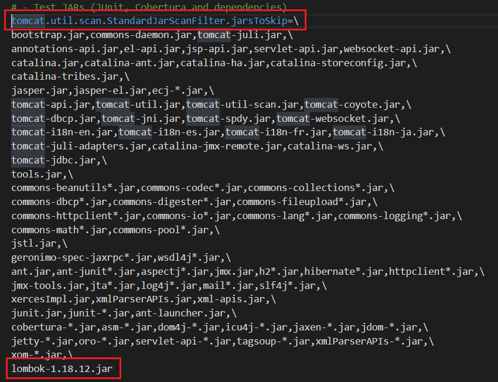

In this article, we will learn how to solve common problems when using Tomcat. Let's get started.

<br>

## Table of contents
- [Error with module-info](#error-with-module-info)
- [Error about pointing main resource incorrectly](#error-about-pointing-main-resource-incorrectly)
- [Wrapping up](#wrapping-up)


<br>

## Error with module-info

1. Problem

    When debugging our project with Tomcat's version such as 8.0.15, ..., we always encounter the below error:

    ```
    Unable to process Jar entry [module-info.class] from Jar [jar:file:/F:/tomcat/InstallationFiles/apache-tomcat-9.0.17/webapps/ROOT/WEB-INF/lib/lombok-1.18.8.jar!/] for annotations
    ```

2. Solution

    We will do the following steps to solve our problem:
    - Open ```catalina.properties``` file in our Tomcat installation folder.

    - In ```catalina.properties``` file, we will find the line with an bold text ```tomcat.util.scan.StandardJarScanFilter.jarsToSkip```.

        

    - Then, we will add our jar file that Tomcat makes errors such as lombok-1.18.8.jar, ... at the bottom line that is as same as the above figure.


<br>

## Error about pointing main resource incorrectly

1. Problem

    ```java
    java.lang.illegalargumentexception the main resource set specified [...] is not valid in Tomcat
    ```

2. Solution

    According to [https://github.com/rzwitserloot/lombok/issues/1801](https://github.com/rzwitserloot/lombok/issues/1801), we have module-info.class file is used to support Java 9.

    This error is relevant to an our resource folder that is not pointed incorrectly. Because Tomcat always search files in folder ```$TOMCAT_HOME/conf/Catalina/localhost```. Firstly, it read the ```ROOT.xml``` file to get the resouce path ```docBase``` property.

    Then, if ```docBase``` property do not exist, it will go to our ```our_context_path_name.xml``` to read it. Our context path here is the project's name.

    So, our solution is to remove the ```docBase``` property.


<br>

## Wrapping up


<br>

Refer:

[https://www.baeldung.com/tomcat-root-application](https://www.baeldung.com/tomcat-root-application)

[https://serverfault.com/questions/304853/tomcat-root-xml](https://serverfault.com/questions/304853/tomcat-root-xml)

[https://blog.csdn.net/lox_J2/article/details/80599097](https://blog.csdn.net/lox_J2/article/details/80599097)

[https://www.mulesoft.com/tcat/tomcat-servlet](https://www.mulesoft.com/tcat/tomcat-servlet)