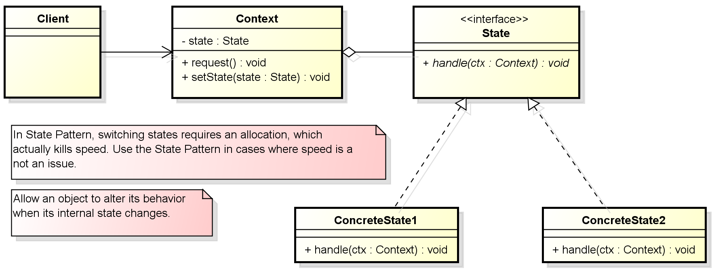

In this article, we will find something out about State pattern. Based on knowledge of it, we should apply its pattern to our real project.

Let's get started.

<br>

## Table of contents
- [Given problem](#given-problem)
- [Definition of State Pattern](#definition-of-state-pattern)
- [When to use](#when-to-use)
- [Benefits && Drawback](#benefits-&&-drawbacks)
- [Code C++/Java](#code-c++/java)
- [Application && Examples](#application-&&-examples)
- [Wrapping up](#wrapping-up)

<br>

## Given problem

Assuming that we have a process or an object that depends so much on internal states of it, with each state, we will do corresponded ways. Normally, we will use some boolean flags and if-else statements within our methods.

For example,

```java
// In Context class
switch(state) {
    case state-specific-1:
        // do something
        break;

    case state-specific-2:
        // do something
        break;

    ...

    default:
        // do default thing.
}
```

When we see above code in Context class, we can find some flaws:
- It violates Single Responsibility Principle, because it has multiple reasons to change.
- Once we have a new state, we need to change the above existing code. So, it violates Open Closed Principle to make our project difficult to maintain.

But if we have multiple states, it will be complicate, difficult to maintain all of our code. So, what is our solution to tackle this problems?

<br>

## Definition of State Pattern

According to [wikipedia.com](https://en.wikipedia.org/wiki/State_pattern), we have:

```
The state pattern is a behavioral software design pattern that allows an object to alter its behavior when its internal state changes. This pattern is close to the concept of finite-state machines. The state pattern can be interpreted as a strategy pattern, which is able to switch a strategy through invocations of methods defined in the pattern's interface.

The state pattern is used in computer programming to encapsulate varying behavior for the same object, based on its internal state. This can be a cleaner way for an object to change its behavior at runtime without resorting to conditional statements and thus improve maintainability.
```

So, to solve the problem that is talked in the previous section, we will use State pattern that describes two solutions:
- Define separate (state) objects that encapsulate state-specific behavior for each state. That is, define an interface (state) for performing state-specific behavior, and define classes that implement the interface for each state.

- A class delegates state-specific behavior to its current state object instead of implementing state-specific behavior directly.

--> This makes a class independent of how state-specific behavior is implemented. New states can be added by defining new state classes. A class can change its behavior at run-time by changing its current state object.

Below is an image about UML diagram of State pattern:



- Each state of a process or an object will be represented with implementation of State interface. So, we can easily expand states by implementing State interface.

- The Context will delegate state-specific behavior to different State implementation.

<br>

## When to use
- When we want to manage the behaviors of an object that depends on its internal states.


<br>

## Benefits & Drawback
1. Benefits

    - Easiy add new states and new behaviors in the application without impacting other components.

    - Helps in reducing complexity by reducing the use of if-else statements of switch-case.

    - Improves cohesion since state-specific behaviors are aggregated into the implementations of State interface, which are placed in one location in the code.

2. Drawbacks

    - State pattern drawback is the payoff when implementing transition between the states. That makes the state hardcoded, which is a bad practice in general. But, depending on our needs and requirements, that might or might not be an issue.


<br>

## Code C++/Java

With Java, we can refer to this [link](https://github.com/DucManhPhan/Design-Pattern/tree/master/Behavioral-Pattern/state-pattern).


<br>

## Application && Examples
- State pattern is in a Video Player capable of playing online video.

    We have to handle playing, paused, buffering, connecting, seeking and even other states.

    When the player is in playing or paused states, it is responsive to user interaction events.
    When the player is in "connecting" state, it might not have enough data to know the video duration and so the seek bar should be disabled.
    Once the player is connected, it will move to buffering state. In buffering state, the user can seek, or stop the video. But if he tries to pause or play the video, the command is saved for later, so that when the buffering is done, the video is either paused or start playing. etc.

<br>

## Wrapping up
- Always to make State objects in singletons.

- There are really two key aspects to consider in working with the state pattern: enumeration and transition. Enumeration simply means identifying the set of possible states (e.g. days of the week), or more abstractly the types of states (i.e. meta states) such as starting, ending, and in between for a workflow engine.Transition means deciding how to model movement between states where this is typically either done by capturing all possible transitions in a tabular representation (i.e. Finite State Machine) or make each state know its possible "transitions" to other states.

    Typically transitions go hand in hand with meta states because its not possible to know all states and relationships ahead of time in such a dynamic system where new states, and thus transitions, can be added at runtime. In addition, with the transition approach, certain behavior - notifications for instance - becomes part of the transition, instead of the state itself.

<br>

Thanks for your reading.

<br>

Refer:

[https://www.baeldung.com/java-state-design-pattern](https://www.baeldung.com/java-state-design-pattern)

[https://howtodoinjava.com/design-patterns/behavioral/state-design-pattern/](https://howtodoinjava.com/design-patterns/behavioral/state-design-pattern/)

[https://stackoverflow.com/questions/3768703/give-me-a-real-life-non-trivial-use-of-the-state-pattern](https://stackoverflow.com/questions/3768703/give-me-a-real-life-non-trivial-use-of-the-state-pattern)

[https://stackoverflow.com/questions/4935806/how-to-use-state-pattern-correctly](https://stackoverflow.com/questions/4935806/how-to-use-state-pattern-correctly)

[https://blogs.oracle.com/javamagazine/the-state-pattern](https://blogs.oracle.com/javamagazine/the-state-pattern)