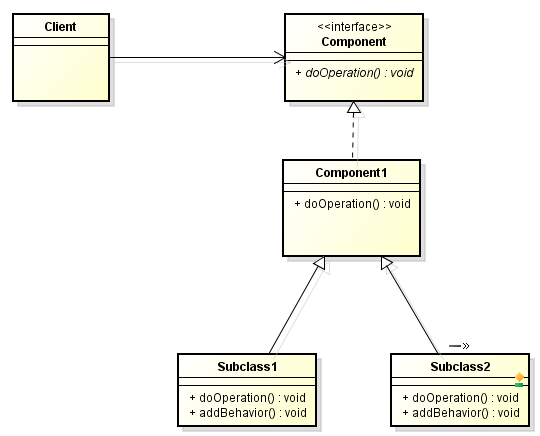
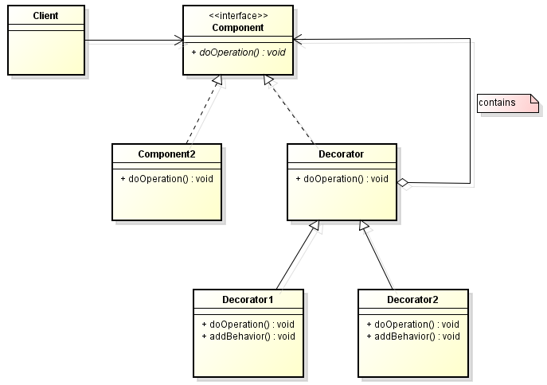

In this article, we will learn how to use Decorator pattern. Let's get started.

<br>

## Table of contents
- [Given Problem](#given-problem)
- [Solution with Decorator Pattern](#solution-with-decorator-pattern)
- [When to use](#when-to-use)
- [Code C++/Java](#code-C++/Java)
- [Relations with other patterns](#relations-with-other-patterns)
- [Application & Examples](#application-&-examples)
- [Wrapping up](#wrapping-up)


<br>

## Given Problem



Assuming that we have an interface ```Component```, and the ```Component1``` class that implements the above interface ```Component```. Normally, when we want Component1's instance do something, we will invoke ```doOperation()``` method.

But if we want to add new behavior to ```doOperation()``` method of Component1 class, we have to extends ```Component1``` class. Then we have ```Subclass1``` and ```Subclass2``` classes with doOperation(), ```addBehavior()``` methods.

```doOperation()``` method of ```Subclass1``` class will still call ```doOperation()``` method of the parent class, and then call its ```addBehavior()``` method.

We can find some problems here:
- We are adding new behavior at compile time because with each subclass of Component1 such as ```Subclass1``` or ```Subclass2```, we will have a specific behavior. If we want to have a behavior that is in ```SubClass1```, and ```Subclass2``` at run time, a normal way is that we create ```Subclass3``` that extends Component1 class. It's bad idea to do it.

    So, subclassing is not a flexible way to resolve its problem.

- With an above problem, when we want to add multiple functionalities, we have to create the amount of subclasses. It produce an explosion of subclasses.

We will have some questions that solve:
- How can responsibilities be added to an object dynamically?
- How can the functionality of an object be extended at run-time?

<br>

## Solution with Decorator Pattern

To solve these above problems in [Given Problem](#given-problem), we will do some following steps:
- Define separate Decorator objects.

    - Define a class (```Decorator```) that maintains a reference to a ```Component``` object (component) and forwards requests to this component (```component.operation()```).

    - Define subclasses (```Decorator1```,…) that implement additional functionality (```addBehavior()```) to be performed before and/or after forwarding a request.

- Because decorators are transparent enclosures of the decorated component, they can be nested recursively to add an open-ended number of responsibilities. Changing the order of decorators allows adding any combinations of responsibilities.

So, we have class diagram of this pattern:



<br>

## When to use
- when we want to add new functionalities for objets without utilizing inheritance property.


<br>

## Code C++/Java

To refer this pattern's code, we can read this [link](https://github.com/DucManhPhan/Design-Pattern/tree/master/Structural-Pattern/Decorator-pattern/src/Java).

<br>

## Relations with other patterns
- Composite pattern composes objects into a tree structure.
- Adapter pattern provides an alternative interface for an class or object.
- Bridge pattern lets an abstraction and its implementation vary independently.
- Facade pattern provides an unified interface for objects in a subsystem.
- Flyweight pattern supports large numbers of fine-grained objects efficiently.
- Proxy pattern provides additional functionality when accessing an object.

<br>

## Application & Examples
- File I/O of java.util.

    ```java
    FileReader       frdr = new FileReader(filename);
    LineNumberReader lrdr = new LineNumberReader(frdr);
    ```

- Java stream.

<br>

## Wrapping up
- The key idea in decorator pattern is to work through separate ```Decorator``` objects that 'decorate' (add responsibilities to) an (already existing) object.


<br>

Refer:

[https://w3sdesign.com/index0100.php#gf](https://w3sdesign.com/index0100.php#gf)

[http://www.beabetterdeveloper.com/2013/03/wanna-cache-decorate.html](http://www.beabetterdeveloper.com/2013/03/wanna-cache-decorate.html)

[https://sourcemaking.com/design_patterns/decorator](https://sourcemaking.com/design_patterns/decorator)