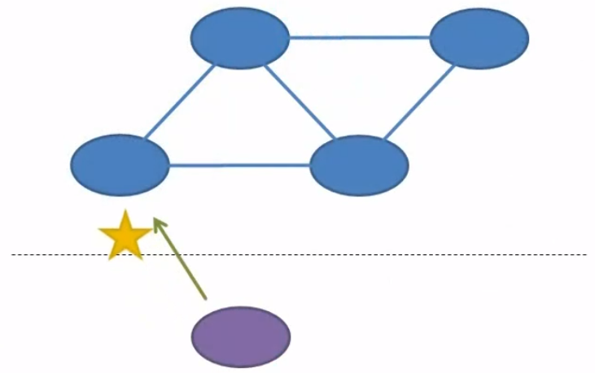
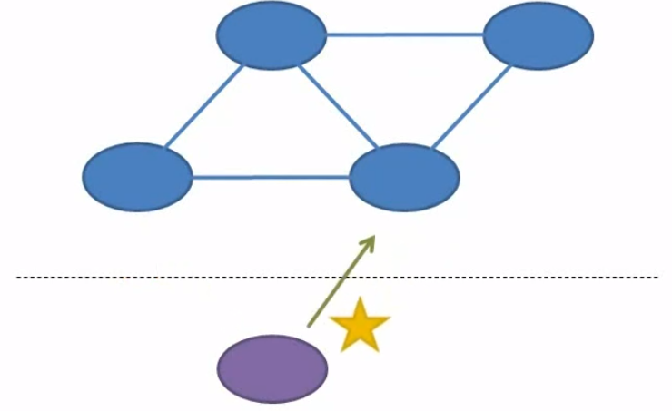
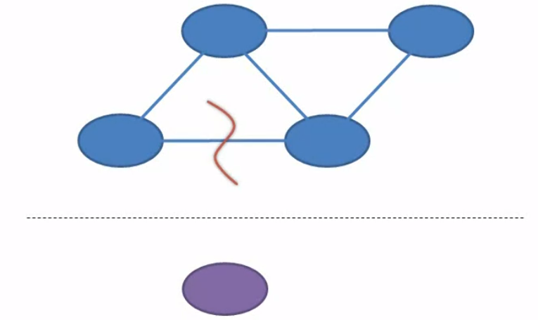
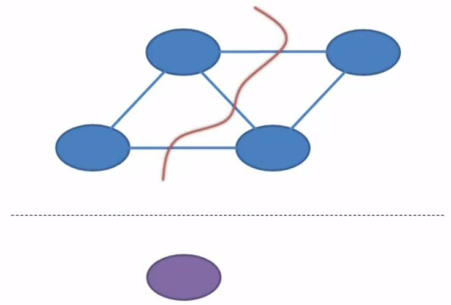
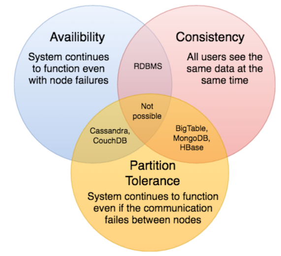

In this article, we will find something out about CAP theorem. Let's get started.

<br>

## Table of contents
- [Introduction to CAP theorem](#Introduction-to-CAP-theorem)
- [Consistency](#Consistency)
- [Availability](#Availability)
- [Partition Tolerance](#Partition-Tolerance)
- [Example with CAP theorem](#example-with-cap-theorem)
- [Fallacies of Distributed Computing](#fallacies-of-distributed-computing)
- [Wrapping up](#wrapping-up)

<br>

## Introduction to CAP theorem

1. Distributed system

    It's a collection of interconnected nodes that all share data. A client can write data to a distributed system by talking to any one of these nodes.
    
    

    And then the client can read data from the distributed system by talking to either that same node or a different node.

    

2. CAP theorem

    CAP stands for **Consistency**, **Availability**, and **Partition Tolerance**.

    **CAP theorem**, also named **Brewer's theorem** after the computer scientist **Eric Brewer** postulated this theorem back in the 2000.
    
    This theorem talks about how the system reacts when it gets a write request followed by a read request. The theorem states that for any given pair of requests, a write followed by a read, a distributed system can promise to guarantee only two out of three attributes.

    These attributes contains:
    - Consistency
    - Availability
    - Partition Tolerance

<br>

## Consistency

It means that the system guarantees to read data that is at least as fresh as what we just wrote. So, whether the client reads from the same node that we just wrote to or from a different node, that node is not allowed to return stale data. So somebody else might have written something newer and the client might see their change, but consistency guarantees that the client will not see older data than what it just wrote.

All nodes see the same data at the same time. Consistency is achieved by updating several nodes.

1. Eventual Consistency

    ```Eventual Consistency``` is a consistency model which enables the data store to be highly available. It is also known as optimistic replication, and is key to the distributed system.

    For example:

    In facebook, if we like a post of our friend that lives in Africa. Immediately, we will see the the number of list for this post was increased. But our friend in Africa still do not see the number of like increased. Because it takes so much time to move data from Asian to Africa to update all nodes. But when she refreshes her web page after a few seconds the number of like is updated.

    So the data was initially inconsistent but eventually got consistent across the server nodes deployed around the world. This is called eventual consistency.

    Eventual consistency is suitable for use cases where the accuracy of values doesn't matter. But some cases we must not use eventual consistency such as in banking, stock markets.

2. Strong Consistency

    ```Strong Consistency``` simply means the data has to be strongly consistent at all times. All the server nodes across the world should contain the same value of an entity at any point in time. And the only way to implement this behaviour is by locking down the nodes when being updated.

    To implement Strong consistency, when we need to update all remained nodes, access to other nodes blocked until the replication completes.

    - Drawback

        The performance of strongly consistency system can suck. That can make the system less useful. Because when we have some times to update something such as phone number. We have to wait for some minutes to hours to databases update completely. It is annoyed.

<br>

## Availability

It means that a non-failing node will give the client a reasonable response whitin a reasonable amount of time. Now all that's relative, but what that really means is that it won't hang definitely, and it won't return an error. This applies to both the read and to the write request.

So, that means that the write request will acknowldge that the data was actually written, and the read request will return valid data. Neither of these requests can return error, and neither one is allowed to hang indefinitely. So, this attribute only applies to non-failing nodes. A node itself could actually be down, and the system would remain available. If the client is able to get access to any non-failing node and that node responds without an error in a reasonable amount of time, then the availability guarantee is upheld.

<br>

## Partition Tolerance

Partition tolerance guarantees that a distributed system will continue to function in the face of network partitions. A network partition is a breaking connectivity. It means that nodes within the system cannot communicate with one another. A partition could be isolated to just the connection between two specific nodes or it could run through the entire network.





On the other hand, a partition could be just a temporary loss of connectivity like may be the loss of a single packet due to line noise or a partition could refer to something permanent like a backhoe cutting through a buried cable. But if the distributed system continues to function when the network is partitioned, then it's said to be partition tolerant.


<br>

## Example with CAP theorem
Assuming that our system is in case of a network failure, when a few of the nodes of the system are down. So, following with CAP theorem, we have to make a choice between ```Availability``` and ```Consistency```.

If we pick ```Availability``` that means when a few nodes go down, the other nodes are available to the users for making updates. In this situation, the system is inconsistent as the nodes which are down do not get updated with the new data. At the point in time when they come back online, if a user fetches the data from them, they'll return the old values they had when they went down.

If we pick ```Consistency```, we have to lock down all the nodes for further writes until the nodes which have gone down come back online. This would ensure the ```Strong Consistency``` of the system as all the nodes will have the same entity values.

So, picking between ```Availability``` and ```Consistency``` largely depends on our use case and the business requirements.

<br>

## Fallacies of Distributed Computing
1. The network is reliable.

    Many of the technologies will hide the fact that we're using a network at all to send requests to different machines. For example, if we're every used WCF then we've seen how it can quickly turn a web service call into a method call on an object.
    
    Methods call are completely reliable. When we make one call, we know for certain that the object that we're calling will receive its parameters and it will execute the method. And when that method call returns, we know beyond a shadow of a doubt that the caller will receive the return value, and then the caller will continue executing at the next line. If the method throws an exeception, then we can be absolutely sure that the caller will catch the exeception and will take the appropriate action. But the same can not be said about web service calls or indeed any communication over a network.

    When we make a web service call there's no guarantee that the service will receive the request, and when it returns a value, we can't be sure that the caller will actually get the result. And when an exeception is thrown, it can sometimes be hard to tell whether it was the result of a problem in the web service itself or simply some kind of a network failure.

    So when coding for network communication, we have to understand that the call might fail in ways that simply are not possible in regular object-oriented in memory programming. We have to code for failures at every point in the communication. The request may fail on its way to the server or worse yet the response may fail on its way back to the client. If a failure happens, then the client generally can't tell which side failed. They can't tell whether the message failed on its way to the service or the response back to the client, so that leaves the system in an indeterminate state. These kinds of states don't occur in regular object-oriented coding, so we typically don't think about them, but when the network is unreliable then we have to.

2. Latency is zero.

    In most object-oriented code, time isn't an issue. The code just tends to be procedural just moving from one statement to the next as quickly as the machine will allow, so we don't even think about the dimension of time.
    
    But when we're sending our requests to a remote machine, we have to be aware of the passage of time. Until that response comes, we're in a state of limbo where we don't know whether the request got through or not, and we have to timeouts for these requests. If the timeout elapses, then we don't know whether the request would have actually succeed had we just waited a little bit longer.
    
    We have two different machines, each keeping tracking of its own state separated by the time and space, and somehow we need to choreograph a dance between these two machines, even though neither one really knows the state of the other. A lot of systems that we've built work fine on localhost, but then they don't work when deployed to real networks, and it's because we've fallen victim to one of these two fallacies.

3. Bandwidth is infinite.

    

4. The network is secure.
5. Topology doesn't change.
6. There is one administrator.
7. Transport cost is zero.
8. The network is homogeneous.

<br>

## Wrapping up
- To summarize this CAP theorem, it can be described in the below image.

    


<br>

Refer:

[Patterns for Building Distributed systems for The Enterprise - Michael Perry](https://app.pluralsight.com/library/courses/cqrs-theory-practice/table-of-contents)

[https://en.wikipedia.org/wiki/CAP_theorem](https://en.wikipedia.org/wiki/CAP_theorem)

[https://towardsdatascience.com/cap-theorem-and-distributed-database-management-systems-5c2be977950e](https://towardsdatascience.com/cap-theorem-and-distributed-database-management-systems-5c2be977950e)

<br>

**Consistency**

[https://blog.container-solutions.com/what-is-eventual-consistency-and-why-is-it-so-cool](https://blog.container-solutions.com/what-is-eventual-consistency-and-why-is-it-so-cool)

[https://en.wikipedia.org/wiki/Eventual_consistency](https://en.wikipedia.org/wiki/Eventual_consistency)

[https://stackoverflow.com/questions/5466012/nosql-and-eventual-consistency-real-world-examples](https://stackoverflow.com/questions/5466012/nosql-and-eventual-consistency-real-world-examples)

[https://www.elastic.io/rebound-practical-application-of-eventual-consistency/](https://www.elastic.io/rebound-practical-application-of-eventual-consistency/)