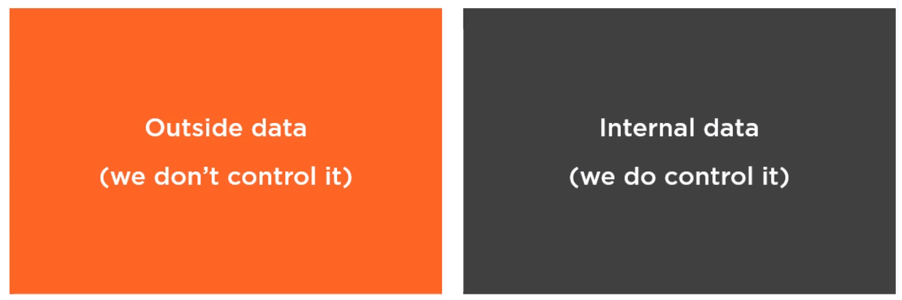
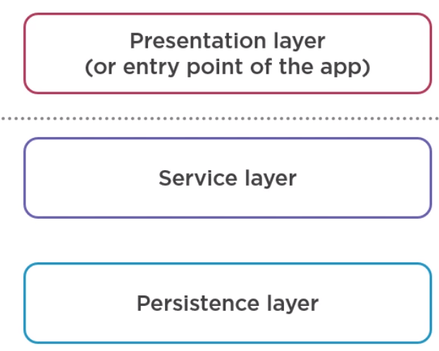
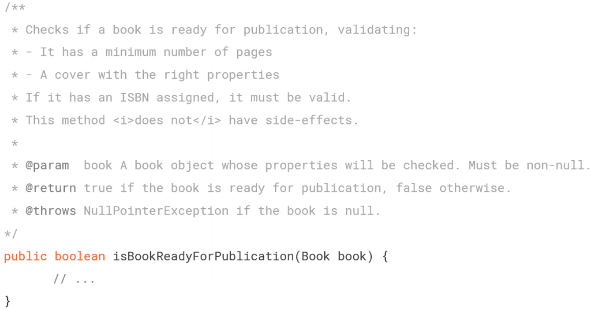
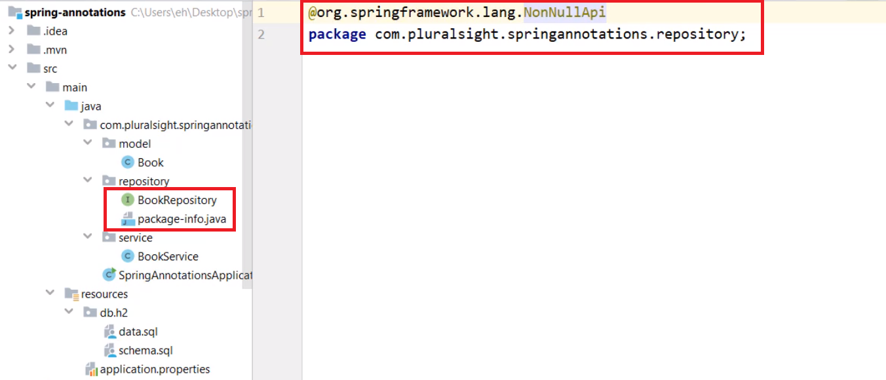

In this article, we will learn some ways to deal with Null value in Java. Let's get started.


<br>

## Table of contents
- [Working with Reference types and Nulls](#working-with-reference-types-and-nulls)
- [Checking for Null using annotations](#checking-for-null-using-annotations)
- [Using the Null Object pattern](#using-the-null-object-pattern)
- [Using Optional instead of Null](#using-optional-instead-of-null)
- [Wrapping up](#wrapping-up)

<br>

## Working with Reference types and Nulls
1. Null and Reference types  
    In the conference, in 2009, Sir Charles Antony Richard Hoare apologized for introducing null references in the programming language Algol Wz in 1965.

    ```
    I call it my billion-dollar mistake. It was the invention of the null reference in 1965. [...] This has led to innumerable errors, vulnerabilities, and system crashes, which have probably caused a billion dollars of pain and damage in the last forty years.
    ```

    Null Usage:
    - Optional data

        Null is useful concept, it allows modeling optional data. For example, for certain the type of books, ISBN numbers are optional.

    - Unknown data

        Null also allow us to model data that hasn't been entered yet, but it will be available at some point. For example, a book record can be created before the book's finished and the exact number of pages is known.

    - Eager deinitialization

        Null can be used for either the initialization, too. For example, if a class manages its own memory, when an element is free, it should be noted out to avoid memory leaks.

    From a technical point of view, null is a value that indicates that our reference does not refer to an object.

    In assignment statement, it has three parts. The first part declares a reference variable. The second part creates an object of the type book telling the JVM to allocates space for a new book object in memory. Finally, the third part assigns the book object to a reference variable.

    

    We also cannot meet the object creation, and in this case, the reference Book would refer to nothing at all because for all reference types, null is the default value. In other words, these two statements are equivalent.

    ```java
    Book book;
    Book book = null;
    ```

    --> Nulls can be completely avoided in Java.

2. Traditional ways to dealing with Nulls

    The most common ways of checking for Nulls.
    - First, we use assertions.

        ```java
        public boolean isBookReadyForPublication(Book book) {
            assert book != null : "Book is null";
            // ...
        }
        ```

        If we use assertion, Error will be thrown.

    - if/else statements

        ```java
        public boolean isBookReadyForPublication(Book book) {
            if (book != null) {     // null != book
                // ...
            } else {
                // ...
            }
        }
        ```

        In this way, there's no extra benefits, but some people prefer it.

    - ```java.util.Objects``` class

        ```java
        public boolean isBookReadyForPublication(Book book) {
            Objects.requireNonNull(book, "Book is null");

            // or
            if (Objects.isNull(book)) {     // Objects.nonNull(book)
                // book object is null
            } else {
                // do something with book object
            }
        }
        ```

        These methods are concise, readble, standard and prevent any kind of typos. However, something to consider is that the ```Objects.requireNonNull()``` method throws a ```NullPointerException``` is the object is ```null```. So everything seems to lead us to exception, if we do nothing and try to call a method on a Null reference, Java will throw ```NullPointerException```.

    - Try/Catch

        ```java
        public boolean isBookReadyForPublication(Book book) {
            try {
                // use book object
            } catch(NullPointerException ex) {
                // book object was null
            }
        }
        ```

        Use try/catch version will have better performance because there's no checking for null. Exceptions may be a big cheaper in terms of performance. But using exception in this way, it's about practice because it leads to go, hard to understand.

- Best practices for data that we don't control

    We can clarify the data that flows through an application in two types.

    

    - Given problem

        Below is an image that describes that our flow's data in application.

        

        The data that we do not control is the data that is sent from Client to Server. It means that data from Presentation layer to Service layer.

    For parts of the application where we don't have control of the data:
    - Document our public API

        It means that every class, interface, constructor, methods should have Java doc comments.

        For methods describe the contract:
        - preconditions
        - postconditions
        - parameters
        - return values

        

    - Check for nulls only in the upper layers
    - Always validate parameters

        - At the beginning of the method, use the general principle fail-fast.
        - If an invalid parameter value is passed to the method and the method checks for this before continuing its execution, it can take appropriate action.

            There are two options for this case:
            - Replace the null value with some default value such as using empty string, a negative value or an empty List.

                This solution is not always the right choice. It can cause the other errors.

            - Throw exceptions to indicate that an invalid value has been received.

                We can choose one of the NullPointerException or IllegalArgumentException and use it consistently.

                For example:

                ```java
                public boolean isBookReadyForPublication(Book book) {
                    Objects.requireNonNull(book, "Book is null");
                    Objects.requireNonNull(book.getAuthor(), "Author is null");
                    Objects.requireNonNull(book.getTitle(), "Title is null");

                    // business logic of this method
                    // ...
                }
                ```

- Best practice for data that we control

    There is no need to check for null in every method when:
    - never pass null as an argument.

        In this case, we can do two things:
        - Use primitives instead of wrapper classes.
        - For optional parameters, we can overload the method with different sets of parameters.

            For example:

            ```java
            public boolean publishBook(Book book, Date publicationDate) {
                // ...
            }
            ```

            In an above code, if the ```publicationDate``` variable is optional, instead of doing like the above code, it's better to have the overloaded methods like the below.

            ```java
            public boolean publishBook(Book book) {
                // ...
            }
            ```

    - never return null.

        For example:

        ```java
        public HashSet<Edition> getBookEditions() {
            return book.hasEditions()
                            ? null
                            : new HashSet<Edition>(book.getEditions());
        }
        ```

        If ```null``` means that something could not be found, instead of using null value, we can return an empty collections.

        ```java
        public HashSet<Edition> getBookEditions() {
            return book.hasEditions()
                            ? new HashSet<Edition>()
                            : new HashSet<Edition>(book.getEditions());
        }
        ```

        These methods will not have to handle the null value.

        So, the solutions for ```never return null``` are:
        - Return empty collection
        - Use Null Object pattern
        - Use Optional type

<br>

## Checking for Null using annotations

1. Spring Annotations

    Belows are some annotations in org.springframework.lang package.
    - ```@NonNull```

        ```java
        public class BookService {
            @NonNull
            private Integer defaultBookId;

            private void setDefaultBookId(@NonNull Integer id) {
                this.defaultBookId = id;
            }

            @NonNull private Integer getDefaultBookId() {
                return this.defaultBookId;
            }
        }
        ```

    - ```@Nullable```

        This annotation allows our object can be null.

        For example:

        ```java
        public interface BookRepository extends JpaRepository<Book, Long> {
            Book getByIsbn10(String isbn10);

            @Nullable Book findByIsbn10(String isbn10);

            Book findByIsbn13(@Nullable String isbn13);
        }
        ```


    - ```@NonNullApi```

        In order to configure this annotation, we have to define it in the package-info.java file of the root directory package.

        

    - @NonNullFields

2. Bean Validation Annotations

    Bean validation is the standard validation of specification, is defined by JSR 303 for its first version and JSR 380 for its second version.

    Some annotations that we need to know:
    - @NotNull
    - @Size
    - @Min/@Max
    - @PositiveOrZero

    Hibernate validator is the reference implementation of the specification, hibernate is associated with the persistent layer and that can be a source of confusion, especially about two things:
    - Does Hibernate Validator only validate objects of the domain model?

        No, it validates objects in all layers.

    - Are @NotNull and @Column(nullable = false) equivalent?

        No, the @Column annotation is part of the JPA specification. However, it doesn't perform any validation if we annotate fields. If Hibernate creates the table, it adds a not null constraint to the database column, the database is the one that checks if the value is not null when we insert or update a record.

        @NotNull is a part of the Bean Validation specification. It triggers a validation during an update or persist lifecycle event. It validates at the applicaltion level. If it fail, Hibernate will not execute any SQL statement.


3. Project Lombok Annotations

    Project Lombok is a library that generates boilerplate methods such as getter/setter. Lombok works as an annotation post-processor. It reads the annotations during the complication process, 

    Some annotations of this library:
    - @NonNull annnotation for parameters of methods and constructors. It also used with the @Data annnotation


To choose an annotation library, consider:
- At what point the null check is performed.
- Where we can use the annotations.
- Tool and language interoperability and compability.

<br>

## Using the Null Object pattern

In order to use Null Object pattern, we can refer the article [Null Object pattern](https://ducmanhphan.github.io/2019-09-26-Null-object-pattern/).

So, instead of using a null reference to represent the absence of an object, it uses an object that implements the expected interface but does nothing, hiding the details from its collaborators.

Some notes about Null Object pattern:
- It's not a kind of GoF patterns.
- It was described in a article **The Null Object pattern** by Bobby Woolf. And later, it was published in the **Pattern Languages of Program Design Vol.3**.
- The other names of this pattern are **Active nothing**, **Stub**.

<br>

## Using Optional instead of Null

Belows are some article we need to read:
- [Understanding Optional in Java 8](http://ducmanhphan.github.io/2020-04-24-Understanding-Optional-in-Java-8/).
- [Best practice for Optional in Java](http://ducmanhphan.github.io/2019-12-06-Best-practice-for-Optional-in-Java/).

<br>

## Wrapping up

- Null is a value that indicates that a reference does not refer to an object.

- The type of the literal value null is Null. That's why use null with **instanceof()** will return false.

- If we use null object, Java will throw a **NullPointerException**. To avoid a **NullPointerException**, developers traditionally use:

    - Assertions
    - If/else statements
    - Methods of the java.util.Objects class
    - And even try/catch blocks.

    It's better to no overcomplicate things.

<br>

Refer:

[Working with Nulls in Java](https://app.pluralsight.com/library/courses/working-nulls-java/table-of-contents)