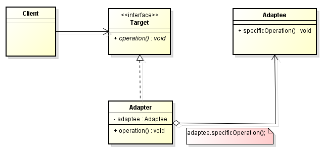

In this article, we will learn how to use adapter pattern. Let's get started.

<br>

## Table of contents
- [Given Problem](#given-problem)
- [Solution of Adapter Pattern](#solution-of-adapter-pattern)
- [When to use](#when-to-use)
- [Benefits & Drawbacks](#benefits-&-drawbacks)
- [Code C++ /Java / Javascript](#code-c++-java-javascript)
- [Wrapping up](#wrapping-up)


<br>

## Given Problem 


Assuming that we have two components such as ```Component1```, ```Component2```. In ```Component1```, we have interface ```Target```. In ```Component2```, we have class ```Adaptee``` that has some behaviors that we need to use in ```Component1```. But ```Adaptee``` class has an interface that does not conform to the Component1's interface ```Target``` that a client requires.

An inflexible way to solve this problem is to change the class so that its interface conforms to the required interface. But it's impossible to change a class each time another interface is needed.

So, we have some questions for this problem:
- How can a class be reused that has not the interface clients require?
- How can classes work together that have incompatible interfaces?

<br>

## Solution of Adapter Pattern

In order to answer the question **How can classes work together that have incompatible interfaces?**, because our ```Component1``` that has different interface when compared with ```Adaptee``` of the ```Component2```. So, we will to use only one interface ```Target``` to unify interaction between ```Component1``` and ```Component2```. Then, we create another class ```Adapter``` that implements Target interface, and contains instance ```Adaptee``` in it. In ```operation()``` method of ```Adapter```, we will call ```adaptee.specificOperation()``` method.

When ```Adapter``` class contains instance of Adaptee class, we will reuse Adaptee class that do not worry about the incompatible between two components.

So, we will have Adapter pattern, and below is UML class diagram of it.



- Some types of Adapter pattern

    - Class Adapter

        With class adapter, Adapter class will extends from Adaptee, and implements from Target interface. In this way, if we have many Adaptee class, we will have multiple inheritance relationship between Adapter class and Adaptee classes.

        In Java, we do not have multiple inheritance. C++ do offer this feature.

    - Object Adapter

        With object adapter, we will use composition to contains all instances of Adaptee classes. This way is more flexible than class adapter because we delegate an Adaptee object at runtime, and a class adapter binds an Adaptee object at compile time.

<br>

## When to use
- When we need subsystems/componenets/classes are incompatible together that can communicate.

    For example, we have a subsystem that is written in C++, other system is written in C#. We need to embbed C++ subsytem into C# subsystem. So, we will create a thin layer between them. This thin layer uses C++/CLR that play a role as Object Adapter class. Target interface will be define in C# subsystem. C++ subsystem will play as Adaptee class.


<br>

## Benefits & Drawbacks
1. Benefits

    - When we are working with legacy project, we want to enhance this project to use new technologies, but we still use the old buniness logic. We use adapter pattern to reduce time to develop, instead of creating a new project.

    - We do not need to change the existing core components or subsystems.

    - Increases reusability and flexibility.

2. Drawbacks

    - All requests are forwarded, so there is a slight increase in the overhead.
    
    - Sometimes many adaptations are required along an adapter chain to reach the type which is required.

<br>

## Code C++ /Java / Javascript

To refer this pattern's code, we can read this [link](https://github.com/DucManhPhan/Design-Pattern/tree/master/Structural-Pattern/Adapter-pattern/src/Java).

<br>

## Wrapping up
- The key idea in this pattern (object version) is to work through a separate ```Adapter``` object that adapts the interface of an (already existing) object.
    
    Clients do not know whether they are working with a ```Target``` object or an ```Adapter```.


<br>

Thanks for your reading.

<br>

Refer: 

[https://w3sdesign.com/index0100.php#gf](https://w3sdesign.com/index0100.php#gf)

[https://stackoverflow.com/questions/11079605/adapter-any-real-example-of-adapter-pattern](https://stackoverflow.com/questions/11079605/adapter-any-real-example-of-adapter-pattern)