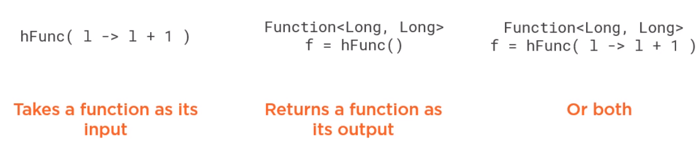

In this article, we will learn how to use Function functional interface. Let's get started.

<br>

## Table of contents
- [Introduction to Function functional interface](#introduction-to-function-functional-interface)
- [Chaining with Function interface](#chaining-with-function-interface)
- [Chaining with BiFunction interface](#chaining-with-bifunction-interface)
- [Source code](#source-code)
- [Some useful examples for applying Function and BiFunction interface](#some-useful-examples-for-applying-function-and-bifunction-interface)
- [Benefits and Drawbacks](#benefits-and-drawbacks)
- [Wrapping up](#wrapping-up)


<br>

## Introduction to Function functional interface

Function is a functional interface with two type parameters T and R. Its functional method called **apply()**, takes an argument of type **T** and returns an object of type **R**. Functions are ideal for converting an object of type **T** to one of type **R**.

```java
@FunctionalInterface
public interface Function<T, R> {
    R apply(T t);
}
```

For example:

```java
Function<String, Integer> func = str -> Integer.parseInt(str);

// pass function interface to a method
public static <T, R> R transform(T t, Function<T, R> func) {
    return func.apply(t);
}
```

Continuously, we will go through **BiFunction** interface with two type parameters for input types in addition to the output type parameter.

```java
@FunctionalInterface
public interface BiFunction<T, U, R> {
    R apply(T, U);
}
```

For example:

```java
BiFunction<String, String, String> func = (s1, s2) -> {
    s3 = s1 + s2;   
};
```

<br>

## Chaining with Function interface

In order to implement chaining with Function interface, we will find something out about some default methods.

```java
// andThen() method applies an additional operation after the operation specified by the apply() method
// completes.
default <V> Function<T, V> andThen(Function<? super R, ? extends V> after);

// compose() method applies a preliminary operation before the operation specified by the apply() method
default <V> Function<V, R> compose(Function<? super V, ? extends T> before);
```

For example:

```java

```


<br>

## Chaining with BiFunction interface

In BiFunction interface, it is only defined **andThen()** default method for chaining expressions.

```java
default <V> BiFunction<T,U,V> andThen(Function<? super R,? extends V> after)
```

For example:

```java

```

<br>

## High-order function

Just like classes are first-class citizens in object-oriented programming, functions are first-class citizens in functional programming. In this context, a function becomes a high-order function when it takes a function as its input, or argument. It returns a function as its output, or both.




<br>

## Source code

In order to see how Predicate functional interface works, we can reference to [Function functional interface](https://github.com/DucManhPhan/J2EE/tree/master/src/Java_Core/Java%208/Functional%20Interfaces/function).


<br>

## Some useful examples for applying Function and BiFunction interface

Assuming that we have a list of Student that we get from database, our tasks are:
- search Student instances that have the same **name**.

    ```java
    BiFunction<String, List<Student>, List<Student>> searchByName = (name, students) -> {
        students.stream
                .filter(str -> str.equals(name))
                .collect(Collectors.toList());
    };
    ```

- get Student instance that has the maximum score.

    ```java
    Function<List<Student>, List<Student>> sortedByScore = students -> {
        students.stream()
                .sorted((x, y) -> y.getAge() > x.getAge())
                .collect(Collectors.toList());
    };

    Function<List<Student>, Optional<Student>> first = student -> student.stream().findFirst();
    Function<List<Student>, Optional<Student>> findMaxScore = first.compose(sortedByScore);
    ```

<br>

## Benefits and Drawbacks
1. Benefits

    - Using Function interface makes our code DRY.

    - easy to understand what it does, and maintain.


<br>

## Wrapping up
- BiFunction interface only offers **andThen()** method, not **compose()** method, because **compose()** method will return single result, then it is not accepted as argument of another BiFunction with two input parameters.

- Some specialization of Function interface that used to convert from primitive types such as **IntFunction**, **LongFunction**, **DoubleFunction**.

    ```java
    @FunctionalInterface
    public interface IntFunction<R> {
        R apply(int value);
    }

    @FunctionalInterface
    public interface LongFunction<R> {
        R apply(long value);
    }

    @FunctionalInterface
    public interface DoubleFunction<R> {
        R apply(double value);
    }
    ```

- Some specialization of Function interface that used to convert to primitive types such as **ToIntFunction**, **ToLongFunction**, **ToDoubleFunction**.

    ```java
    @FunctionalInterface
    public interface ToIntFunction<T> {
        int applyAsInt(T value);
    }

    @FunctionalInterface
    public interface LongFunction<T> {
        long applyAsLong(T value);
    }

    @FunctionalInterface
    public interface DoubleFunction<T> {
        double applyAsDouble(T value);
    }
    ```

- Some non-generic specialization of Function interface such as **DoubleToIntFunction**, **DoubleToLongFunction**, **IntToDoubleFunction**, **IntToLongFunction**, **LongToDoubleFunction**, **LongToIntFunction**.

<br>

Refer:

[Functional Interfaces in Java book]()

[https://www.deadcoderising.com/2015-09-07-java-8-functional-composition-using-compose-and-andthen/](https://www.deadcoderising.com/2015-09-07-java-8-functional-composition-using-compose-and-andthen/)

[https://www.logicbig.com/how-to/code-snippets/jcode-java-functional-interfaces-bifunction-andthen.html](https://www.logicbig.com/how-to/code-snippets/jcode-java-functional-interfaces-bifunction-andthen.html)