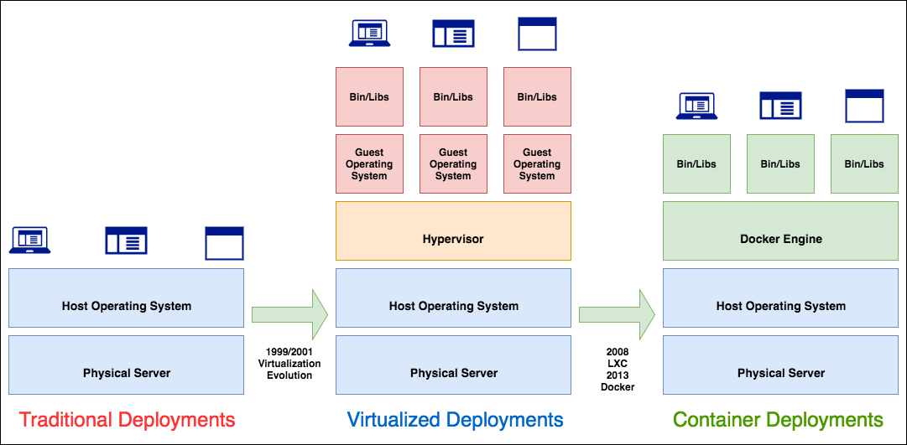
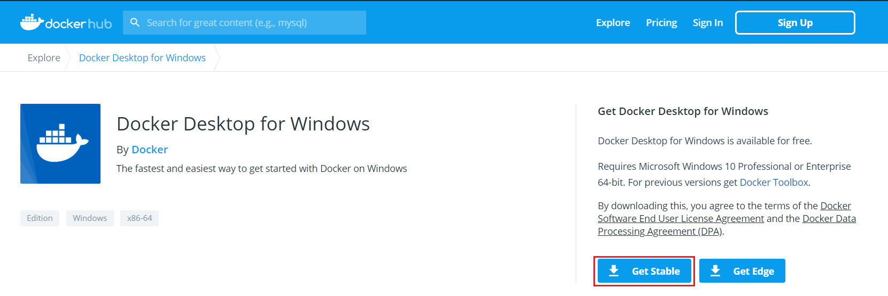
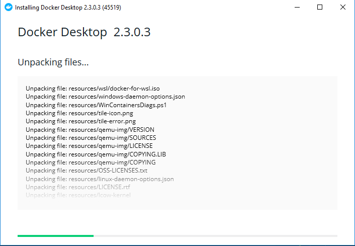
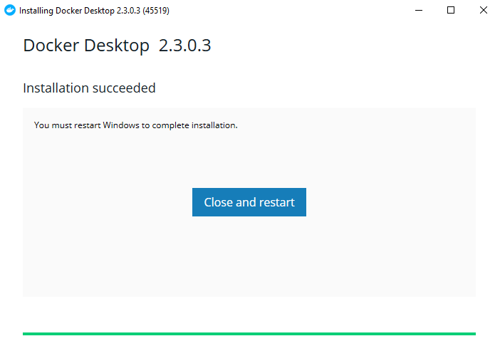
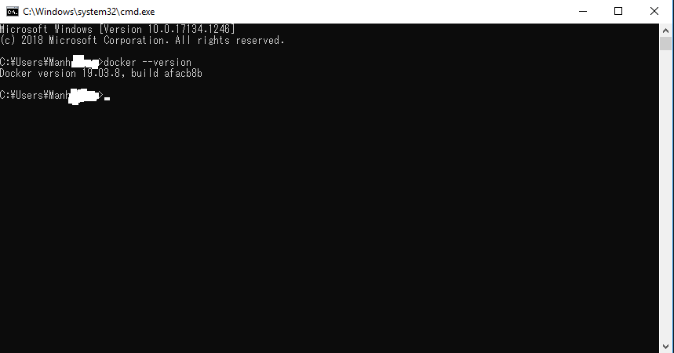

<br>

## Table of contents
- [Given problem](#given-problem)
- [Introduction to Docker](#introduction-to-docker)
- [How to setup Docker](#how-to-setup-docker)
- [Some commands in Docker CLI](#some-commands-in-docker-cli)
- [Wrapping up](#wrapping-up)


<br>

## Given problem

Before Docker was born, we usually use Virtual Machine software such as VMWare, Virtual Box, ... But to use it, we need to install the Operating System that we want to simulate the webserver's environment that we want to use. 

Then, we have to install softwares that we really need in out project. Installing these softwares takes so much our time. 

Supposed that we had the environment that we want, but our softwares that has multiple versions, different environment variables to configure. They can conflict together. It is the worst thing that we do not want to touch.

How do we overcome these problems?

<br>

## Introduction to Docker

1. History of Docker

    Accroding to the [wikipedia.com](https://en.wikipedia.org/wiki/Docker_(software)), we have:

    ```
    Docker Inc. was founded by Solomon Hykes and Sebastien Pahl during the Y Combinator Summer 2010 startup incubator group and lauched in 2011.

    Hykes started the Docker project in France as an internal project within dotCloud, a platform-as-a-service company.

    In 2017, Docker created the Moby project for open research and development.
    ```

    Below is an image that describes the development of containers.

    

2. Some concepts in Docker

    - Docker is a software that helps us to build, deploy, and run our applications.

        Docker will package our applications into containers.
        
        For example, in our Java project, we need to use redis, mysql, mongodb, glassfish application server. Then, each application will be run in other containers. To be easily maintainable, we can create an image by using DockerFile.

        To combine containers into a completely system, we need to use Docker Compose.

    - Docker Image basically contains executable application source code as well as the tools, libraries, and dependencies that our application code needs to run as a container.

        Every Docker Image consists of one or more file system layers that generally have a direct one-to-one mapping to each individual build step used to create that image.

        

    - Docker Container is an instance of Docker Image.

        This relationship is as same as the relationship between program and process.

        A container runs inside the Docker Host isolated from the other containers and even the Host OS. It can not see the other containers, physical storage, ... It contains everything it needs to run: OS, packages, runtimes, files, environment variables, standard IO.

    - DockerFile is a script file that guide Docker how to build an image.

        To be aware more about DockerFile, we can read about an article [How to build an image from DockerFile](http://ducmanhphan.github.io/2020-05-07-how-to-build-an-image-from-dockerfile).

    - Registry is a place that contains multiple images.

3. The architecture of Docker

    

    This article [Docker Architecture Tutorial for Beginners](https://morioh.com/p/47719a08c1e8) will show the details of Docker's architecture.

<br>

## How to setup Docker

1. In Windows

    - Download Docker Desktop for Windows

        To install Docker for Windows, we need to download docker desktop from [https://hub.docker.com/editions/community/docker-ce-desktop-windows/](https://hub.docker.com/editions/community/docker-ce-desktop-windows/).

        

        Click **Get Stable** button to download Docker.

    - Setup Docker desktop for Windows

        

        After setting up Docker completely, we need to restart Windows OS.

        

    - Check Docker is setup completely by using a below command line.

        ```
        docker --version
        ```

        Then, we have:

        

2. In Ubuntu

    To install Docker in Ubuntu, we can read the article [How To Install and Use Docker on Ubuntu 18.04](https://www.digitalocean.com/community/tutorials/how-to-install-and-use-docker-on-ubuntu-18-04). It's very detailed and easy to track steps.

<br>

## Some commands in Docker CLI

1. List all images that are downloaded from Docker Hub

    ```python
    # 1st way
    docker image ls

    # 2nd way
    docker images
    ```

2. List all containers that are running in Docker engine

    ```python
    # 1st way
    docker ps

    # 2nd way
    docker container ls --all

    # call help
    docker container --help

    docker container ls --help
    ```

3. Pull an image from Docker Hub and run a container

    ```python
    docker run <image_name>

    # call help
    docker run --help
    ```

    For example, below is a command that pull ngix webserver from DockerHub and run it as a container.

    ```python
    docker run --detach --publish 80:80 --name webserver ngix
    ```

    The meaning of options in an above command:
    - ```--detach``` or ```-d```

        In Docker, there are two mode:
        - the background mode or a detach mode
        - the default foreground mode

        If we use **--detach** or **-d** option, it means that we want this container run in a detached mode.

    - ```--expose```

        Using this flag is a way of documenting which ports are used, but does not actually map or open any ports. Exposing ports is optional.

    - ```--publish``` or ```-p```

        By default, when you create a container, it does not publish any of its ports to the outside world. To connect to the outside, we use ```-p``` option.

        This option means that mapping a **host port** to a running **container port**.

        For example:

        ```python
        docker run -d -p <host_port>:<container_port> --name webserver ngix
        ```

    - ```--name```

        Assign a name for this container. If we do not use a name for a container, Docker will generate a random string name for a container.

    - ```-rm```
        
        Using this option will remove our container when it exits.

    To know more about this run command, we can refer this Docker's article [https://docs.docker.com/engine/reference/commandline/run/](https://docs.docker.com/engine/reference/commandline/run/).

4. Stop a container

    ```python
    docker container stop <container_name>
    ```


5. To check version of Docker Client/Server

    ```python
    # Only check version without the detailed information
    docker --version

    # verbose information about Docker Client/Server
    docker version
    ```

6. Pull an image from Docker Hub

    ```python
    docker pull <image_name>
    ```

7. Remove an image

    ```python
    # Use image_id to specify which image to delete
    docker rmi <image_id>

    # Use the repository's name that combines with the tag
    docker rmi <repository_name>:<tag>
    ```

    For example:

    ```python
    # Use -f flat to forcely remove an image
    docker rmi -f fd484f19954f

    docker rmi test:latest
    ```

8. List all containers with some specific states

    ```python
    # all shutdowned containers
    docker ps -a

    # show all shutdowned containers with only numeric IDs
    docker -ps -a -q

    # show containers with disk usage
    docker ps --size

    # filter some containers with key=value pair
    docker ps --filter 'exited=0'
    ```

9. Run a container

    ```python
    docker start <container_name>
    ```

10. Restart a container

    ```python
    docker restart <container_name>
    ```

11. Build an image from DockerFile

    ```python
    docker build --file <dockerfile_name> .
    ```

12. Search an image from Docker Hub

    ```python
    docker search <image_name>
    ```

    For example:

    ```python
    docker search mysql
    ```

13. Stop all running containers

    ```python
    docker stop $(docker ps -aq)
    ```

14. Remove all containers

    ```python
    docker rm $(docker ps -aq)
    ```

15. Remove all images

    ```python
    docker rmi $(docker images -q)
    ```

<br>

## Wrapping up

- Understanding about Docker and common commands that we usually use to communicate with it.


<br>

Refer:

[https://medium.com/edumall/vi%E1%BA%BFt-dockerfile-hi%E1%BB%87u-qu%E1%BA%A3-77a6603b8f8](https://medium.com/edumall/vi%E1%BA%BFt-dockerfile-hi%E1%BB%87u-qu%E1%BA%A3-77a6603b8f8)

[https://viblo.asia/p/docker-nhung-kien-thuc-co-ban-phan-1-bJzKmM1kK9N](https://viblo.asia/p/docker-nhung-kien-thuc-co-ban-phan-1-bJzKmM1kK9N)

[https://en.wikipedia.org/wiki/Docker_(software)](https://en.wikipedia.org/wiki/Docker_(software))

[https://medium.com/@ITsolutions/containers-101-starting-the-journey-from-os-virtualization-to-workload-virtualization-1ce0b32df473](https://medium.com/@ITsolutions/containers-101-starting-the-journey-from-os-virtualization-to-workload-virtualization-1ce0b32df473)

[https://stackoverflow.com/questions/20274162/why-do-you-need-a-base-image-with-docker](https://stackoverflow.com/questions/20274162/why-do-you-need-a-base-image-with-docker)

[https://www.educative.io/courses/docker-for-developers](https://www.educative.io/courses/docker-for-developers)