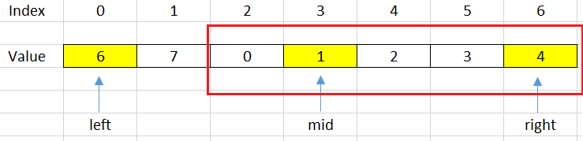
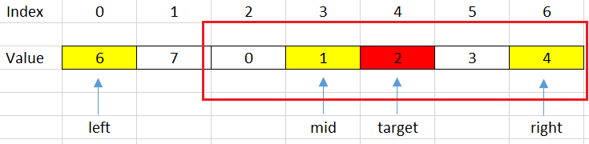
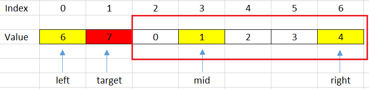
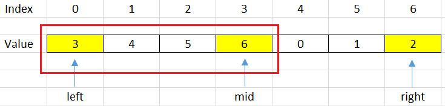
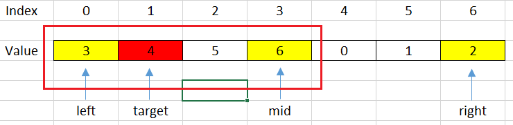
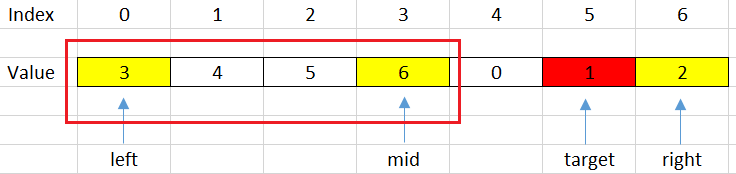

<br>

## Table of contents
- [Given problem](#given-problem)
- [Using Linear Search to find element](#using-linear-search-to-find-element)
- [Using Binary Search](#using-binary-search)
- [Wrapping up](#wrapping-up)

<br>

## Given problem

There is an integer array `nums` sorted in ascending order (with distinct values).

Prior to being passed to your function, `nums` is possibly rotated at an unknown pivot index k (`1 <= k < nums.length`) such that the resulting array is `[nums[k], nums[k+1], ..., nums[n-1], nums[0], nums[1], ..., nums[k-1]]` (0-indexed).

For example, `[0,1,2,4,5,6,7]` might be rotated at pivot index 3 and become `[4,5,6,7,0,1,2]`.

Given the array nums after the possible rotation and an integer target, return the index of `target` if it is in `nums`, or `-1` if it is not in `nums`.

You must write an algorithm with `O(log n)` runtime complexity.

Example 1:
- Input: nums = `[4,5,6,7,0,1,2]`, target = 0
- Output: 4

Example 2:
- Input: nums = `[4,5,6,7,0,1,2]`, target = 3
- Output: -1

Example 3:
- Input: nums = `[1]`, target = 0
- Output: -1

Constraints:
- `1 <= nums.length <= 5000`
- `-104 <= nums[i] <= 104`
- All values of `nums` are unique.
- `nums` is an ascending array that is possibly rotated.
- `-104 <= target <= 104`


<br>

## Using Linear Search to find element

Normally, the first thing we do is to use brute-force to deal with problem. In this case, we will use linear search to do it.

```java
public static int search(int[] nums, int target) {
    int pos = 0;
    for (int i = 0; i < nums.length - 1; ++i) {
        if (nums[i] == target) {
            pos = i;
            break;
        }
    }

    return pos;
}
```

The complexity of using Linear Search is:
- Time complexity: O(n)
- Space complexity: O(1)


<br>

## Using Binary Search

The drawback of using Linear Search is about the time complexity - **O(n)**. But we can improve it in **O(logn)**, because our rotated array has sub-arrays that are increased array.

So we can use Binary Search.

- First way.

    Next, we will analyze our problem when using Binary Search's the first invariant.

    1. Case 1 - When we jump into the right sub-array

        

        But in this case, we can have two issues:
        - our target will under this range.

            For example: target = 2, then we have:

            

            Then, we will shift left with steps: ```left = mid + 1;```

        - our target will not be contain in this range.

            For example: target = 7, then we have:

            

            Then, we will shift right with steps: ```right = mid - 1;```

        Based on the above conditions, we can have the segment code:

        ```java
        if (nums[mid] <= nums[right]) {
            if (nums[mid] < target && target <= nums[right]) {
                left = mid + 1;
            } else {
                right = mid - 1;
            }
        }
        ```

    2. Case 2 - When we jump into the left sub-array

        

        But in this case, we also have two issues:
        - our target will under this range.

            For example: target = 4, it can be described in a below image.

            

            Then, we will shift left with some steps: ```right = mid - 1;```

        - our target will be not contain in this range.

            For example, target = 1, then we have:

            

            Then, we will shift right with some steps: ```left = mid + 1;```

        Based on above conditions, we can some code to describe it.

        ```java
        if (nums[mid] >= nums[left]) {
            if (nums[left] < target && target < nums[mid]) {
                right = mid - 1;
            } else {
                left = mid + 1;
            }
        }
        ```

    Below is our source code of this way:

    - First invariant of Binary Search.

        ```java
        public static int search(int[] nums, int target) {
            int left = 0;
            int right = nums.length - 1;

            while (left <= right) {
                int mid = left + (right - left) / 2;
                if (nums[mid] == target) {
                    return mid;
                }

                if (nums[mid] <= nums[right]) { // right half is sorted
                    if (target > nums[mid] && target <= nums[right]) {
                        left = mid + 1;
                    } else {
                        right = mid - 1;
                    }
                } else {        // left half is sorted
                    if (nums[left] <= target && target < nums[mid]) {
                        right = mid - 1;
                    } else {
                        left = mid + 1;
                    }
                }
            }

            return -1;
        }
        ```

    - Third invariant of Binary Search.

        ```Java
        class Solution {
            public int search(int[] nums, int target) {
                int left = 0;

                // The initially condition of right variable is not correct when using the template of Binary Search's third invariant.
                // But in this problem, we need to use it to pass all test case in LeetCode.
                int right = nums.length - 1;

                while (left + 1 < right) {
                    int mid = left + (right - left) / 2;

                    if (nums[mid] == target) {
                        return mid;
                    } else if (nums[mid] > nums[left]) {    // 1st sorted sub-array
                        if (nums[left] <= target && target <= nums[mid]) {
                            right = mid;
                        } else {
                            left = mid;
                        }
                    } else {    // 2nd sorted sub-array
                        if (right < nums.length && nums[mid] <= target && target <= nums[right]) {
                            left = mid;
                        } else {
                            right = mid;
                        }
                    }
                }

                if (nums[left] == target) {
                    return left;
                }

                if (right < nums.length && nums[right] == target) {
                    return right;
                }

                return -1;
            }
        }
        ```

- Second way.

    We can search pivot point in this sorted rotated array. Then, search the `target` on each sub-array.

    ```Java
    class Solution {
        public int search(int[] nums, int target) {
            int pivot = findPivot(nums);

            int res = binarySearch(nums, 0, pivot, target);
            if (res != -1) {
                return res;
            }

            return binarySearch(nums, pivot, nums.length, target);
        }

        private int findPivot(int[] nums) {
            int left = 0;
            int right = nums.length;

            while (left + 1 < right) {
                int mid = left + (right - left) / 2;

                if (nums[mid - 1] > nums[mid]) {
                    return mid;
                } else if (nums[mid] > nums[left]) {
                    left = mid;
                } else {
                    right = mid;
                }
            }

            return nums[left] > nums[0] ? 0 : left;
        }

        private int binarySearch(int[] nums, int startIdx, int endIdx, int target) {
            int left = startIdx;
            int right = endIdx;

            while (left + 1 < right) {
                int mid = left + (right - left) / 2;

                if (nums[mid] == target) {
                    return mid;
                } else if (nums[mid] < target) {
                    left = mid;
                } else {
                    right = mid;
                }
            }

            if (nums[left] == target) {
                return left;
            }

            if (right < nums.length - 1 && nums[right] == target) {
                return right;
            }

            return -1;
        }
    }
    ```

The complexity of Binary Search is:
- Time complexity: O(log(n)).
- Space complexity: O(1).


<br>

## Wrapping up
- Understanding why we can apply Binary Search in this problem.

- Go from the brute-force solution, then optimize it.

