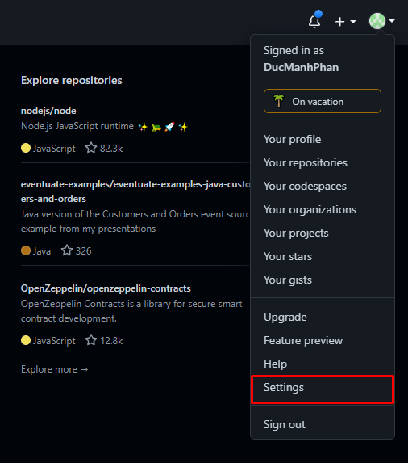
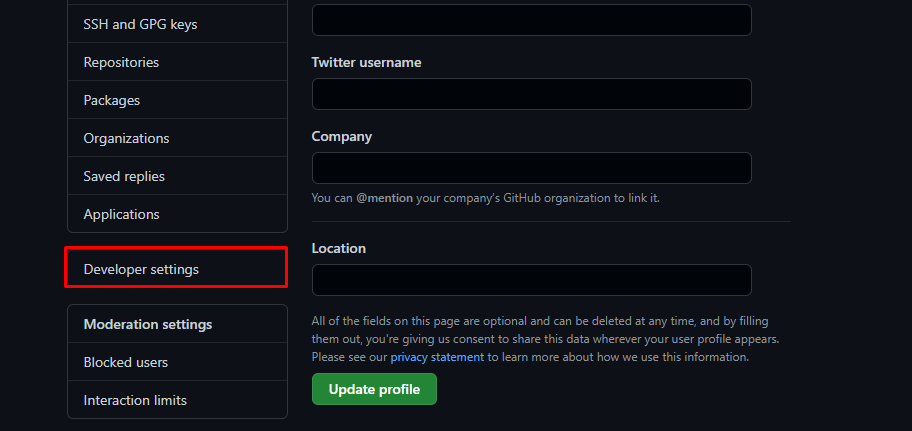
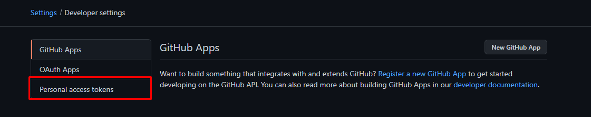
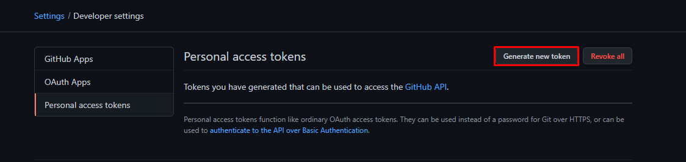
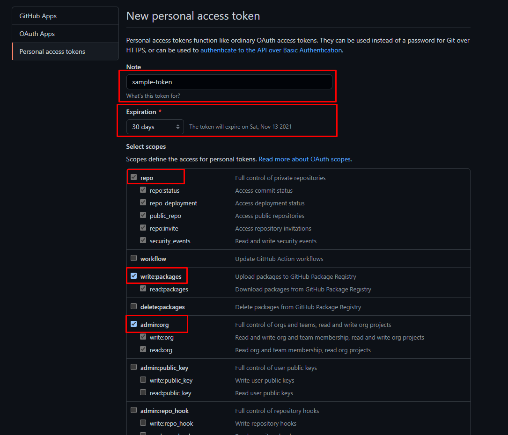
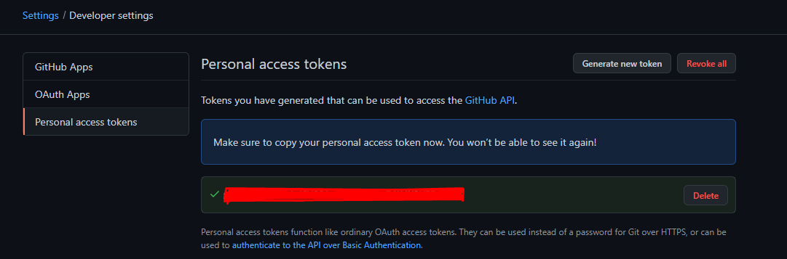

<br>

## Table of Contents
- [Create a new repository](#create-a-new-repository)
- [Remove the remote repository](#remove-the-remote-repository)
- [Add the new remote repository](#add-the-new-remote-repository)
- [How to check URL for remote repository](#how-to-check-url-for-remote-repository)
- [Wrapping up](#wrapping-up)


<br>

## Create a new repository

Belows are steps that we will create a new repository.
1. Create a new folder that contains our project

2. In this folder, typing **git init** command

    ```bash
    # create an empty repository with .git folder to manage everything in this folder
    git init
    ```

3. Create our new things and push them to the local repository

    ```bash
    git add .

    git commit -m "message"
    ```

    If we don't want to track some files, create **.gitignore** file.

4. Finally, we will connect the local repository with our Gitlab or Github

    - In the Gitlab or Github, create our new repository.

    - Then, in our working space, we will add the remote repository's url in the loal configuration

        ```bash
        git remote add origin <remote-repository-url>

        git push -u origin master
        ```

<br>

## Remove the remote repository

```bash
# syntax
git remote rm <repository-name>

# for example
git remote rm sample-repo
```

<br>

## Add the new remote repository

```bash
git remote add <name_of_repository> url
```

url: means the path that points to repo, the tail of url is **.git**.

To check this remote whether it makes or not, use the syntax:

```bash
git remote
git remote -v
```

When to use:
- when we want to merge a repository's branches to the other repository's branches.

<br>

## How to check URL for remote repository

1. Using ```git config``` command

    ```bash
    git config --get remote.origin.url
    ```

2. Using ```git remote``` command.

    ```bash
    git remote show origin
    ```

    To know more details a particular remote, use the generic command:

    ```bash
    git remote show [remote-name] command
    ```

<br>

## How to use token as credential for our repositories

1. Create a token on Github

    - Go to our account, then click to **Setting** menu item.

        

    - Scroll down and then select **Developer settings** item.

        

        Then, we have:

        

    - Click on **Personal access tokens** item, we have:

        

    - Click **Generate new token** button, select our information for this token, especially about defining scopes of this personal tokens.

        We can create this personal token looks like the image below.

        

    - Click **Generate** button, then we have:

        

        We need to save this personal token to your secret place, and we will use it later.

2. Using that token for our local repository

    ```bash
    # 1st step
    git remote set-url origin https://<personal-token>@<url-repository>

    # 2nd step
    git push
    ```


<br>

## Wrapping up

- Understanding what we will intend to do with Git.
