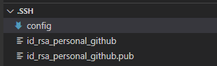
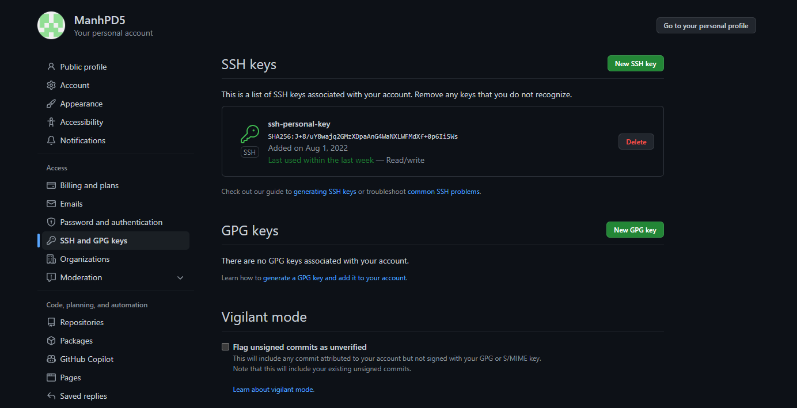
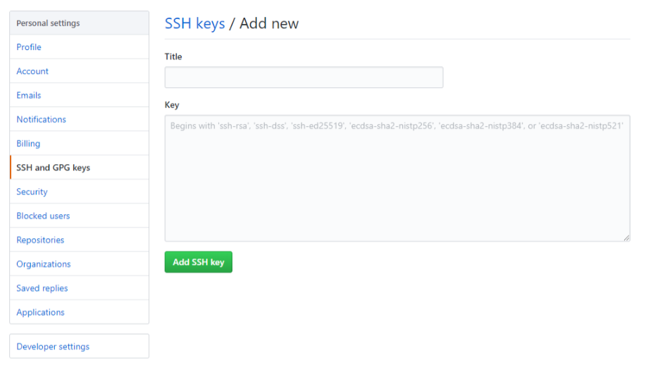
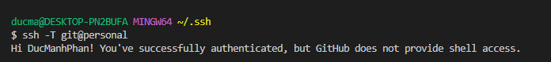
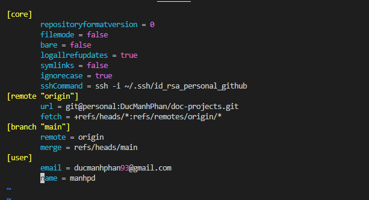

<br>

## Table of Content
- [Given Problem](#given-problem)
- [Some steps to use multiple Github accounts on the same machine](#some-steps-to-use-multiple-github-accounts-on-the-same-machine)
- [Wrapping up](#wrapping-up)


<br>

## Given Problem

Currently, we have multiple accounts on the same host - https://github.com/. It's difficult to work on lots of projects at the same time. Because it can cause the issue of using the personal mail for our work projects. It will violate the security of our companies.

How do we solve this issue?


<br>

## Some steps to use multiple Github accounts on the same machine

1. Create a new SSH key for each account on terminal

    On Git Bash terminal, typing the following command:

    ```bash
    ssh-keygen -t rsa -C "your_mail_address"
    ```

    - `-t` stands for "type" and `rsa` is type of encryption.
    - `-C` stands for "comment".

    Then, it will show like the below comment:

    ```
    Generating public/private rsa key pair.
    Enter file in which to save the key (/c/Users/your_username/.ssh/id_rsa):
    ```

    We can type the name for this key as "id_rsa_`name_company`_github".

    Then, we're defining the `name_company` as `personal` name.

    

    We can find these files in `C:\Users\ducma\.ssh\id_rsa_personal_github`.

    In this step, we don't need to fill some words for passphrase.

2. Check these key files in `.ssh` folder.

    ```bash
    ls -al ~/.ssh
    ```

    Then, we have:

    

3. Create the `config` file in `.ssh` directory.

    The content of this config file will follow the below rules:

    ```bash
    # Personal github
    Host personal
    HostName github.com
    User git
    IdentityFile ~/.ssh/id_rsa_personal_github

    # Work github
    Host name_company
    HostName github.com
    User git
    IdentityFile ~/.ssh/id_rsa_name_company_github
    ```

4. Add public key file's content to Github.

    - Navigate to your `Github account --> Settings --> SSH and GPG Keys`.

        

    - In this step, click `New SSH key` button to create a new ssh public key on Github.

        

    - Then, we copy the public key file's content to Github.

    - After that, it will look like the above image.

5. Test your connection with Github.

    ```bash
    ssh -T git@personal

    ssh -T git@name_company
    ```

    Then, we can have:

    

6. Setup configuration for our projects.

    - If our project's Git is existing with HTTPS mode, we should change it to using SSH mode.

        ```bash
        # configure our name and email
        git config user.name "our-name"
        git config user.email "our-email"

        # configure Git's url
        git remote set-url origin git@`Host`:someone/name-project.git
        ```

        For example, below is the configuration file in `doc-projects`.

        

        Actually, we don't need to configure `sshCommand` field to the command of ssh.

    - If we didn't clone a project some time, we will follow the below commands:

        ```bash
        # Personal Project
        $ git clone git@personal:someone/project.git
        $ cd /path/to/project

        $ git config user.email "personal@email.com"
        $ git config user.name  "name"

        # Work Project
        $ git clone git@name_company:someone/project.git
        $ cd /path/to/project

        $ git config user.email "work@email.com"
        $ git config user.name  "work name"
        ```

    - If we want to push a new projects to Github.

        ```bash
        git init

        git add .
        git commit -m "First commit"

        git remote add origin git@personal:someone/project.git
        git push origin master
        ```

7. To check our steps above is successful or not.

    Run the below command.

    ```bash
    git pull
    ```

    Then, we have:

    


<br>

## Wrapping up

That's it for the guide that configures multiple Github accounts on one machine.

Thanks for reading. Have a great day.
