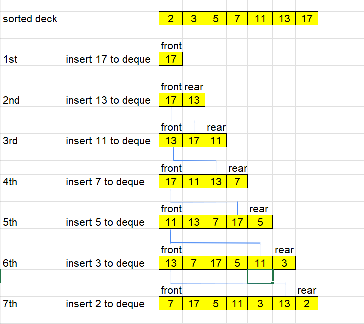

<br>

## Table of contents
- [Given problem](#given-problem)
- [Using Deque data structure](#using-deque-data-structure)
- [Wrapping up](#wrapping-up)


<br>

## Given problem

You are given an integer array `deck`. There is a deck of cards where every card has a unique integer. The integer on the `ith` card is `deck[i]`.

You can order the deck in any order you want. Initially, all the cards start face down (unrevealed) in one deck.

You will do the following steps repeatedly until all cards are revealed:
1. Take the top card of the deck, reveal it, and take it out of the deck.
2. If there are still cards in the deck then put the next top card of the deck at the bottom of the deck.
3. If there are still unrevealed cards, go back to step 1. Otherwise, stop.

Return an ordering of the deck that would reveal the cards in increasing order.

Note that the first entry in the answer is considered to be the top of the deck.

```
Example 1:
Input: deck = [17,13,11,2,3,5,7]
Output: [2,13,3,11,5,17,7]
Explanation: 
We get the deck in the order [17,13,11,2,3,5,7] (this order does not matter), and reorder it.
After reordering, the deck starts as [2,13,3,11,5,17,7], where 2 is the top of the deck.
We reveal 2, and move 13 to the bottom.  The deck is now [3,11,5,17,7,13].
We reveal 3, and move 11 to the bottom.  The deck is now [5,17,7,13,11].
We reveal 5, and move 17 to the bottom.  The deck is now [7,13,11,17].
We reveal 7, and move 13 to the bottom.  The deck is now [11,17,13].
We reveal 11, and move 17 to the bottom.  The deck is now [13,17].
We reveal 13, and move 17 to the bottom.  The deck is now [17].
We reveal 17.
Since all the cards revealed are in increasing order, the answer is correct.

Example 2:
Input: deck = [1,1000]
Output: [1,1000]
```

Constraints:
- `1 <= deck.length <= 1000`
- `1 <= deck[i] <= 106`
- All the values of `deck` are **unique**.


<br>

## Using Deque data structure

Our target is to get an deck array that an ordering of the deck that would reveal the cards in increasing order. It can be difficult to go through an original deck array. So we will start from the increasing order of deck array. And we will go to these reversed steps.

The solution can be described in the image below:



```java
class Solution {
    public int[] deckRevealedIncreasing(int[] deck) {
        if (deck == null || deck.length == 0) {
            return deck;
        }

        Arrays.sort(deck);
        if (deck.length == 2) {
            return deck;
        }

        Deque<Integer> queue = new LinkedList<>();
        for (int i = deck.length - 1; i >= 0; --i) {
            if (deck.length - i <= 2) {
                queue.addLast(deck[i]);
                continue;
            }

            queue.addLast(queue.pollFirst());
            queue.addLast(deck[i]);
        }

        int[] res = new int[queue.size()];
        int i = 0;
        while (!queue.isEmpty()) {
            int value = queue.pollLast();
            res[i++] = value;
        }

        return res;
    }
}
```

The complexity of this solution:
- Time complexity: O(n)
- Space complexity: O(n)


<br>

## Wrapping up


<br>

Refer:

[950. Reveal Cards In Increasing Order](https://leetcode.com/problems/reveal-cards-in-increasing-order/)
