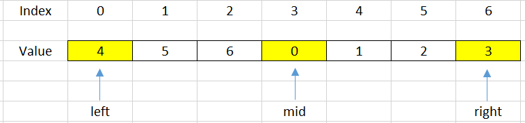
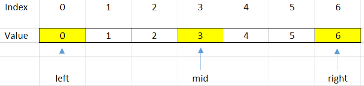
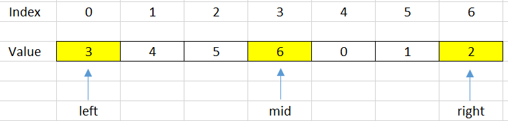

<br>

## Table of contents
- [Given problem](#given-problem)
- [Some properties of a rotated array](#some-properties-of-a-rotated-array)
- [Solutions for this problem](#solutions-for-this-problem)
- [Using Linear Search](#using-linear-search)
- [Using Binary Search algorithm](#using-binary-search-algorithm)
- [Wrapping up](#wrapping-up)


<br>

## Given problem

Suppose an array of length n sorted in ascending order is rotated between 1 and n times. For example, the array nums = [0,1,2,4,5,6,7] might become:
- `[4,5,6,7,0,1,2]` if it was rotated 4 times.
- `[0,1,2,4,5,6,7]` if it was rotated 7 times.

Notice that rotating an array `[a[0], a[1], a[2], ..., a[n-1]]` 1 time results in the array `[a[n-1], a[0], a[1], a[2], ..., a[n-2]]`.

Given the sorted rotated array nums of `unique` elements, return the minimum element of this array.

You must write an algorithm that runs in `O(log n)` time.

Example 1:

Input: nums = [3,4,5,1,2]
Output: 1
Explanation: The original array was [1,2,3,4,5] rotated 3 times.
Example 2:

Input: nums = [4,5,6,7,0,1,2]
Output: 0
Explanation: The original array was [0,1,2,4,5,6,7] and it was rotated 4 times.
Example 3:

Input: nums = [11,13,15,17]
Output: 11
Explanation: The original array was [11,13,15,17] and it was rotated 4 times. 
 

Constraints:
- `n == nums.length`
- `1 <= n <= 5000`
- `-5000 <= nums[i] <= 5000`
- All the integers of nums are `unique`.
- nums is sorted and rotated between 1 and n times.


<br>

## Some properties of a rotated array

- When we divide a rotated array into two halves, at least one of the two halves will always sorted.

    To understand this property, we can see a below image:

    

    If we choose the mid = 3 as the pivot point, we can find that our array is divided into two halves that are increased arrays.

    --> So we can apply Binary Search for problems that are relevant to rotated array.


<br>

## Solutions for this problem

To solve this problem, we can have two solutions:
- Linear Search

    The simple solution to solve it is to use Linear Search. We can scan all elements and compare them with the minimum element.

- Binary Search

    Because the a part of array is sorted, so we can use Binary Search to solve it.


<br>

## Using Linear Search

Below is our source code about this way.

```java
public static int findMinElement(int[] arr) {
    int minPos = 0;
    for (int i = 1; i < arr.length - 1; ++i) {
        if (arr[minPos] > arr[i]) {
            minPos = i;
        }
    }

    return minPos;
}
```

The complexity of Linear Search:
- Time complexity: O(n) - n is the number of elements of this array
- Space complexity: O(1)


<br>

## Using Binary Search algorithm

1. Using Template #1

    In a rotated array, we will have some cases that we will cope with when shift it.

    - Case 1 - when sorted array is not rotated with any steps

        

        In this case, our array is a sorted array but does not rotate with any steps. So, to check this case, we do the below expression:

        ```java
        if (arr[left] <= arr[high]) {
            return left;
        }
        ```

    - Case 2 - When our **mid** index points to the minimum element

        

        So, we will check it by using the following condition:

        ```java
        int next = (mid + 1) % n;   // n is the length of the array
        int prev = (mid + n - 1) % n;

        if (arr[mid] < arr[next] && arr[mid] < arr[prev]) {
            return mid;
        }
        ```

    - Case 3 - When our **mid** index points to the element that is belong to the sub-array. It does not contains the minimum element.

        

        In order to know exactly how we are under this case, we will use the below condition:

        ```java
        if (arr[left] <= arr[mid]) {
            left = mid + 1;
        }
        ```

        Due to the minimum element that is belong to the other side, so we will shift the right side.


    - Case 4 - When our mid index points to the element that is belong to the sub-array. It contains the minimum element.

        

        ```java
        if (arr[mid] <= arr[right]) {
            right = mid - 1;
        }
        ```

    Based on the four conditions, we will have source code for this problem:

    ```java
    class Solution {
        public int findMin(int[] arr) {
            int len = arr.length;
            int left = 0;
            int right = len - 1;

            while (left <= right) {
                if (arr[left] <= arr[right]) {  // Case 1: sorted array
                    return arr[left];
                }

                int mid = left + (right - left) / 2;
                int next = (mid + 1) % len;
                int prev = (mid + len - 1) % len;
                if (arr[mid] <= arr[next] && arr[mid] <= arr[prev]) {   // Case 2: mid index points to the minimum element
                    return arr[mid];
                } else if (arr[mid] <= arr[right]) {    // Case 4
                    right = mid - 1;
                } else if (arr[mid] >= arr[left]) {     // Case 3
                    left = mid + 1;
                }
            }

            return -1;
        }
    }
    ```

2. Using Template #2

    ```java
    class Solution {
        public int findMin(int[] nums) {
            if (nums == null) {
                return -1;
            }

            int left = 0;
            int right = nums.length - 1;

            while (left < right) {
                int mid = left + (right - left) / 2;

                if (nums[mid] > nums[right]) {
                    left = mid + 1;
                } else {
                    right = mid;
                }
            }

            return nums[left];
        }
    }
    ```

3. Using Template #3

    ```java
    class Solution {
        public int findMin(int[] nums) {
            int low = 0;
            int high = nums.length - 1;
            
            while (low + 1 < high) {
                int mid = low + (high - low) / 2;
                
                if (nums[mid] > nums[high]) {
                    low = mid;
                } else {
                    high = mid;
                }
            }
            
            return nums[low] < nums[high] ? nums[low] : nums[high];
        }
    }
    ```

The complexity of this solution:
- Time complexity: O(logn)
- Space complexity: O(1)


<br>

## Wrapping up

- Understanding how to use some templates of Binary Search algorithm.

- Understanding about what the rotated array is, and its properties.

- When we have two different trends in our array, we can use Binary Search to solve this problem.

- From this problem, we can find that in a rotated array, the index of the minimum element will be equal to the number of rotation of its array.


<br>

Refer:

[153. Find Minimum in Rotated Sorted Array](https://leetcode.com/problems/find-minimum-in-rotated-sorted-array/)